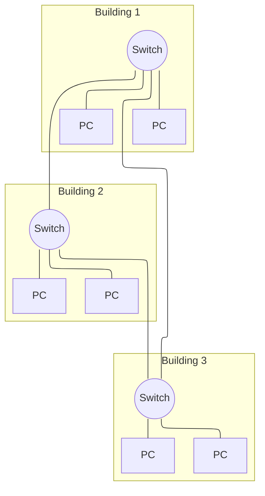

# LAN Design

## 1.1 Hierarchisch Netwerk Design
*Naarmate een netwerk groeit, volstaat een eenvoudig, ongestructureerd ontwerp niet langer. Dit onderdeel behandelt hoe netwerken op een hiërarchische, schaalbare manier ontworpen worden, en welke principes daaraan ten grondslag liggen.*

### 1.1.1 Netwerkgroottes

Een netwerk kan op verschillende manieren ontworpen worden, afhankelijk van de grootte en de complexiteit van het netwerk. Om een netwerkontwerp te kunnen bespreken, onderscheiden we eerst drie groottecategorieën:

- **Klein netwerk**: 1 tot 200 apparaten. Denk hierbij aan een thuisnetwerk, een klein kantoor of een koffiebar.
- **Middelgroot netwerk**: 200 tot 1.000 apparaten, zoals een kantoor met meerdere afdelingen, een kleine school of een klein ziekenhuis.
- **Groot netwerk**: meer dan 1.000 apparaten, zoals een groot ziekenhuis, een universiteit of een grote onderneming.

Bij een klein netwerk wordt traditioneel weinig aandacht besteed aan het ontwerp: vaak volstaat een eenvoudige opzet. Dat maakt het netwerk kwetsbaarder voor uitval, maar de impact daarvan blijft beperkt, omdat er minder apparaten en gebruikers van afhankelijk zijn. Naarmate een netwerk groter wordt, neemt echter ook het belang van een doordacht ontwerp toe. Drie aspecten worden dan cruciaal:

- de **betrouwbaarheid** van het netwerk,
- de **schaalbaarheid**, zodat het netwerk kan meegroeien met de organisatie,
- en de **redundantie**, zodat een aanpassing of storing in één deel van het netwerk niet het volledige netwerk onderuithaalt.

### 1.1.2 Design Principes

Bij het ontwerpen van een netwerk zijn er een aantal principes die helpen om een goede netwerkarchitectuur te realiseren. Deze zijn onafhankelijk van de grootte of de vereisten van het netwerk. De principes die we in deze cursus behandelen zijn:

#### Hiërarchie

Een hiërarchisch netwerkontwerp verdeelt het netwerk in verschillende lagen, waarbij elke laag een specifieke rol vervult. In plaats van elk toestel rechtstreeks met elk ander toestel te verbinden (wat snel onbeheerbaar wordt naarmate het netwerk groeit), wordt het netwerk opgebouwd uit een access layer, distribution layer en core layer, elk met een duidelijk afgebakende verantwoordelijkheid. Dit maakt het netwerk overzichtelijker, makkelijker te beheren en eenvoudiger uit te breiden.

*Voorbeeld:* een bedrijf met vijf gebouwen kan in elk gebouw access switches plaatsen die de eindtoestellen aansluiten. Deze access switches worden per gebouw verbonden met een distribution switch, en alle distribution switches worden op hun beurt verbonden met een centrale core. Wil het bedrijf een zesde gebouw toevoegen, dan volstaat het om in dat gebouw access switches te plaatsen en die via een nieuwe distribution switch met de core te verbinden. De rest van het netwerk moet niet aangepast worden.

#### Modulariteit

Modulariteit betekent dat het netwerk wordt opgedeeld in afzonderlijke functionele blokken (modules), die elk een specifieke taak vervullen en onafhankelijk van elkaar ontworpen, aangepast of vervangen kunnen worden. Een probleem of wijziging in één module heeft zo geen impact op de rest van het netwerk.

*Voorbeeld:* de internetverbinding en firewall van een bedrijf (de WAN-edge module) kunnen vervangen of geüpgraded worden zonder dat dit gevolgen heeft voor de interne serverfarm (data center module) of het interne campusnetwerk. Het zijn afzonderlijke, losgekoppelde bouwstenen.

#### Resiliëntie

Resiliëntie is het vermogen van een netwerk om beschikbaar te blijven, zowel onder normale omstandigheden (regulier verkeer, geplande onderhoudsmomenten) als onder abnormale omstandigheden (defecten, piekbelasting, aanvallen). Dit wordt meestal gerealiseerd door redundantie te voorzien: meerdere paden of componenten, zodat de uitval van één onderdeel niet meteen het volledige netwerk platlegt.

*Voorbeeld:* wanneer een distribution switch uitvalt door een hardwaredefect, kan een tweede distribution switch, via protocollen zoals HSRP of VRRP, automatisch de rol overnemen, zodat gebruikers de storing niet of nauwelijks merken.

#### Flexibiliteit

Flexibiliteit is het vermogen om delen van het  breiden of nieuwe diensten toe te voegen,zonder dat dit een grote impact heeft op de resedige vervanging van de bestaande infrastructuurvereist. Dit is belangrijk omdat vereisten en tnderen.*Voorbeeld:* wanneer een bedrijf VoIP-telefoons access layer aangepast worden (bv. door Powerover Ethernet en een aparte voice-VLAN te voorzien) layer blijven ongewijzigd.

:::info[Herkomst van deze principes]
Deze vier principes zijn niet specifiek voor deze cursus, maar zijn principes die Cisco zelf hanteert in zijn [netwerkarchitectuurdocumentatie](https://www.cisco.com/c/en/us/td/docs/solutions/Enterprise/Campus/campover.html) en in een [Cisco Press-analyse van deze ontwerpprincipes](https://www.ciscopress.com/articles/article.asp?p=2201795). Het betreft dus geen formele IEEE- of RFC-standaard, maar een breed erkende best practice binnen de sector en het is deze aanpak die we in deze cursus als leidraad volgen.
:::

### 1.1.3 Een slecht hiërarchisch ontwerp
Om de principes van hiërarchie, modulariteit, resiliëntie en flexibiliteit te illustreren, bekijken we een voorbeeld van een slecht hiërarchisch netwerkontwerp. het type dat we bekijken bevat een "flat-switched network" oftewel een netwerkarchitectuur waarbij alle toestellen via een enkele laag van switches met elkaar verbonden zijn. Dit type netwerk is eenvoudig op te zetten, maar het is moeilijk te beheren en bij schalen wordt het al snel onoverzichtelijk. Het is ook moeilijk om redundantie en flexibiliteit te voorzien, waardoor het netwerk kwetsbaar is voor uitval en veranderingen.

