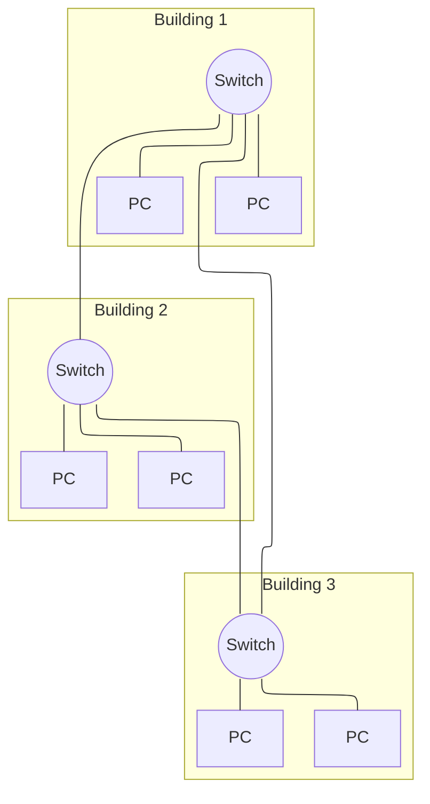
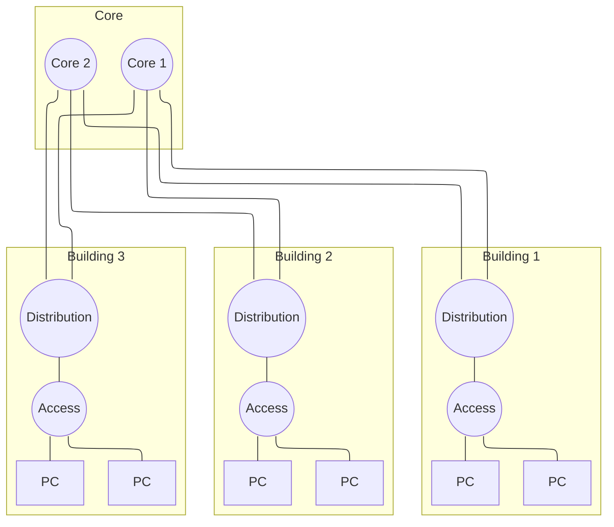
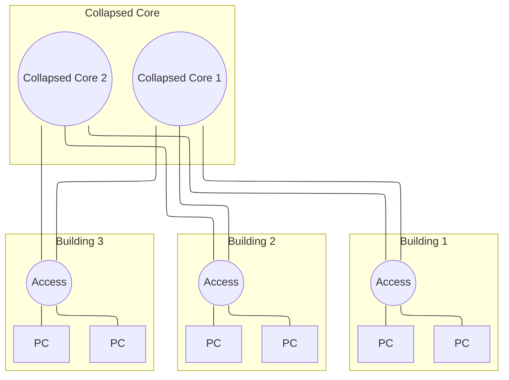

# LAN Design

## 1.1 Hierarchisch Netwerk Design
*Naarmate een netwerk groeit, volstaat een eenvoudig, ongestructureerd ontwerp niet langer. Dit onderdeel behandelt hoe netwerken op een hiërarchische, schaalbare manier ontworpen worden, en welke principes daaraan ten grondslag liggen.*

### 1.1.1 Netwerkgroottes

Een netwerk kan op verschillende manieren ontworpen worden, afhankelijk van de grootte en de complexiteit van het netwerk. Om een netwerkontwerp te kunnen bespreken, onderscheiden we eerst drie groottecategorieën:

- **Klein netwerk**: 1 tot 200 apparaten. Denk hierbij aan een thuisnetwerk, een klein kantoor of een koffiebar.
- **Middelgroot netwerk**: 200 tot 1.000 apparaten, zoals een kantoor met meerdere afdelingen, een kleine school of een klein ziekenhuis.
- **Groot netwerk**: meer dan 1.000 apparaten, zoals een groot ziekenhuis, een universiteit of een grote onderneming.

Bij een klein netwerk wordt traditioneel weinig aandacht besteed aan het ontwerp: vaak volstaat een eenvoudige opzet. Dat maakt het netwerk kwetsbaarder voor uitval, maar de impact daarvan blijft beperkt, omdat er minder apparaten en gebruikers van afhankelijk zijn. Naarmate een netwerk groter wordt, neemt echter ook het belang van een doordacht ontwerp toe. Drie aspecten worden dan cruciaal:

- de **betrouwbaarheid** van het netwerk,
- de **schaalbaarheid**, zodat het netwerk kan meegroeien met de organisatie,
- en de **redundantie**, zodat een aanpassing of storing in één deel van het netwerk niet het volledige netwerk onderuithaalt.

### 1.1.2 Design Principes

Bij het ontwerpen van een netwerk zijn er een aantal principes die helpen om een goede netwerkarchitectuur te realiseren. Deze zijn onafhankelijk van de grootte of de vereisten van het netwerk. De principes die we in deze cursus behandelen zijn:

#### Hiërarchie

Een hiërarchisch netwerkontwerp verdeelt het netwerk in verschillende lagen, waarbij elke laag een specifieke rol vervult. In plaats van elk toestel rechtstreeks met elk ander toestel te verbinden (wat snel onbeheerbaar wordt naarmate het netwerk groeit), wordt het netwerk opgebouwd uit een access layer, distribution layer en core layer, elk met een duidelijk afgebakende verantwoordelijkheid. Dit maakt het netwerk overzichtelijker, makkelijker te beheren en eenvoudiger uit te breiden.

*Voorbeeld:* een bedrijf met vijf gebouwen kan in elk gebouw access switches plaatsen die de eindtoestellen aansluiten. Deze access switches worden per gebouw verbonden met een distribution switch, en alle distribution switches worden op hun beurt verbonden met een centrale core. Wil het bedrijf een zesde gebouw toevoegen, dan volstaat het om in dat gebouw access switches te plaatsen en die via een nieuwe distribution switch met de core te verbinden. De rest van het netwerk moet niet aangepast worden.

#### Modulariteit

Modulariteit betekent dat het netwerk wordt opgedeeld in afzonderlijke functionele blokken (modules), die elk een specifieke taak vervullen en onafhankelijk van elkaar ontworpen, aangepast of vervangen kunnen worden. Een probleem of wijziging in één module heeft zo geen impact op de rest van het netwerk.

*Voorbeeld:* de internetverbinding en firewall van een bedrijf (de WAN-edge module) kunnen vervangen of geüpgraded worden zonder dat dit gevolgen heeft voor de interne serverfarm (data center module) of het interne campusnetwerk. Het zijn afzonderlijke, losgekoppelde bouwstenen.

#### Resiliëntie

Resiliëntie is het vermogen van een netwerk om beschikbaar te blijven, zowel onder normale omstandigheden (regulier verkeer, geplande onderhoudsmomenten) als onder abnormale omstandigheden (defecten, piekbelasting, aanvallen). Dit wordt meestal gerealiseerd door redundantie te voorzien: meerdere paden of componenten, zodat de uitval van één onderdeel niet meteen het volledige netwerk platlegt.

*Voorbeeld:* wanneer een distribution switch uitvalt door een hardwaredefect, kan een tweede distribution switch, via protocollen zoals HSRP of VRRP, automatisch de rol overnemen, zodat gebruikers de storing niet of nauwelijks merken.

#### Flexibiliteit

Flexibiliteit is het vermogen om delen van het  breiden of nieuwe diensten toe te voegen,zonder dat dit een grote impact heeft op de resedige vervanging van de bestaande infrastructuurvereist. Dit is belangrijk omdat vereisten en tnderen.*Voorbeeld:* wanneer een bedrijf VoIP-telefoons access layer aangepast worden (bv. door Powerover Ethernet en een aparte voice-VLAN te voorzien) layer blijven ongewijzigd.

:::info[Herkomst van deze principes]
Deze vier principes zijn niet specifiek voor deze cursus, maar zijn principes die Cisco zelf hanteert in zijn [netwerkarchitectuurdocumentatie](https://www.cisco.com/c/en/us/td/docs/solutions/Enterprise/Campus/campover.html) en in een [Cisco Press-analyse van deze ontwerpprincipes](https://www.ciscopress.com/articles/article.asp?p=2201795). Het betreft dus geen formele IEEE- of RFC-standaard, maar een breed erkende best practice binnen de sector en het is deze aanpak die we in deze cursus als leidraad volgen.
:::

### 1.1.3 Een slecht hiërarchisch ontwerp
Om de principes van hiërarchie, modulariteit, resiliëntie en flexibiliteit te illustreren, bekijken we een voorbeeld van een slecht hiërarchisch netwerkontwerp. het type dat we bekijken bevat een "flat-switched network" oftewel een netwerkarchitectuur waarbij alle toestellen via een enkele laag van switches met elkaar verbonden zijn. Dit type netwerk is eenvoudig op te zetten, maar het is moeilijk te beheren en bij schalen wordt het al snel onoverzichtelijk. Het is ook moeilijk om redundantie en flexibiliteit te voorzien, waardoor het netwerk kwetsbaar is voor uitval en veranderingen.

In dit voorbeeld zijn er drie gebouwen, elk met een switch die de eindtoestellen (PC's) verbindt. De switches zijn onderling verbonden, maar er is geen duidelijke hiërarchie of scheiding in het netwerk. Dit kan leiden tot problemen zoals:

- Er is geen scheiding tussen lokaal verkeer en verkeer tussen gebouwen. Dit loopt allemaal via dezelfde switches.
- Het is moeilijk om dit netwerk uit te breiden, omdat elke nieuwe switch direct met alle andere switches verbonden moet worden. Stel dat we niet 3, maar 10 gebouwen moeten aansluiten, dan zijn er op elke switch 9 verbindingen nodig, alleen al om de andere gebouwen te bereiken.
- Er is in principe geen redundantie: als een switch uitvalt, verliezen alle apparaten die eraan verbonden zijn hun verbinding.
- Doordat er geen duidelijke isolatie is van de functionele delen van het netwerk, is het ook niet of moeilijk mogelijk om beleidsregels toe te passen, zoals het scheiden van spraak- en dataverkeer of het toepassen van beveiligingsmaatregelen.
- Er is sprake van één groot broadcastdomein, waardoor broadcastverkeer zich door het hele netwerk kan verspreiden en de prestaties kan beïnvloeden. Dit betekent dat ARP-verkeer of DHCP-verkeer van het ene gebouw naar het andere kan gaan, zonder dat dit nodig is.
- Alle switches vervullen dezelfde rol, er is geen functionele specialisatie tussen de toestellen. Er wordt geen onderscheid gemaakt tussen eenvoudige Layer 2-switches en krachtigere Layer 3-switches met routing- of beleidsfunctionaliteit, waardoor het ook niet duidelijk is welk type toestel waar het best wordt ingezet.

### 1.1.4 Een goed hiërarchisch ontwerp

Als tegenvoorbeeld bekijken we nu hetzelfde netwerk van drie gebouwen, maar dan opnieuw ontworpen volgens de principes van hiërarchie, modulariteit, resiliëntie en flexibiliteit. In plaats van alle switches rechtstreeks met elkaar te verbinden, wordt het netwerk opgebouwd uit drie lagen: een access layer, een distribution layer en een core layer.

In dit ontwerp heeft elk gebouw een eigen access switch en distribution switch, en zijn de distribution switches van alle gebouwen verbonden met twee gemeenschappelijke core switches. Ter vereenvoudiging toont het diagram slechts één access switch per gebouw. In de praktijk kan een gebouw echter gemakkelijk meerdere access switches bevatten, bijvoorbeeld één per verdieping, die allemaal met dezelfde distribution switch verbonden worden.

De sleutel tot dit ontwerp is dat de distribution switches multilayer switches zijn: toestellen die naast Layer 2 ook Layer 3-functionaliteit hebben, en dus kunnen routeren. Elk gebouw vormt hierdoor een eigen IP-subnet. Binnen dat subnet gedraagt de distribution switch zich als een gewone Layer 2-switch en stuurt lokale broadcasts door naar alle access-poorten in datzelfde subnet. Zodra verkeer de grens van dat subnet oversteekt, bijvoorbeeld richting een ander gebouw, gebeurt dat via Layer 3-routing op basis van IP-adressen, en een broadcast heeft geen geldig IP-doeladres om te routeren. Elk gebouw vormt zo zijn eigen broadcastdomein. Lokaal verkeer blijft lokaal, en de core blijft vrij van verkeer dat er niet thuishoort.

Diezelfde Layer 3-functionaliteit maakt het ook mogelijk om beleidsregels toe te passen: de distribution switches kunnen verkeer filteren en controleren, bijvoorbeeld via access control lists, terwijl de core zich uitsluitend bezighoudt met snelle doorschakeling (fast switching). Dit levert meteen ook functionele specialisatie op: de access layer bestaat uit eenvoudige Layer 2-switches, de distribution layer uit Layer 3-switches met routing- en beleidsfunctionaliteit, en de core layer uit toestellen die uitsluitend geoptimaliseerd zijn voor snelheid. Omdat spanning-tree-herberekeningen, broadcast storms en een overvolle MAC-address-table stuk voor stuk Layer 2-fenomenen zijn, blijven ook deze problemen om dezelfde reden beperkt tot het gebouw waarin ze ontstaan, zonder zich te verspreiden naar de rest van het netwerk.

Los van deze Layer 3-scheiding zorgt ook de topologie zelf voor verbeteringen. Doordat er twee core switches voorzien zijn, kan bij uitval van één core switch de andere de rol overnemen, wat het netwerk redundant maakt. Bovendien is de afstand van elke distribution switch tot de root switch nooit meer dan één hop, wat het netwerk stabieler maakt.

Ten slotte is het netwerk ook eenvoudiger uit te breiden. Een nieuw gebouw toevoegen vereist enkel een nieuwe access en distribution switch die met de bestaande core verbonden wordt, in plaats van een extra verbinding met elke bestaande switch zoals in het vorige platte ontwerp.

### 1.1.5 Access Layer
De access layer is de laag van het netwerk die de eindtoestellen verbindt. Zoals de naam al zegt, geeft deze laag toegang tot het netwerk. In een hiërarchisch ontwerp staat de access layer het dichtst bij de eindtoestellen. Het is de laag met de meeste toestellen, en daardoor ook de laag die het meest onderhevig is aan veranderingen.

De access layer bestaat meestal uit eenvoudige Layer 2-switches, die de eindtoestellen met het netwerk verbinden en lokaal verkeer doorsturen naar de distribution layer.

Om beschikbaarheid te garanderen, worden de uplinks tussen access en distribution layer vaak gebundeld tot een EtherChannel: meerdere fysieke verbindingen die logisch als één verbinding functioneren. Valt één van die fysieke links uit, dan blijft de bundel via de overige links beschikbaar. Zo'n bundel kan opgezet worden met LACP, het open standaardprotocol dat hiervoor gebruikt wordt. Dit beschermt wel enkel tegen de uitval van een individuele link, niet tegen de uitval van de volledige distribution switch waarnaar deze links lopen.

Daarnaast moet de access layer voorzien zijn van port security, zodat enkel geautoriseerde toestellen toegang krijgen tot het netwerk. Port security beperkt welke MAC-adressen op een poort toegelaten worden, hetzij via statisch geconfigureerde adressen, hetzij door een beperkt aantal adressen dynamisch te laten aanleren. Wanneer een onbekend adres verbinding probeert te maken, kan de switch dit op verschillende manieren afhandelen: het verkeer stil laten vallen (protect), het verkeer laten vallen én een melding versturen (restrict), of de volledige poort uitschakelen tot een beheerder ze manueel opnieuw activeert (shutdown).

In een bedrijfsomgeving wordt hiernaast vaak ook 802.1X-authenticatie toegepast, zodat enkel toestellen die zich correct authenticeren toegang krijgen tot het netwerk.

Naast port security kunnen ook VLAN access control lists (VACLs) ingezet worden. Waar een gewone ACL verkeer filtert dat een router of Layer 3-interface passeert, filtert een VACL verkeer rechtstreeks binnen een VLAN, dus ook tussen toestellen die zich in hetzelfde subnet bevinden.

Om ARP-spoofing en de daaraan gekoppelde man-in-the-middle-aanvallen te voorkomen, kan Dynamic ARP Inspection (DAI) ingeschakeld worden. DAI controleert binnenkomende ARP-pakketten aan de hand van een bindingstabel van geldige combinaties van MAC-adres, IP-adres en VLAN, en laat enkel ARP-pakketten door die met deze tabel overeenkomen. Deze bindingstabel wordt automatisch opgebouwd via DHCP snooping, dat de DHCP-communicatie op het netwerk opvolgt en zo registreert welk IP-adres aan welk MAC-adres werd toegekend.

Spanning Tree Protocol (STP) wordt op de access layer gebruikt om lussen in het netwerk te vermijden wanneer er redundante verbindingen aanwezig zijn, bijvoorbeeld wanneer een access switch via meerdere paden met het netwerk verbonden is.

Ten slotte wordt de access layer vaak voorzien van Power over Ethernet (PoE), waarmee toestellen zoals IP-telefoons of access points via dezelfde kabel zowel data als stroom ontvangen. In combinatie hiermee wordt doorgaans een aparte auxiliary VLAN (voice VLAN) ingesteld, zodat spraakverkeer gescheiden blijft van het gewone datenverkeer. Op deze manier kan ook Quality of Service (QoS) toegepast worden om spraak- en videoverkeer prioriteit te geven ten opzichte van gewoon dataverkeer.

### 1.1.6 Distribution Layer

De distribution layer bundelt de uplinks van de access layer samen, alvorens deze door te sturen naar de core layer. De distribution layer is de grens tussen de domeinen op Layer 2 en het gerouteerde netwerk op Layer 3.

De distribution layer is meestal een Layer 3-switch of een router, en wordt gebruikt om het netwerk te segmenteren.

Op de distribution layer kunnen ook beleidsregels toegepast worden in de vorm van access control lists (ACL's), waarmee verkeer gefilterd kan worden voordat het de core layer bereikt.

Daarnaast verzorgt de distribution layer routeringsdiensten tussen VLAN's en tussen verschillende routing domains. Wanneer bijvoorbeeld het ene deel van het netwerk EIGRP gebruikt en een ander deel OSPF, gebeurt de redistributie tussen beide protocollen op deze laag.

Om redundantie en load balancing te voorzien, wordt op de distribution layer vaak gebruikgemaakt van first-hop redundancy-protocollen zoals VRRP, HSRP of GLBP. Deze protocollen zorgen ervoor dat eindtoestellen steeds een actieve gateway ter beschikking hebben, ook wanneer één van de distribution switches uitvalt.

Ten slotte vormt de distribution layer de grens waarop routes samengevat worden (route summarization) voordat ze naar de core layer doorgestuurd worden. Hierdoor moet de core layer geen aparte route bijhouden voor elk subnet, wat de routingtabel kleiner en het netwerk schaalbaarder maakt.

:::info[Routeringsdiensten]
We spreken hier over een aantal routeringsprotocollen, zoals EIGRP, OSPF, RIP en IS-IS. Wat deze protocollen precies inhouden en hoe ze werken, bekijken we verderop in de cursus. Voorlopig volstaat het om te weten dat dit protocollen zijn die toestellen in staat stellen om elkaar te vinden en onderling te communiceren, zodat ze verkeer correct kunnen routeren. Dit gebeurt op de distribution layer.
:::

### 1.1.7 Core Layer (network backbone)

De core layer wordt ook wel de network backbone genoemd. Deze laag verbindt de distribution layers van de verschillende gebouwen of blokken met elkaar, en zorgt voor de connectiviteit naar bijvoorbeeld het data center of de WAN edge.

Omdat de core layer al het verkeer van alle distribution switches samenbrengt, moet deze laag in staat zijn om zeer grote hoeveelheden data snel te verwerken. Om deze snelheid te garanderen, worden op de core layer bewust geen CPU-intensieve taken uitgevoerd zoals ACL's, QoS-classificatie of inspectie. Die taken gebeuren al op de distribution layer, zodat de core layer zich uitsluitend kan focussen op snelle doorschakeling (fast switching).

Doordat de core layer al het verkeer van het volledige netwerk verwerkt, is beschikbaarheid hier cruciaal: valt de core layer uit, dan valt in principe het volledige netwerk uit. Daarom wordt de core layer steeds redundant opgebouwd, zoals ook te zien was in het voorbeeld uit 1.1.4, met twee core switches die elkaars taken kunnen overnemen bij uitval.

Wanneer de core layer onvoldoende capaciteit heeft, wordt deze bij voorkeur geschaald door snellere toestellen te plaatsen, in plaats van door extra toestellen toe te voegen. Meer toestellen in de core zouden immers extra complexiteit met zich meebrengen, zonder dat dit de snelheid van individuele verbindingen verbetert.

### 1.1.8 Two-Tier Collapsed Core Design
Het drielaags-ontwerp uit 1.1.4, met een aparte access, distribution en core layer, biedt de beste prestaties, beschikbaarheid en schaalbaarheid. Voor kleinere netwerken die niet significant blijven groeien, is dit echter niet altijd nodig. In dat geval wordt vaak een two-tier hierarchical design gebruikt: een netwerk met slechts twee lagen in plaats van drie. Wanneer de functies van de distribution en core layer daarbij samengevoegd worden in één enkel toestel, spreekt men specifiek van een collapsed core.

Vergeleken met het drielaags-voorbeeld uit 1.1.4 verdwijnt hier de aparte distribution switch per gebouw: de access switches sluiten rechtstreeks aan op de twee collapsed core switches, die samen zowel de distribution- als de core-functies vervullen.

De belangrijkste motivatie voor een collapsed core is het verlagen van de netwerkkost, terwijl toch het grootste deel van de voordelen van het drielaags-ontwerp behouden blijft. Er is nog steeds een duidelijke scheiding tussen de access layer en de rest van het netwerk, en de resterende laag kan nog steeds redundant opgebouwd worden met twee toestellen, zoals in het diagram hierboven.