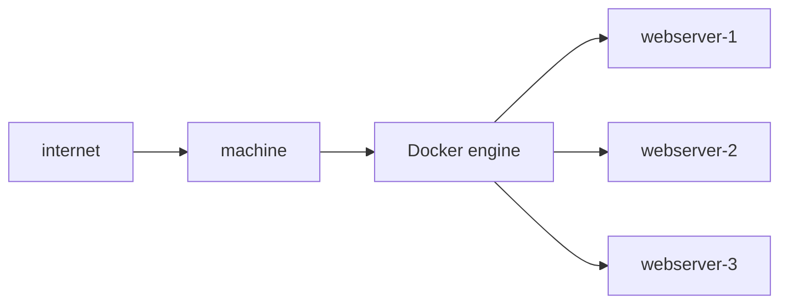
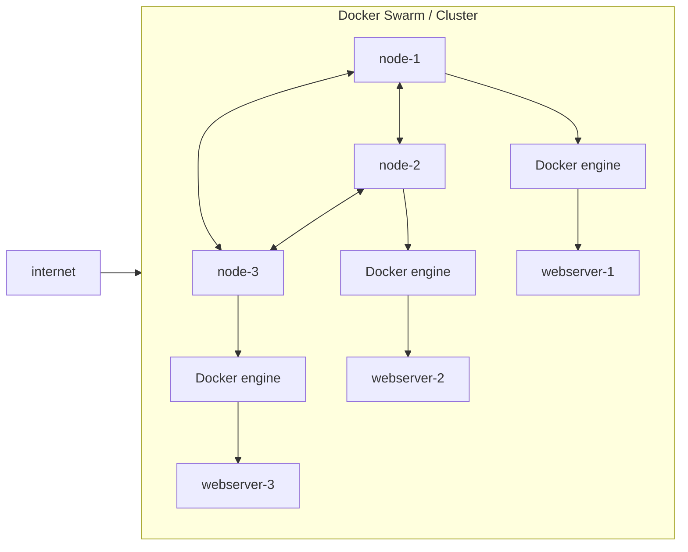

In dit hoofdstuk schetsen we de basiscontext van Docker Swarm. We bespreken wat het verschil is tussen docker en Docker Swarm en hoe de architectuur van Docker Swarm is opgebouwd.

:::warning[belangrijk]
Dit hoofdstuk gaat ervan uit dat je al enige basiskennis hebt van Docker.
:::

## 1. Van Docker naar Docker Swarm
Zoals we al eerder hebben gezien, maakt docker het mogelijk om applicaties te verpakken in containers. Hierdoor kunnen we applicaties isoleren zorgen dat ze overal hetzelfde draaien, ongeacht de onderliggende infrastructuur.

We kijken even naar het volgende voorbeeld:

In dit voorbeeld draait er op een enkele machine een docker engine, waarop een webserver container draait. Deze machine kan een fysieke machine zijn, een virtuele machine in de cloud of zelfs je eigen laptop.

Stel je nu even voor dat we de webserver af en toe willen updaten. Als we dat op deze machine willen doen, moeten we de container stoppen, updaten en weer opnieuw starten. Hierdoor is er een korte downtime van de webserver. En stel je voor dat er tijdens een update iets misgaat, dan is de webserver helemaal niet meer beschikbaar.

We zouden dit kunnen oplossen door meerdere containers op dezelfde machine te draaien en dan zou het er zo uit kunnen zien:

Nu hebben we meerdere webservers op dezelfde machine draaien. Als we nu een update willen uitvoeren, kunnen we één voor één de containers updaten, waardoor er altijd minimaal één webserver beschikbaar blijft. Dit is al een stuk beter, maar het wordt wel al heel wat complexer om te beheren. We moeten nu namelijk bijhouden welke containers er draaien. Daarnaast lost dit het probleem ook niet volledig op, want wat als de machine zelf een update nodig heeft of crasht? Dan zijn alle webservers ineens niet meer beschikbaar.

Om deze problemen op te lossen, kunnen we Docker Swarm gebruiken. Docker Swarm stelt ons in staat om meerdere machines (**nodes**) te groeperen tot één enkele virtuele docker engine. Hierdoor kunnen we containers over meerdere machines verspreiden, wat zorgt voor meer beschikbaarheid en schaalbaarheid. Wanneer deze machines samenwerken, noemen we dit een **cluster**.
Ons voorbeeld zou er dan zo uit kunnen zien:

Als we nu een update zouden willen uitvoeren, kunnen we één voor één de nodes updaten. Hierdoor blijft de webserver altijd beschikbaar, zelfs als een hele machine crasht. Hoe dit precies in zijn werk gaat, bespreken we in de volgende hoofdstukken.

