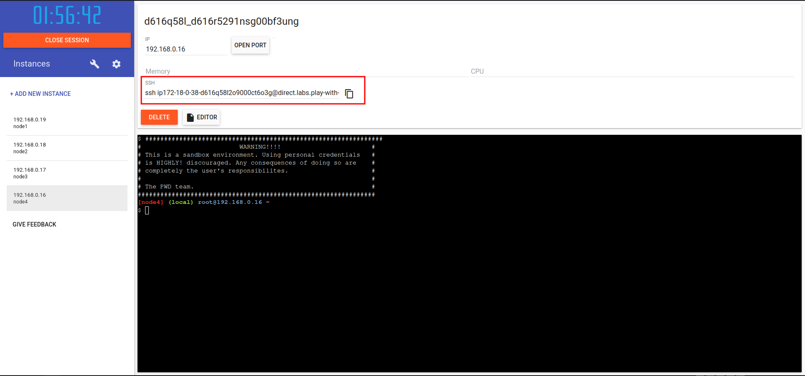

# Labo 1: Introductie tot Docker Swarm
In dit labo zullen we een eenvoudige Docker Swarm cluster opzetten met behulp van drie virtuele machines. We zullen leren hoe we een swarm kunnen initialiseren, nodes kunnen toevoegen en een eenvoudige service kunnen deployen.

## Benodigdheden
Voor dit labo maken we gebruik van het platform [Play with Docker](https://labs.play-with-docker.com/). Maak een gratis account aan als je dat nog niet hebt gedaan.
1. Ga naar [Play with Docker](https://labs.play-with-docker.com/) en log in.
2. Klik op "Start" om een nieuwe sessie te starten.
3. Voeg drie nieuwe machines toe door op de knop `Add New Instance`te klikken.
4. Wacht tot alle machines zijn opgestart en noteer hun IP-adressen.

:::info[Werken in groep]
Indien je dit labo in een groep uitvoert, zorg er dan voor dat alle deelnemers in dezelfde Play with Docker sessie zitten, zodat ze de machines van elkaar kunnen bereiken. Dit kan je doen door één persoon de sessie te laten aanmaken en de link naar de sessie te delen met de andere groepsleden.

Wijs elk groepslid een machine toe om mee te werken aan het labo. Wanneer er verder gesproken wordt over een bepaalde machine, dan voert enkel diegene die aan die machine werkt de stappen uit.

Zorg dat je één machine meer hebt dan het aantal groepsleden, zodat je een extra machine hebt om als testclient te gebruiken.
:::
In dit voorbeeld gaan we van de volgende opstelling uit:
- 3 machines die samen een Docker Swarm Cluster zullen vormen.
- 1 machine die zal fungeren als testclient om de werking te verifiëren.
Indien je met meerdere machines werkt, zorg dan dat je één machine reserveert als testclient en de andere machines gebruikt als nodes in de swarm.
**Zorg dat je deze testclient niet gebruikt tot wanneer dit specifiek gevraagd wordt.**

### Stap 1: Maak een SSH-verbinding met de machines
Wanneer je een machine hebt aangemaakt, krijg je een terminalvenster te zien en een command om via SSH verbinding te maken met de machine. Kopieer dit commando en plak het in je lokale terminal om verbinding te maken met de eerste machine. 

Herhaal dit voor alle drie de machines, zodat je drie terminalvensters hebt geopend, elk verbonden met een andere machine. 
:::info
Je hoeft geen SSH-keys in te stellen in Play with Docker, dit is al voor je gedaan. Je kunt dus gewoon het gegeven SSH-commando gebruiken om verbinding te maken.
Het zou wel kunnen dat je bij het verbinden de volgende foutmelding krijgt:
```
ip172-18-0-38-d616q58l2o9000ct6o3g@direct.labs.play-with-docker.com: Permission denied (publickey).
```
Dit komt waarschijnlijk doordat je lokaal geen SSH-sleutel hebt in het formaat dat Play with Docker verwacht. Je kunt dit oplossen door een nieuwe SSH-sleutel te genereren met het volgende commando:
```
ssh-keygen -t  ed25519
```
Druk gewoon op enter bij alle vragen om de standaardwaarden te accepteren. Probeer daarna opnieuw verbinding te maken met de machine.
:::
### Stap 2: Initialiseer de Docker Swarm
In Docker swarm zijn er twee soorten nodes: **managers** en **workers**. Managers zijn verantwoordelijk voor het beheren van de cluster, terwijl workers de taken uitvoeren. Voor dit labo zullen we één machine als manager instellen en de anderen als workers. 
Kies één van de machines om als manager te fungeren. Voer op die machine het volgende commando uit om de swarm te initialiseren:
```bash
docker swarm init --advertise-addr <MANAGER-IP>
```
Vervang `<MANAGER-IP>` door het IP-adres van de machine die je als manager hebt gekozen. Dit commando zal de swarm initialiseren en een token genereren dat we later nodig zullen hebben om de worker nodes toe te voegen.

:::info
Als je het IP-adres van de machine opzoekt, zal je merken dat er twee IP-adressen zijn: één beginnend met `192.168.x.x` en één beginnend met `172.x.x.x`. Dit heeft te maken met de netwerkconfiguratie van Play with Docker. Wij zullen altijd het `192.168.x.x` adres gebruiken, omdat dit het interne netwerk is waarin de machines met elkaar kunnen communiceren.
:::
Wanneer je dit correct hebt uitgevoerd, zou je een output moeten zien die lijkt op het volgende:
```bash
$ docker swarm init --advertise-addr 192.168.0.17
Swarm initialized: current node (c9ftf58lm87qiwf4b19etw9mt) is now a manager.

To add a worker to this swarm, run the following command:

    docker swarm join --token SWMTKN-1-1ebg062yt91g5gkqxnw59i25ntwx60z7ashuduk3e4f9p2nq46-bt5mnzc4kc6msfv9kxapvtl4b 192.168.0.17:2377

To add a manager to this swarm, run 'docker swarm join-token manager' and follow the instructions.
```
Kopieer het commando dat begint met `docker swarm join --token ...`, we zullen dit later nodig hebben om de worker nodes toe te voegen. 
:::info[werken in groep]
Indien je in groep werkt, moet je dit commando delen met de andere groepsleden die niet op de manager machine werken. Je kan dit bijvoorbeeld doen via [pastebin](https://pastebin.com/).  Je kan het commando daarplakken en vervolgens de link naar de paste delen met je groepsleden (deze is veel korter dan het volledige commando).

**Houdt er rekening mee dat pastebin openbare inhoud is, dus zorg ervoor dat je dit commando niet gebruikt voor gevoelige informatie. Voor dit labo maakt dit echter niet uit.**
:::

### Stap 3: Een worker node toevoegen
Op de andere machines (de worker nodes), voer je het commando uit dat je in de vorige stap hebt gekopieerd. Dit zal de machines toevoegen aan de swarm als worker nodes.
```bash
$ docker swarm join --token SWMTKN-1-1ebg062yt91g5gkqxnw59i25ntwx60z7ashuduk3e4f9p2nq46-bt5mnzc4kc6msfv9kxapvtl4b 192.168.0.17:2377This node joined a swarm as a worker.
```
*Gebruik het commando dat je in stap 2 hebt gekopieerd, dit is slechts een voorbeeld.*
Herhaal dit voor alle worker machines.
### Stap 4: Verifieer de swarm status
Op de manager machine, voer je het volgende commando uit om de status van de swarm te controleren:
```bash
docker node ls
```
Je zou een output moeten zien die lijkt op het volgende:
```
$ docker node ls
ID                            HOSTNAME   STATUS    AVAILABILITY   MANAGER STATUS   ENGINE VERSION
ltyiwo95hsgalvspdahc7es92     node1      Ready     Active                          27.3.1
xpv9fe90k85y18vkso7xspizf     node2      Ready     Active                          27.3.1
c9ftf58lm87qiwf4b19etw9mt *   node3      Ready     Active         Leader           27.3.1
nd5ws8afz3kzbrb3e43kocqpx     node4      Ready     Active                          27.3.1
```
Merk op dat de machine die je als manager hebt ingesteld de `Leader` is, en de andere machines als workers worden weergegeven.

### Stap 5: Deploy een service
Nu we een werkende cluster hebben, kunnen we eenvoudig een service deployen. Een service is een taak die door de swarm wordt beheerd en kan worden geschaald over meerdere nodes. Je kan het zien als een container waar kopieën van worden gemaakt op de verschillende nodes. Je geeft dus aan hoeveel kopieën (replica's) je wilt draaien, en Docker Swarm zorgt ervoor dat deze worden verspreid over de beschikbare nodes.
Om dit te demonstreren, gaan we de image `hashicorp/http-echo` gebruiken, wat een eenvoudige webserver. We beginnen met het deployen van een service met drie replica's:
```bash
docker service create --name webserver --replicas 3 -p 5678:5678 hashicorp/http-echo
```
Dit commando zal een service genaamd 'webserver' aanmaken met drie replica's, en poort 5678 van de host naar poort 5678 van de container mappen.
Merk op dat dit  `-p 5678:5678` gedeelte ook werd gebruikt bij het aanmaken van een gewone container met `docker run`. In dit geval zorgen we ervoor dat Docker Swarm de poort op alle nodes opent, zodat we de service kunnen bereiken via elke machine in de swarm.

Als we dit uitvoeren krijgen we een output zoals deze:
```
$ docker service create --name webserver --replicas 3 -p 5678:5678 hashicorp/http-echo
nvx9khvttw01zr0dc9mqxdrvx
overall progress: 3 out of 3 tasks 
1/3: running   
2/3: running   
3/3: running   
verify: Service nvx9khvttw01zr0dc9mqxdrvx converged 
```
Je krijgt eerst ook heel wat veranderende tekst te zien. Wanneer een replica wordt opgestart begint deze als `preparing`, daarna gaat deze naar `starting` en uiteindelijk naar `running`. Wanneer alles correct is opgestart, zou je moeten zien dat alle drie de taken `running` zijn. Indien er iets misgaat, zal je dit ook hier zien. Op het einde staat er nog `verify: Service ... converged`, wat betekent dat de service correct op alle nodes is uitgerold.

### Stap 6: Containers opzoeken
Nu de server is uitgerold, kan je op de verschillende nodes opzoeken waar de containers draaien. Je voert op elke machine het volgende commando uit:
```bash
docker ps
```
Je zou iets moeten zien zoals dit:
```
CONTAINER ID   IMAGE                        COMMAND        CREATED         STATUS         PORTS      NAMES
76c98479b3e5   hashicorp/http-echo:latest   "/http-echo"   3 minutes ago   Up 3 minutes   5678/tcp   webserver.1.xydtcnml8zr69erpr91e362z9
```
Merk op dat de containernaam begint met `webserver`, gevolgd door een nummer (de replica) en een unieke ID. Dit helpt ons te identificeren welke replica op welke node draait.

Indien je meer dan drie nodes hebt (inclusief de manager node), zal je merken dat sommige nodes geen ccontainer hebben draaien. Het kan ook goed zijn dat de manager zelf geen containers draait. Docker Swarm verdeelt de replica's automatisch over de beschikbare nodes. Indien we geen verdere instructies geven, zal Docker Swarm proberen de replica's zo gelijkmatig mogelijk te verdelen, maar is er dus geen manier om te garanderen welke node een container zal draaien.

### Stap 7: Test de service
Nu we de service hebben uitgerold, kunnen we deze testen. Verbind met de testclient machine die we eerder hebben gereserveerd. Vanaf deze machine kunnen we de webserver benaderen via het IP-adres van elke node in de swarm, gevolgd door poort 5678. Dit is mogelijk omdat we eerder de poort hebben geopend op alle nodes.
Voer eerst op alle nodes van de cluster het volgende commando uit:
```bash
docker logs <container-id> -f
```
Je kan de `container-id` vinden door `docker ps` uit te voeren op elke node. Dit commando toont de logs van de webserver containers in realtime, zodat we kunnen zien of er requests binnenkomen.

We kunnen nu vanaf de testclient machine de webserver benaderen met het volgende commando:
```bash
curl http://<NODE-IP>:5678
```
Je zou als response `hello-world` moeten krijgen, wat betekent dat de webserver correct functioneert. Herhaal dit commando voor de andere nodes in de swarm om te verifiëren dat de service overal bereikbaar is.
Wanneer je dit doet, zou je in de logs van de webserver containers op de nodes moeten zien dat er requests binnenkomen. Dit bevestigt dat de service correct is uitgerold en functioneert binnen de Docker Swarm cluster.

Voer nu het curl-commando meerdere keren uit, naar hetzelfde IP-adres. Je zal merken in de logs van die specifieke node, dat het lijkt alsof niet alle requests daar aankomen. Dit komt omdat Docker Swarm een interne load balancer gebruikt om de requests te verdelen over de verschillende replica's van de service. Hierdoor wordt de belasting gelijkmatiger verdeeld en kunnen we beter omgaan met meerdere gelijktijdige requests.

### Stap 8: Een node drainen
We hebben nu een werkende Docker Swarm Cluster met een eenvoudige service, maar soms is het nodig om een node uit de swarm te halen voor onderhoud of updates. In Docker Swarm kunnen we een node in "drain" modus zetten, wat betekent dat deze geen nieuwe services meer zal ontvangen en de bestaande services zal migreren naar andere nodes.
Kies één van de worker nodes en voer op de manager-node het volgende commando uit om deze in drain modus te zetten:
```bash
docker node update --availability drain <NODE-ID>
```
Vervang `<NODE-ID>` door de ID van de node die je wilt drainen.
Je kan de node ID vinden door `docker node ls` uit te voeren op de manager machine.
Nadat je dit commando hebt uitgevoerd, zal Docker Swarm automatisch de services die op die node draaien migreren naar de andere beschikbare nodes in de swarm.
Je kan dit verifiëren door opnieuw `docker ps` uit te voeren op de gedraineerde node. Je zou moeten zien dat er geen containers meer draaien op die node.
Daarnaast kan je op de manager machine `docker service ps webserver` uitvoeren om te zien waar de replica's van de webserver service nu draaien. Je zou moeten zien dat de replica die eerder op de gedraineerde node draaide, nu is verplaatst naar een andere node.

Probeer nu opnieuw de webserver te benaderen vanaf de testclient machine met het curl-commando. Test ook de node die je hebt gedraineerd. Je zou moeten merken dat je de service nog steeds kunt bereiken, zelfs nadat je een node hebt gedraineerd. Dit is te danken aan de [Docker Swarm Routing Mesh](https://docs.docker.com/engine/swarm/ingress/), die ervoer zorgt dat alle requests naar de verschillende nodes in de swarm gerouteerd kunnen worden, ongeacht waar de service daadwerkelijk draait.


### Stap 9: Updates uitvoeren
We willen ook updates kunnen uitvoeren op onze nodes zonder dat de service onbeschikbaar wordt. Dit is één van de belangrijkste voordelen van het gebruik van Docker Swarm. In plaats van alle nodes tegelijk bij te werken, maken we gebruik van **rolling updates**, waarbij we één node tegelijk bijwerken, terwijl de andere nodes de service blijven draaien. De routing mesh zal er dan voor zorgen dat alle requests correct worden gestuurd naar de beschikbare nodes. Om dit te testen maken we gebruik van de image `redis:7.4.0`, die we zullen updaten naar `redis:7.4.1`.
We maken eerst de nieuwe service aan met het volgende commando:
```bash
docker service create \
  --replicas 3 \
  --name redis \
  --update-delay 10s \
  redis:7.4.0
```
Hier zien we iets nieuws: de `--update-delay` optie geeft aan hoeveel tijd er moet zitten tussen het updaten van elke node. In dit geval is dat 10 seconden. Deze klok begint te lopen zodra de update oftewel geslaagd is, of mislukt is. Een update stopt dus niet automatisch als er een fout optreedt in een van de nodes, maar door de update-delay kunnen we wel wel snel ingrijpen als er iets misgaat.
Je kan hier nog enkele andere opties aan toevoegen zoals 
```
--update-parallelism 1
```
om aan te geven dat er slechts één replica tegelijk mag worden bijgewerkt, maar dit is standaard al ingesteld op 1, dus we hoeven dit niet expliciet aan te geven. We zouden dit kunnen verhogen, maar voor dit labo houden we het bij 1 om het effect van rolling updates beter te kunnen zien.
We hebben ook de optie
```
--update-failure-action
```
om aan te geven wat er moet gebeuren als een update faalt. Standaard is dit ingesteld op `pause`, wat betekent dat de update stopt als er een fout optreedt. We kunnen dit ook instellen op `continue`, wat betekent dat de update doorgaat, zelfs als er een fout optreedt. Voor dit labo laten we dit op de standaardwaarde staan.
Om de update te starten, voeren we het volgende commando uit:
```bash
docker service update --image redis:7.4.1 redis
```
Dit commando geeft aan dat we de service `redis` willen updaten naar de nieuwe image `redis:7.4.1`. Zodra we dit commando uitvoeren, zal Docker Swarm beginnen met het updaten van de nodes, één voor één, met een vertraging van 10 seconden tussen elke update.
```bash
$ docker service update --image redis:7.4.1 redis
redis
overall progress: 3 out of 3 tasks 
1/3: running   
2/3: running   
3/3: running   
verify: Service redis converged 
```
Je zal nu merken dat er telkens 10 seconden zitten tussen wanneer er `running` staat bij een replica, en wanneer de volgende replica `preparing` wordt.

Als we nu opnieuw `docker service ps redis` uitvoeren, kunnen we zien dat de replica's één voor één worden geüpdatet naar de nieuwe image. Je zou moeten zien dat er steeds één replica wordt bijgewerkt, terwijl de andere replica's nog steeds draaien en de service beschikbaar houden.

### Stap 10: Services verwijderen
We kunnen ook services verwijderen wanneer we deze niet meer nodig hebben. Dit kan eenvoudig worden gedaan met het volgende commando:
```bash
docker service rm redis
```
Dit zal de `redis` service verwijderen van de swarm. Dit commando dien je enkel uit te voeren op de manager machine, omdat alleen de manager nodes de swarm kunnen beheren. Na het uitvoeren van dit commando zal de service worden verwijderd van alle nodes in de swarm, en zullen de containers die bij deze service horen worden gestopt en verwijderd.
Je kan dit verifiëren door `docker ps` uit te voeren op alle nodes, en je zou moeten zien dat de containers van de `redis` service niet meer draaien. Daarnaast kan je op de manager machine `docker service ls` uitvoeren om te zien dat de `redis` service niet meer in de lijst van services staat.

### Uitdaging: Docker Stacks
We zullen in een volgend labo zien hoe we Docker Stacks kunnen gebruiken om meerdere services tegelijk te beheren. Hieronder staat een uitdaging om alvast te oefenen met Docker Stacks.

Maak aan de hand van onderstaande files een minimale `stack.yml`file. Dit is gelijkend op een `docker-compose.yml` file, maar dan voor Docker Swarm. Gebruik deze file om een stack te deployen in de swarm aan de hand van de [legacy compose specificatie](https://github.com/docker/compose/blob/v1/docs/Compose%20file%20reference%20(legacy)/version-3.md). Je moet tenminste aan de volgende zaken voldoen:
- Alle containers moeten op worker nodes runnen en niet op managers.
- De flask service moet twee replica's omvatten
- Updates aan de flask service moeten container per container gebeuren met een wachttijd van 30 seconden tussen elke update.
<a href="/downloads/bijlagen-labo-1.zip" download target="_blank">Download de bijlagen voor deze uitdaging</a>
