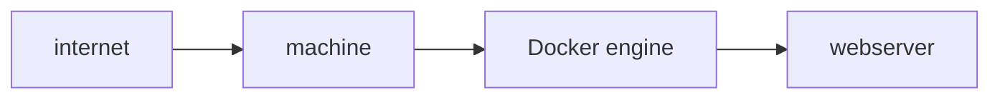
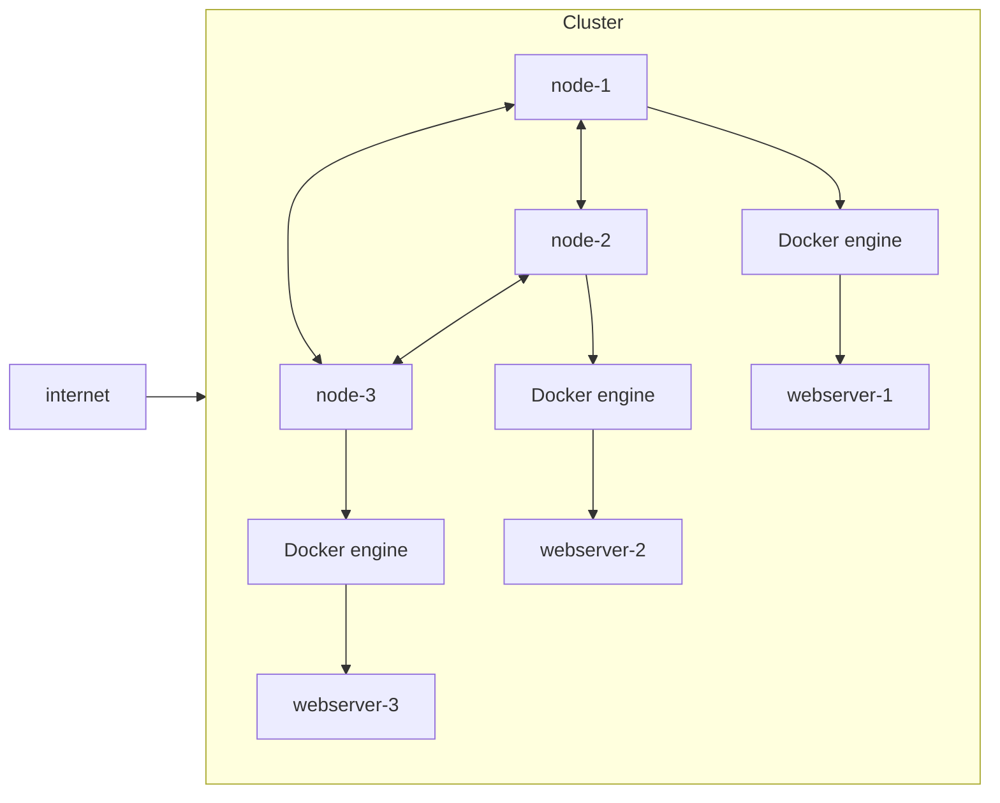
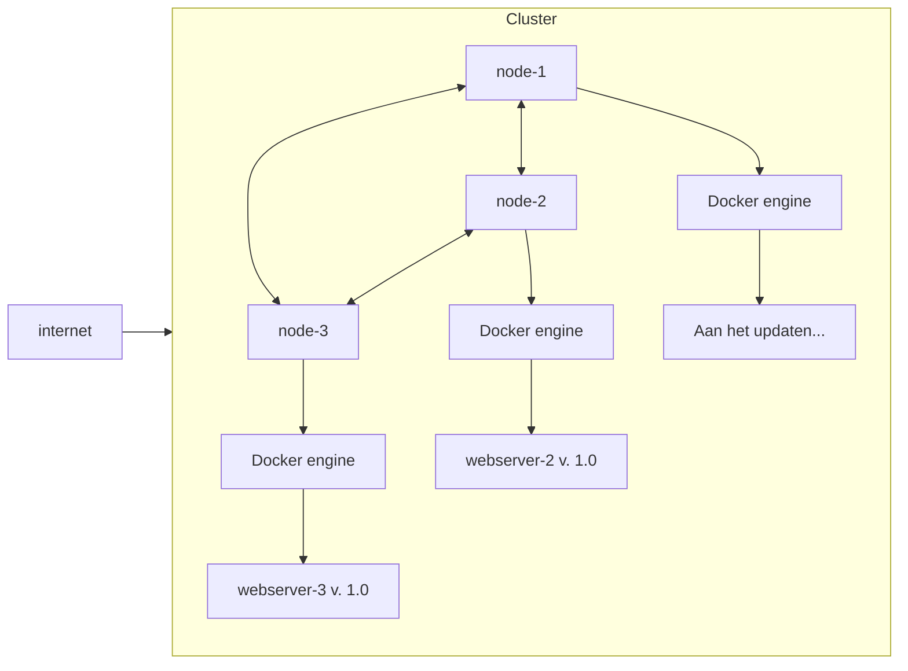
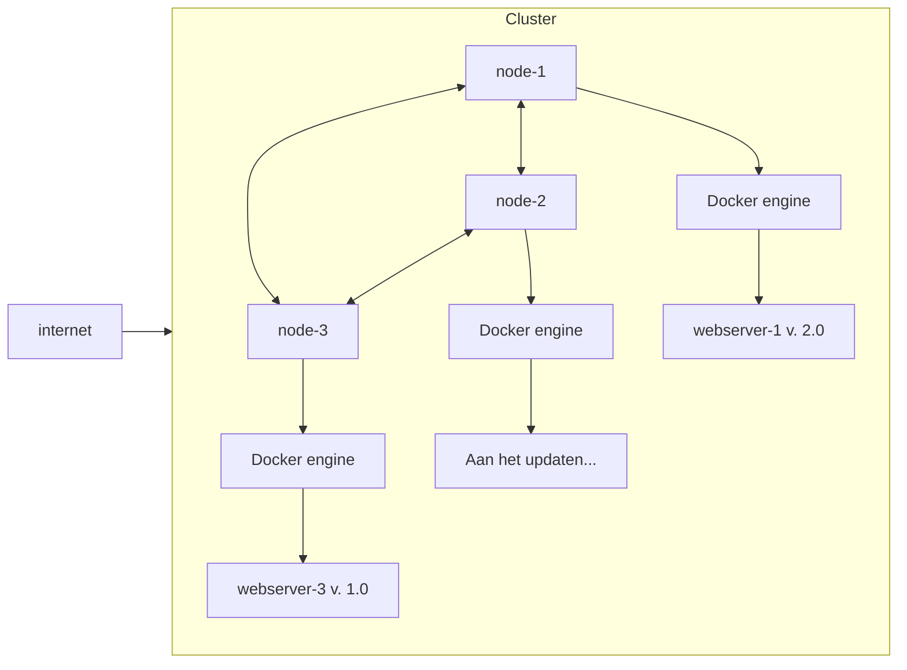
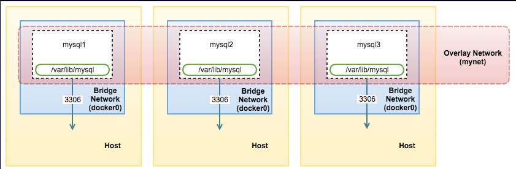
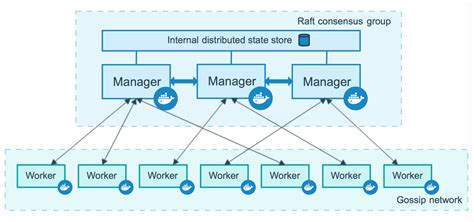

# 1. Multi-host orchestration
### 1. Wat is multi-host orchestration?
We hebben ondertussen al gezien dat we een webserver kunnen opzetten in een Docker-container, op een machine.
Het nadeel hierval is dat we een single point of failure hebben: als die ene machine uitvalt, is onze webserver niet meer bereikbaar.

Om dit op te lossen, kunnen we gebruik maken van meerdere machines waarop we onze containers kunnen draaien. Hierbij worden kopieën van de webserver verspreid over meerdere machines en worden deze kopieën beheerd (georchestreerd) door een tool zoals Docker Swarm of Kubernetes. Dit zorgt ervoor dat als één machine uitvalt, de andere machines nog steeds de webserver kunnen blijven draaien, waardoor de beschikbaarheid van onze dienst toeneemt.

Dit geeft ons ook de mogelijkheid om onze webserver te schalen. Als we meer verkeer verwachten, kunnen we eenvoudigweg meer containers op verschillende machines draaien, zonder dat we ons zorgen hoeven te maken over de onderliggende infrastructuur.

### 2. Rolling updates
Een ander voordeel van multi-host orchestration is dat we rolling updates kunnen uitvoeren. Dit wilt zeggen dat we onze webserver geleidelijk kunnen updaten en slechts een deel van de containers tegelijk bijwerken. Hierdoor blijft onze webserver altijd beschikbaar zelfs tijdens een update.

Wanneer de update van de eerste container succesvol is, kunnen we doorgaan met het updaten van de volgende container, en zo verder totdat alle containers zijn bijgewerkt. Dit minimaliseert de downtime en zorgt ervoor dat onze webserver altijd bereikbaar blijft voor gebruikers.

### 3. Docker Swarm Mode
Docker Swarm is een native clustering en scheduling tool voor Docker containers. We gebruiken dit om onze containers te orchestreren over meerdere machines. Het is sterk gelijkend op Docker Compose, maar dan met extra functionaliteiten voor clustering en schaalbaarheid.

### 4. De "Swarm"
In Docker Swarm noemen we de groep van machines die samenwerken een "swarm". Een swarm bestaat uit meerdere nodes waarbij elke node een machine is waarop Docker draait. Deze verschillende containers zijn verbonden via een Docker overlay netwerk, waardoor ze met elkaar kunnen communiceren alsof ze op dezelfde machine draaien.



### 5. Managers en Workers
Binnen een Docker Swarm zijn er twee soorten nodes:
managers en workers. Managers zijn verantwoordelijk voor het beheren van de swarm, het opzetten van services en het toewijzen van deze services aan de worker nodes.
Worker nodes voeren de toegewezen taken uit, zoals het draaien van containers.



Binnen de managers is er ook nog een onderscheid tussen de "leader" en de "followers". De leader is verantwoordelijk voor het coördineren van de swarm en het nemen van beslissingen, terwijl de followers de instructies van de leader opvolgen. Als een manager node uitvalt dat een follower is, kan de leader gewoon doorgaan met het beheren van de swarm. Echter, als de leader uitvalt, dan wordt er automatisch een nieuwe leader gekozen uit de overgebleven managers, zodat de swarm operationeel blijft. Hierbij is het belangrijk dat een meerderheid van de managers (quorum) beschikbaar blijft om beslissingen te kunnen nemen.

Wanneer er meer dan de helft van de managers uitvalt, kan er geen quorum meer gevormd worden en kan de swarm dus niet langer beslissingen nemen. Hierdoor wordt de cluster read-only en kunnen er geen nieuwe services worden uitgerold of bestaande services worden aangepast totdat het quorum is hersteld.

###  6. De stack
In Docker Swarm gebruiken we het concept van een "stack" om een groep van services te definiëren die samen een applicatie vormen. Een stack kan meerdere services bevatten, zoals webservers, databases, en andere componenten die nodig zijn voor de werking van de applicatie. We defniëren een stack meestal in een `stack.yml` bestand, vergelijkbaar met een `docker-compose.yml` bestand. De stack zal dan worden uitgerold over de verschillende nodes in de swarm, waarbij Docker Swarm automatisch zorgt voor het toewijzen van de services aan de beschikbare nodes.

### 7. Vereiste poorten
Om een Docker Swarm cluster correct te laten functioneren, moeten bepaalde poorten openstaan. Hier is een overzicht van de belangrijkste poorten die gebruikt worden:
| Poort | Protocol | Beschrijving |
|-------|----------|--------------|
| 2377  | TCP      | Gebruikt voor communicatie tussen manager nodes in de swarm. |
| 7946  | TCP/UDP  | Gebruikt voor communicatie tussen alle nodes in de swarm (managers en workers). |
| 4789  | UDP      | Gebruikt voor het Docker overlay netwerk, waardoor containers op verschillende nodes met elkaar kunnen communiceren. |

Deze poorten worden ook gebruikt om de "liveness" en "health" van de nodes te controleren, zodat de swarm weet welke nodes en containers beschikbaar zijn en of deze moeten worden herstart of verplaatst.
Daarnaast moeten ook de applicatie-specifieke poorten openstaan. Dit blijft hetzelfde zoals bij een enkele Docker host, maar nu moeten deze poorten op alle nodes in de Swarm openstaan, zodat de services bereikbaar zijn vanaf het netwerk.

:::info[Cloudproviders]
Bij het opzetten van een Docker Swarm cluster in een cloudomgeving, zoals AWS, Azure, Hetzner of Google Cloud, kan het zijn dat het niet voldoende is om enkel de firewall op de machine zelf te configureren. Vaak moet je ook de netwerkbeveiligingsgroepen of firewallregels binnen de cloudprovider zelf aanpassen om ervoor te zorgen dat de benodigde poorten openstaan voor communicatie tussen de nodes in de swarm.
:::

### 8. Configs en secrets
We hebben eerder bij Docker Compose al gezien dat we gebruik kunnen maken van environment variables om gevoelige informatie, zoals wachtwoorden door te geven aan onze containers. Dit was al een verbetering ten opzichte van het hard-coderen van deze informatie in onze docker-compose.yml bestanden, maar het heeft nog steeds enkele nadelen. Zo kunnen environment variables nog steeds worden uitgelezen door iedereen die toegang heeft tot de container, wat een beveiligingsrisico kan vormen.

In Docker Swarm hebben we daarom het concept van "configs" en "secrets". Configs zijn bedoeld voor het beheren van niet-gevoelige configuratiegegevens, zoals configuratiebestanden of instellingen die door de applicatie worden gebruikt. Secrets daarentegen zijn specifiek ontworpen voor het veilig opslaan en beheren van gevoelige informatie, zoals wachtwoorden, API-sleutels of certificaten.

Secrets worden versleuteld opgeslagen en ze zijn enkel toegankelijk voor de containers die expliciet toestemming hebben om ze te gebruiken. Dit betekent dat zelfs als iemand toegang krijgt tot de hostmachine of de container, ze nog steeds geen toegang hebben tot de secrets tenzij ze daarvoor gemachtigd zijn.
Dit verlaagt ook het risico dat gevoelige informatie per ongeluk in versiebeheer terecht komt, zoals bij een docker-compose.yml bestand.

Updates aan secrets en configs gebeuren wanneer een service wordt herstart of opnieuw wordt uitgerold. Dit betekent dat als je een secret of config bijwerkt, je de bijbehorende service moet herstarten om de wijzigingen door te voeren. Indien je dit niet wilt, kan je gebruik maken van een externe data-store of een secrets manager zoals HashiCorp Vault, AWS Secrets Manager of Azure Key Vault om gevoelige informatie te beheren zonder dat je de services hoeft te herstarten. Dit moet dan wel op applicatieniveau worden afgehandeld.

Configs kunnen ook gebruikt worden als een read-only volume, maar beperkt tot 500KB. Om een configuratie te maken zonder YAML, kan je het volgende commando gebruiken:
```bash
echo "indexpagina!" | docker config create example-config -
docker service create \
    --name apackewebserver
    --p 80:80 \
    --config src=example-config, target=/usr/local/apache2/htdocs/index.html \
    httpd:alpine
```
In dit voorbeeld maken we een simpele config aan met de tekst "indexpagina!" en gebruiken we deze als de indexpagina voor een Apache webserver. Dit kan ook perfect met een yaml bestand. Hieronder hebben we een voorbeeld van hoe we een MongoDB service kunnen opzetten met behulp van secrets voor de root username en password.
```yml
services:
    mongo:
        image: mongo:latest
        environment:
            MONGO_INITDB_ROOT_USERNAME_FILE: /run/secrets/mongo_user
            MONGO_INITDB_ROOT_PASSWORD_FILE: /run/secrets/mongo_password
        secrets:
            - mongo_user
            - mongo_password
        deploy:
            restart_policy:
                condition: any
secrets:
    mongo_user:
        external: true
    mongo_password:
        external: true
```
In dit voorbeeld gebruiken we de `_FILE` varianten van de MongoDB environment variables om alle waarden uit bestanden te lezen die door Docker Swarm worden beheerd als secrets. Merk op dat we hier `external: true` gebruiken, wat betekent dat deze secrets al bestaan in de swarm en niet door deze stack worden aangemaakt. We kunnen deze secrets aanmaken met de volgende commando's:
```bash
echo "adminuser" | docker secret create mongo_user -
echo "supersecurepassword" | docker secret create mongo_password -
```
De `-` aan het einde van het commando geeft aan dat de input van stdin komt, in dit geval is dat de output van het `echo` commando. We kunnen hier ook een bestand geven in plaats van stdin:
```bash
docker secret create mongo_user ./mongo_user.txt
docker secret create mongo_password ./mongo_password.txt
```


:::info[Secrets in Docker Compose]
Je zal misschien denken dat je ook secrets kan gebruiken in Docker Compose, zonder Docker Swarm, en dat klopt gedeeltelijk. Docker Compose biedt de volgende syntax voor secrets:
```yaml
services:
    app:
        image: myapp
        secrets:
            - db_password

secrets:
    db_password:
        file: ./db_password.txt
```
Echter, zoals je al merkt, is dit enkel mogelijk om te gebruiken met een bind-mount, waarbij het bestand `db_password.txt` op de hostmachine moet staan. Dit betekent dat de secret nog steeds toegankelijk is voor iedereen die toegang heeft tot de hostmachine.

In Docker Swarm daarentegen, worden secrets veilig opgeslagen in de swarm en zijn ze alleen toegankelijk voor de containers die expliciet toestemming hebben om ze te gebruiken.
:::


### 9. Constraints
In Docker Swarm kunnen we gebruik maken van "constraints" om te bepalen op welke nodes bepaalde services moeten draaien. Zo kunnen we bijvoorbeeld ervoor zorgen dat een database-service alleen op nodes met voldoende geheugen draait, of dat een webserver-service alleen op nodes in een specifieke geografische locatie wordt uitgevoerd. We kunnen ook een role constraint gebruiken om ervoor te zorgen dat bepaalde services alleen op manager nodes of worker nodes draaien.
```yaml
services:
    web:
        image: nginx:latest
        deploy:
            placement:
                constraints:
                    - node.role == worker
    db:
        image: postgres:latest
        deploy:
            placement:
                constraints:
                    - node.labels.db == true
```
In dit voorbeeld hebben we een webservice die alleen op worker nodes draait en een database-service die alleen op nodes met het label `db=true` wordt uitgevoerd. We kunnen labels toevoegen aan nodes met het volgende commando:
```bash
docker node update --label-add db=true <node-id>
```
