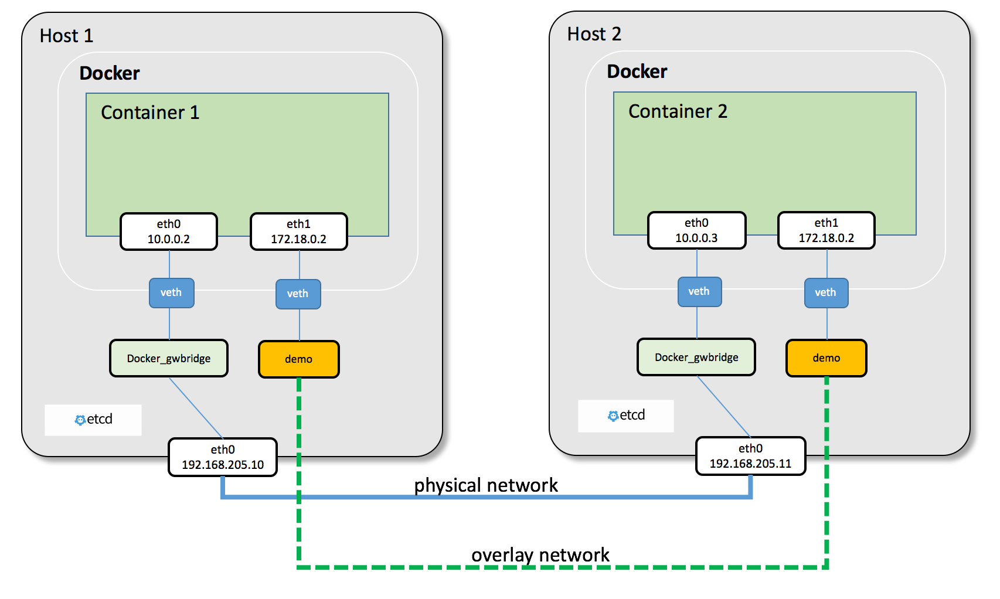

# 2. Vervolg Docker Swarm

In dit hoofdstuk gaan we dieper in op enkele geavanceerdere concepten en functies van Docker Swarm, zoals de control plane en data plane, reconciliation, netwerken, locking, node labels, volumes, distributed storage en global services. We zullen deze concepten uitleggen aan de hand van voorbeelden en analogieën om een beter begrip te krijgen van hoe Docker Swarm werkt en hoe we het kunnen gebruiken om onze applicaties te beheren en schalen in een multi-host omgeving.
### 1. Control plane en data plane
In Docker Swarm is er een onderscheid tussen de control plane en de data plane. Dit zijn twee logische lagen, die samenwerken om de werking van de swarm te coördineren en te beheren.

Je kan het vergelijken met een luchthaven. De control plane is de toren van de luchthaven, waar de luchtverkeersleiders werken. Zij coördineren het verkeer, geven instructies aan de piloten en zorgen ervoor dat alles soepel verloopt. De data plane zijn de piloten en de vliegtuigen zelf. Zij voeren de instructies van de luchtverkeersleiders uit en zorgen ervoor dat de passagiers veilig op hun bestemming aankomen.

In Docker Swarm is de control plane verantwoordelijk voor het beheren van de swarm, het plannen van taken, het monitoren van de status van services en het coördineren van updates. De data plane is verantwoordelijk voor het uitvoeren van de taken die door de control plane zijn gepland, zoals het starten en stoppen van de containers die de services vormen en het uitvoeren van de applicaties binnen die containers.


### 2. Reconciliation
Eén van de taken van de control plane is het monitoren van de status van de services. Als de container die een service vormt om welke reden dan ook stopt of crasht, zal de control plane dit detecteren en automatisch een nieuwe container starten om de service weer in de gewenste staat te brengen. Dit proces wordt reconciliation genoemd.

We zien dit wanneer we een service schalen en bij het commando `docker service ls` zien we dat er bijvoorbeeld `3/4` staat bij de replica's. Dit betekent dat er 3 containers draaien, maar dat er nog 1 container is die nog niet is gestart. De control plane zal blijven proberen om die laatste container te starten totdat deze succesvol draait, waardoor de service uiteindelijk weer in de gewenste staat komt.


### 3. Netwerken
In Docker Swarm kunnen we ook gebruik maken van netwerken om communicatie tussen containers mogelijk te maken. In Docker Compose hebben we gezien dat we Docker netwerken kunnen definiëren en gebruiken, en dit geldt ook voor Docker Swarm. 

Een normaal Docker netwerk maakt gebruik van een virtuele switch op de host machine, waardoor de containers die op dezelfde host draaien met elkaar kunnen communiceren. In Docker Swarm kunnen we echter ook gebruik maken van een overlay netwerk, dat een virtueel netwerk creërt dat zich uitstrekt over meerdere hosts in de swarm. Hierbij wordt er gebruik gemaakt van tunneling om communicatie tussen containers op verschillende hosts mogelijk te maken. 

Het overlay netwerk zorgt ervoor dat containers die zich op verschillende hosts bevinden toch met elkaar kunnen communiceren alsof ze zich op dezelfde host bevinden.

Elke node heeft ook een speciaal netwerk genaamd het 'ingress' netwerk, dat wordt gebruikt voor het routeren van verkeer naar services die zijn geconfigureerd met een 'published port'. Zoals we in het vorige hoofdstuk hebben gezien, maakt Docker Swarm gebruik van een load balancer om inkomend verkeer naar de juiste container te routeren. Om dit mogelijk te maken, maakt Docker Swarm dus gebruik van het ingress netwerk. 


### 4. Locking
Docker Swarm maakt gebruik van Raft (een consensus algoritme) om te zorgen dat de staat van de swarm consistent en betrouwbaar blijft. Dit algoritme genereert ook logs van alle wijzigingen die worden aangepast in de swarm, zoals het toevoegen of verwijderen van nodes, het starten of stoppen van services, enzovoort. 

Deze logs worden standaard versleuteld opgeslagen (encrypted at rest) op de manager-nodes. Echter, zonder aanvullende configuratie wordt de bijbehorende encryptiesleutel ook onversleuteld op diezelfde schijf bewaard. Hierdoor kan de Docker-daemon bij een herstart de logs automatisch laden. Ook nieuwe nodes krijgen hun sleutel veilig via een mutual TLS (mTLS) verbinding wanneer ze zich bij de swarm voegen.

Het beveiligingsrisico ontstaat wanneer een aanvaller een kopie van de schijf van een manager-node maakt. Omdat de decryptiesleutel op de schijf staat, kan de aanvaller een kopie van deze node opstarten. De node zal zichzelf automatisch ontsleutelen, waardoor de aanvaller volledige controle krijgt over de swarm, inclusief toegang tot alle secrets en containers.

Om dit te voorkomen, kunnen we Autolock inschakelen. Dit voegt een extra beveiligingslaag toe door de lokale encryptiesleutels zelf weer te versleutelen met een aparte unlock key. Wanneer een manager-node herstart, zal de swarm niet automatisch actief worden. In plaats daarvan verschijnt er een foutmelding dat de swarm "locked" is. De beheerder moet dan handmatig de sleutel invoeren om de node toegang te geven tot de logs en de rest van de swarm.

Om de lock in te stellen, kunnen we het volgende commando gebruiken:
```bash
docker swarm update --autolock=true
```
Om de lock te ontgrendelen, kunnen we het volgende commando gebruiken:
```bash
docker swarm unlock
```
Hierbij zal er worden gevraagd om de unlock key, die we hebben gekregen toen we de lock hebben ingesteld. Het is belangrijk om deze unlock key veilig te bewaren, omdat deze nodig is om toegang te krijgen tot de swarm in geval van een herstart of een andere situatie waarbij de swarm is locked.
:::warning[Opgelet]
Locking beschermt specifiek tegen diefstal van data op de schijf (data-at-rest). Als een aanvaller echter toegang krijgt tot de actieve shell van een reeds ontgrendelde manager-node, kan deze alsnog de unlock-key roteren of de swarm manipuleren. Locking is dus een krachtige aanvulling, maar geen vervanging voor goede server-harding.
:::

### 5. node labels
We hebben gezien dat we constraints kunnen gebruiken om te bepalen op welke nodes een service mag draaien, maar momenteel hebben we enkel een onderscheid tussen manager- en worker-nodes. Soms willen we echter meer specifieke criteria gebruiken, zoals het besturingssysteem, de locatie of de hardwarecapaciteiten van een node. Hiervoor kunnen we gebruik maken van labels.

Labels zijn key-value paren die we kunnen toewijzen aan nodes in de swarm. We kunnen deze labels vervolgens gebruiken in onze service-definities om te specificeren dat een service alleen op nodes met bepaalde labels mag draaien. Bijvoorbeeld we hebben het label `os=linux`
```bash
docker node update --label-add os=linux node1
```
En vervolgens kunnen we dit label gebruiken in onze service-definitie:
```bash
docker service create --constraint 'node.labels.os == linux' --name mydb postgres:latest
```
In dit voorbeeld maken we een postgres database service aan en geven we aan dat deze alleen mag draaien op nodes die het label `os=linux` hebben.

:::info[info]
We hebben dit concept van labels ook al gezien bij traefik, waar we labels gebruiken om aan te geven dat een container op een bepaalde manier moet gerouteerd worden. Dat waren container labels. Traefik kon ze opvragen via het Docker Socket (`/var/run/docker.sock`) en gebruiken om de routingregels te bepalen. Node labels zijn vergelijkbaar, maar worden gebruikt om te bepalen op welke nodes een service mag draaien, in plaats van hoe verkeer naar die service wordt gerouteerd.
:::

### 6. Volumes
In Docker compose hebben we gezien dat we volumes kunnen gebruiken om data persistent op te slaan. Bij Docker Swarm kunnen we dit ook doen, maar standaard zijn dit zogenaamde 'node-local' volumes. Dat betekent dat de volumes alleen toegankelijk zijn voor containers die op dezelfde node draaien. Wanneer een service dus wordt geschaald over meerdere nodes, kunnen de containers op verschillende nodes geen toegang hebben tot dezelfde data, wat een probleem kan zijn voor stateful applicaties zoals databases.

We kunnen een volume koppelen bij het aanmaken van een service met `--mount`:
```bash
docker service create \
    --name mydb \
    --mount type=volume,source=mydbdata,target=/var/lib/postgresql/data \
    postgres:latest
```
In dit voorbeeld maken we een postgres database service aan en kopppelen we een volume genaamd `mydbdata` aan de data directory van postgres. Zoals eerder vermeld is dit volume echter alleen toegankelijk voor containers die op dezelfde node draaien als het volume, wat betekent dat als we deze service schalen over meerdere nodes, elke container zijn eigen lokale volume zal hebben en geen toegang zal hebben tot de data van de andere containers.

### 7. Distributed storage
Om het probleem van node-local volumes op te lossen, kunnen we gebruik maken van een distributed storage oplossing zoals NFS, GlusterFS of Ceph. Deze oplossingen maken het mogelijk om een gedeeld volume te creëren dat toegankelijk is voor containers op verschillende nodes in de swarm. Hierdoor kunnen stateful applicaties zoals databases nog steeds profiteren van de voordelen van multi-host orchestration zonder zich zorgen te hoeven maken over data consistentie of beschikbaarheid.

De exacte werking hierachter behandelen we niet

### 8. Global services
Tot nu toe hebben we alleen services gezien die worden geschaald over meerdere nodes, waarbij we het aantal replica's hebben gespecificeerd. Maar stel nu dat we een service willen hebben die op elke node in de swarm draait, ongeacht het aantal nodes? Hiervoor kunnen we gebruik maken van global services.
```bash
docker service create --mode global --name prometheus prom/prometheus:latest
```
In dit voorbeeld maken we een service aan die in global mode draait, wat betekent dat er automatisch een replica van deze service wordt gestart op elke node in de swarm. Dit is handig voor services die we op elke node willen hebben, zoals monitoring agents, log collectors of andere infrastructuurcomponenten die dicht bij de host moeten draaien.

Mocht je een service willen die slechts één keer per node draait, moet je dit niet met `global` oplossen. Hiervoor bestaat namelijk een andere optie: `--replicas-max-per-node`. Hiermee kun je aangeven dat er maximaal één replica van een service per node mag draaien, maar dat het totale aantal replica's nog steeds kan worden geschaald op basis van het aantal nodes in de swarm.
```bash
docker service create --replicas-max-per-node 1 --name nginx nginx:latest
```

:::warning[Belangrijk]
Wanneer je `global` gebruikt, zal Docker Swarm `replicas` negeren. Het aantal replica's wordt automatisch bepaald door het aantal nodes in de swarm. Als je een service in global mode hebt en je voegt een nieuwe node toe aan de swarm, zal Docker Swarm automatisch een nieuwe replica van die service starten op die nieuwe node. Omgekeerd, als je een node verwijdert, zal de replica op die node automatisch worden verwijderd.
:::
