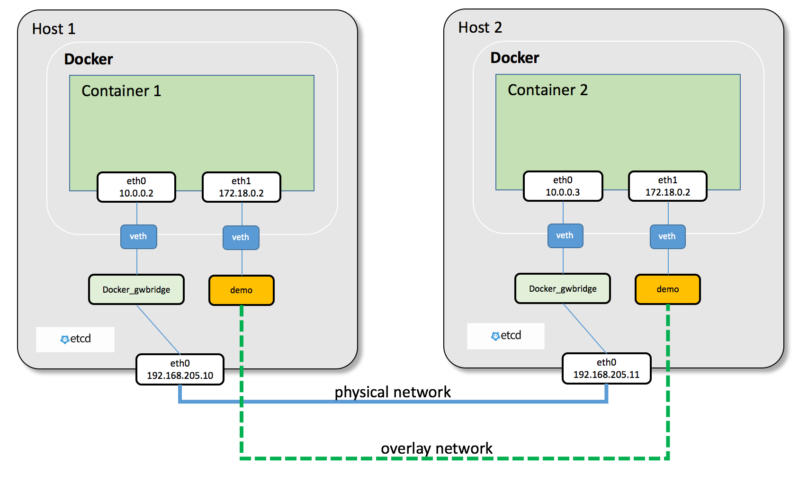
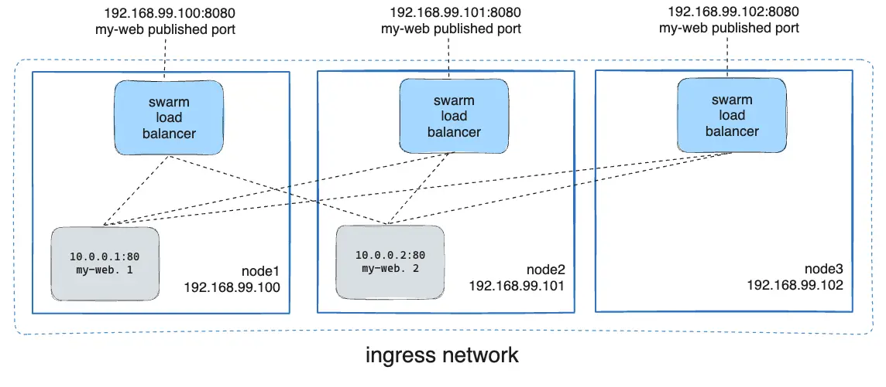

# 2. Vervolg Docker Swarm

In dit hoofdstuk gaan we dieper in op enkele geavanceerdere concepten en functies van Docker Swarm, zoals de control plane en data plane, reconciliation, netwerken, locking, node labels, volumes, distributed storage en global services. We zullen deze concepten uitleggen aan de hand van voorbeelden en analogieën om een beter begrip te krijgen van hoe Docker Swarm werkt en hoe we het kunnen gebruiken om onze applicaties te beheren en schalen in een multi-host omgeving.
### 1. Control plane en data plane
In Docker Swarm is er een onderscheid tussen de control plane en de data plane. Dit zijn twee logische lagen, die samenwerken om de werking van de swarm te coördineren en te beheren.

Je kan het vergelijken met een luchthaven. De control plane is de toren van de luchthaven, waar de luchtverkeersleiders werken. Zij coördineren het verkeer, geven instructies aan de piloten en zorgen ervoor dat alles soepel verloopt. De data plane zijn de piloten en de vliegtuigen zelf. Zij voeren de instructies van de luchtverkeersleiders uit en zorgen ervoor dat de passagiers veilig op hun bestemming aankomen.

In Docker Swarm is de control plane verantwoordelijk voor het beheren van de swarm, het plannen van taken, het monitoren van de status van services en het coördineren van updates. De data plane is verantwoordelijk voor het uitvoeren van de taken die door de control plane zijn gepland, zoals het starten en stoppen van de containers die de services vormen en het uitvoeren van de applicaties binnen die containers.


### 2. Reconciliation
Eén van de taken van de control plane is het monitoren van de status van de services. Als de container die een service vormt om welke reden dan ook stopt of crasht, zal de control plane dit detecteren en automatisch een nieuwe container starten om de service weer in de gewenste staat te brengen. Dit proces wordt reconciliation genoemd.

We zien dit wanneer we een service schalen en bij het commando `docker service ls` zien we dat er bijvoorbeeld `3/4` staat bij de replica's. Dit betekent dat er 3 containers draaien, maar dat er nog 1 container is die nog niet is gestart. De control plane zal blijven proberen om die laatste container te starten totdat deze succesvol draait, waardoor de service uiteindelijk weer in de gewenste staat komt.


### 3. Netwerken
Docker containers maken gebruik van een zogenaamd docker netwerk om met elkaar te communiceren. Dit hebben we reeds gezien bij Docker Compose. Hierbij wordt er een virtuele switch gecreëerd op de host machine, waardoor de containers die op dezelfde host draaien, en in hetzelfde netwerk zitten, met elkaar kunnen communiceren zonder dat er poorten naar buiten toe hoeven te worden geopend. 

Met Docker Swarm kunnen we dit ook doen maar er komt een moeilijkheid bij kijken: wat als de container waarmee we willen communiceren zich op een andere host bevindt? In een normaal Docker netwerk kunnen containers alleen communiceren als ze zich op dezelfde host bevinden. Docker Swarm biedt hier de oplossing voor in de vorm van overlay netwerken. 

Een overlay netwerk kan je beschouwen als een virtuele switch die verbonden wordt over meerdere hosts. Het is alsof je een kabel trekt tussen de hosts, waardoor de containers op verschillende hosts kunnen communiceren alsof ze zich op dezelfde host bevinden. Om dit mogelijk te maken maakt Docker Swarm gebruik van tunnel-technologie.



Elke host in een swarm is ook lid van één speciaal overlay netwerk genaamd "ingress". Docker Swarm maakt namelijk gebruik van een zogenaamde routing mesh om verkeer naar services te routeren. Stel dat we een service hebben (bijvoorbeeld nginx) waarvan 3 replica's verspreid zijn over 3 verschillende hosts. We kunnen nu zorgen dat we deze service kunnen bereiken, door de poort te publiceren op elke host. Dit is gelijkaardig aan hoe we dit deden bij Docker Compose. Wanneer we nu een request sturen naar het ip-adres van één van de hosts, wordt deze niet alleen naar de container op die host gestuurd, maar kan deze ook worden doorgestuurd naar één van de andere replica's op de andere hosts. Zelfs als we geen replica van de service hebben draaien op de host waar we het request naartoe sturen, zal Docker Swarm automatisch het verkeer over het overlay netwerk routeren naar een host waar wel een replica van de service draait.


:::warning[Belangrijk]
Het ingress netwerk wordt alleen gebruik voor het routeren van verkeer naar services die poorten hebben gepubliceerd. Dit netwerk wordt niet gebruikt voor container-to-container communicatie binnen dezelfde service. Als we bijvoorbeeld een service hebben met 3 replica's, kunnen deze replica's direct met elkaar communiceren via het overlay netwerk, zonder dat het verkeer eerst naar het ingress netwerk hoeft te worden gestuurd. Het ingress netwerk is specifiek bedoeld voor het routeren van verkeer van buiten de swarm naar de services binnen de swarm.
:::
### 4. Locking
Docker Swarm bewaart de volledige staat van de swarm, inclusief alle secrets en serviceconfiguraties, in versleutelde Raft-logs op elke manager-node. Dit is ook precies de reden waarom Autolock werd geïntroduceerd: ter ondersteuning van de Docker secrets-functionaliteit.

Wanneer Docker herstart worden er twee sleutels vanuit de schijf in het geheugen geladen: de sleutel om de Raft-logs te ontsleutelen, en de TLS-sleutel voor beveiligde communicatie tussen nodes. Zonder aanvullende configuratie worden beide sleutels onversleuteld op de schijf bewaard.

Dit brengt twee concrete beveiligingsrisico's met zich mee. Ten eerste, een aanvaller die een kopie van de schijf van een manager-node maakt, kan de Raft-logs ontsleutelen en zo alle secrets en serviceconfiguraties uitlezen. Ten tweede, met de gestolen TLS-sleutel kan diezelfde aanvaller een manager-node nabootsen en zo deelnemen aan de swarm alsof hij een legitieme manager is.

Om dit te voorkomen, kunnen we Autolock inschakelen. Dit voegt een extra beveiligingslaag toe door de lokale encryptiesleutels zelf weer te versleutelen met een aparte unlock key. Wanneer een manager-node herstart, zal de swarm niet automatisch actief worden. In plaats daarvan verschijnt er een foutmelding dat de swarm "locked" is. De beheerder moet dan handmatig de sleutel invoeren om de node toegang te geven tot de logs en de rest van de swarm.

Om de lock in te stellen, kunnen we het volgende commando gebruiken:
```bash
docker swarm update --autolock=true
```
Om de lock te ontgrendelen, kunnen we het volgende commando gebruiken:
```bash
docker swarm unlock
```
Hierbij zal er worden gevraagd om de unlock key, die we hebben gekregen toen we de lock hebben ingesteld. Het is belangrijk om deze unlock key veilig te bewaren, omdat deze nodig is om toegang te krijgen tot de swarm in geval van een herstart of een andere situatie waarbij de swarm is locked.
:::warning[Opgelet]
Locking beschermt specifiek tegen diefstal van data op de schijf (data-at-rest). Als een aanvaller echter toegang krijgt tot de actieve shell van een reeds ontgrendelde manager-node, kan deze alsnog de unlock-key roteren of de swarm manipuleren. Locking is dus een krachtige aanvulling, maar geen vervanging voor goede server-harding.
:::

### 5. Node labels
We hebben gezien dat we constraints kunnen gebruiken om te bepalen op welke nodes een service mag draaien, maar momenteel hebben we enkel een onderscheid tussen manager- en worker-nodes. Soms willen we echter meer specifieke criteria gebruiken, zoals het besturingssysteem, de locatie of de hardwarecapaciteiten van een node. Hiervoor kunnen we gebruik maken van labels.

Labels zijn key-value paren die we kunnen toewijzen aan nodes in de swarm. We kunnen deze labels vervolgens gebruiken in onze service-definities om te specificeren dat een service alleen op nodes met bepaalde labels mag draaien. Stel bijvoorbeeld dat we het label `os=linux` willen gebruiken:
```bash
docker node update --label-add os=linux node1
```
En vervolgens kunnen we dit label gebruiken in onze service-definitie:
```bash
docker service create --constraint 'node.labels.os == linux' --name mydb postgres:latest
```
In dit voorbeeld maken we een postgres database service aan en geven we aan dat deze alleen mag draaien op nodes die het label `os=linux` hebben.

:::info[info]
We hebben dit concept van labels ook al gezien bij traefik, waar we labels gebruiken om aan te geven dat een container op een bepaalde manier moet gerouteerd worden. Dat waren container labels. Traefik kon ze opvragen via het Docker Socket (`/var/run/docker.sock`) en gebruiken om de routingregels te bepalen. Node labels zijn vergelijkbaar, maar worden gebruikt om te bepalen op welke nodes een service mag draaien, in plaats van hoe verkeer naar die service wordt gerouteerd.
:::

### 6. Volumes
In Docker compose hebben we gezien dat we volumes kunnen gebruiken om data persistent op te slaan. Bij Docker Swarm kunnen we dit ook doen, maar standaard zijn dit zogenaamde 'node-local' volumes. Dat betekent dat de volumes alleen toegankelijk zijn voor containers die op dezelfde node draaien. Wanneer een service dus wordt geschaald over meerdere nodes, kunnen de containers op verschillende nodes geen toegang hebben tot dezelfde data, wat een probleem kan zijn voor stateful applicaties zoals databases.

We kunnen een volume koppelen bij het aanmaken van een service met `--mount`:
```bash
docker service create \
    --name mydb \
    --mount type=volume,source=mydbdata,target=/var/lib/postgresql/data \
    postgres:latest
```
In dit voorbeeld maken we een postgres database service aan en koppelen we een volume genaamd `mydbdata` aan de data directory van postgres. Zoals eerder vermeld is dit volume echter alleen toegankelijk voor containers die op dezelfde node draaien als het volume, wat betekent dat als we deze service schalen over meerdere nodes, elke container zijn eigen lokale volume zal hebben en geen toegang zal hebben tot de data van de andere containers.

### 7. Distributed storage
Om het probleem van node-local volumes op te lossen, kunnen we gebruik maken van een distributed storage oplossing zoals NFS, GlusterFS of Ceph. Deze oplossingen maken het mogelijk om een gedeeld volume te creëren dat toegankelijk is voor containers op verschillende nodes in de swarm. Hierdoor kunnen stateful applicaties zoals databases nog steeds profiteren van de voordelen van multi-host orchestration zonder zich zorgen te hoeven maken over data consistentie of beschikbaarheid.

De exacte werking hierachter en hoe we dit opzetten bekijken we kort in het labo. Dit is echter niet iets wat we standaard in Docker Swarm nodig hebben.
### 8. Global services
Tot nu toe hebben we alleen services gezien die worden geschaald over meerdere nodes, waarbij we het aantal replica's hebben gespecificeerd. Maar stel nu dat we een service willen hebben die op elke node in de swarm draait, ongeacht het aantal nodes? Hiervoor kunnen we gebruik maken van global services.
```bash
docker service create --mode global --name prometheus prom/prometheus:latest
```
In dit voorbeeld maken we een service aan die in global mode draait, wat betekent dat er automatisch een replica van deze service wordt gestart op elke node in de swarm. Dit is handig voor services die we op elke node willen hebben, zoals monitoring agents, log collectors of andere infrastructuurcomponenten die dicht bij de host moeten draaien.

Mocht je een service willen die slechts één keer per node draait, moet je dit niet met `global` oplossen. Hiervoor bestaat namelijk een andere optie: `--replicas-max-per-node`. Hiermee kun je aangeven dat er maximaal één replica van een service per node mag draaien, maar dat het totale aantal replica's nog steeds kan worden geschaald op basis van het aantal nodes in de swarm.
```bash
docker service create --replicas-max-per-node 1 --name nginx nginx:latest
```

:::warning[Belangrijk]
Wanneer je `global` gebruikt, zal Docker Swarm `replicas` negeren. Het aantal replica's wordt automatisch bepaald door het aantal nodes in de swarm. Als je een service in global mode hebt en je voegt een nieuwe node toe aan de swarm, zal Docker Swarm automatisch een nieuwe replica van die service starten op die nieuwe node. Omgekeerd, als je een node verwijdert, zal de replica op die node automatisch worden verwijderd.
:::
