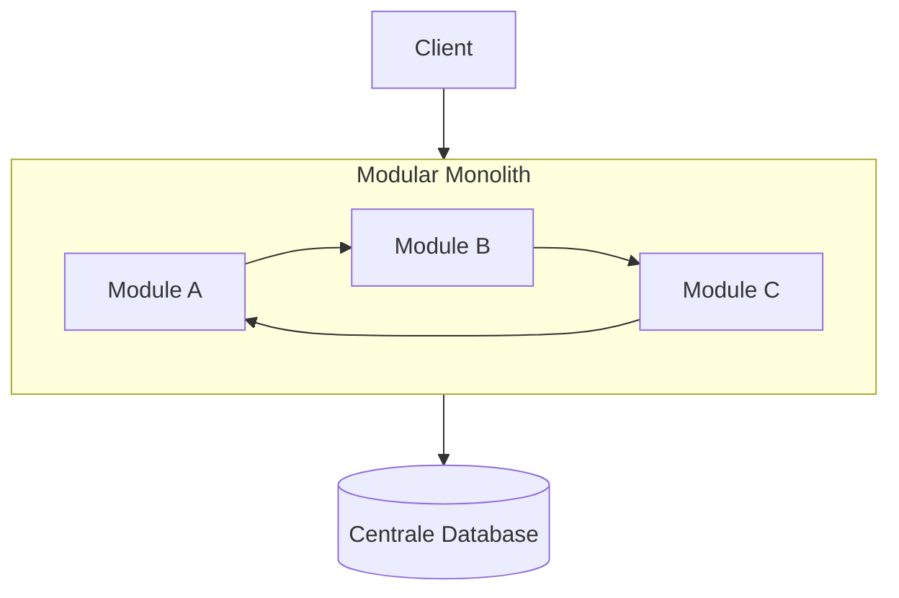
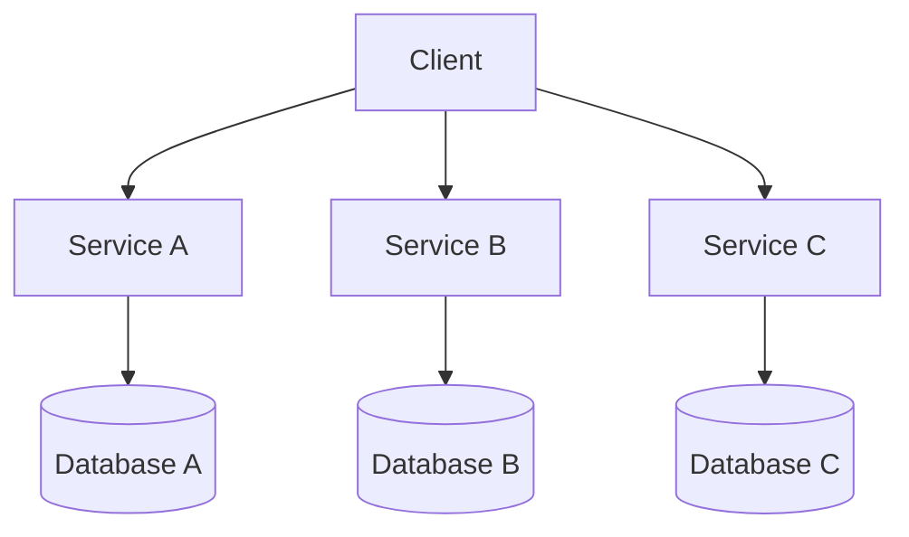
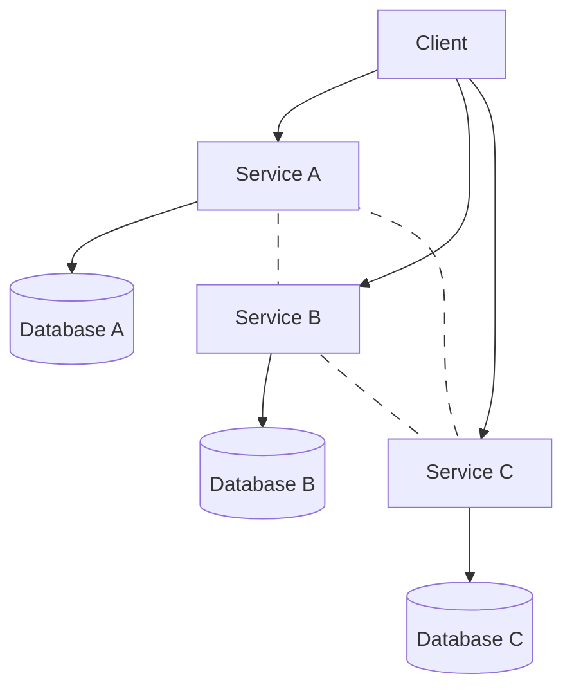
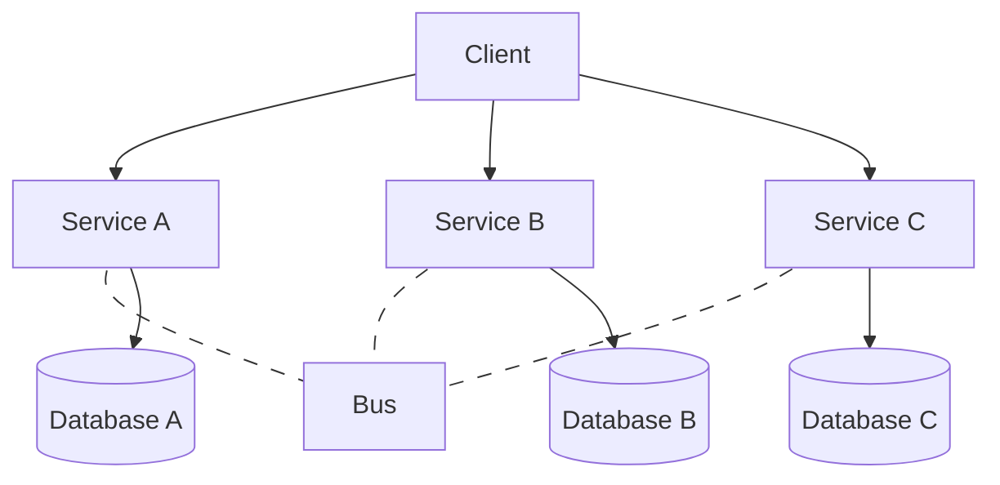
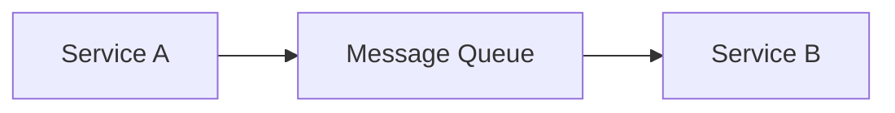
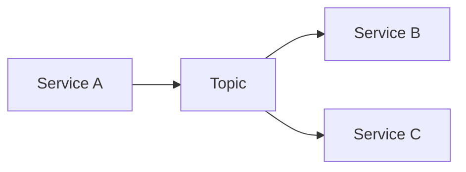
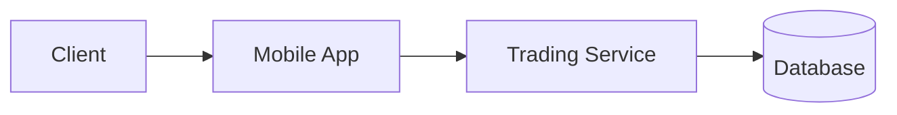
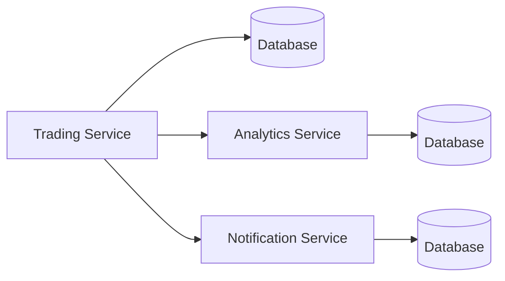
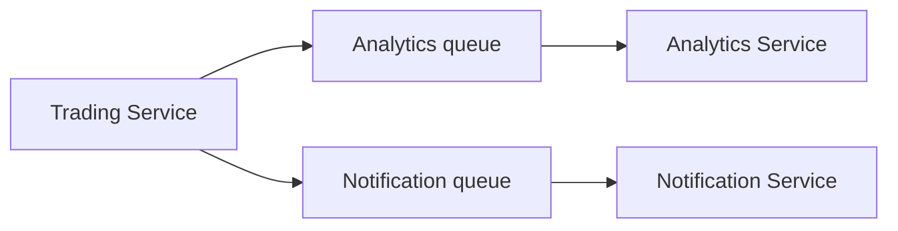
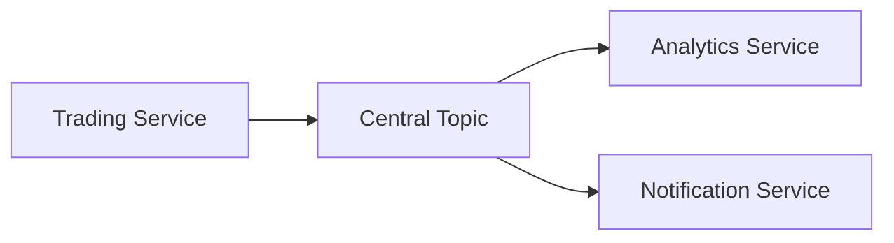

# 3. Software architectuur en message queues

In dit hoofdstuk gaan we kijken naar hoe software wordt opgebouwd en georganiseerd, hoe een softwarepakket schaalbaar kan worden gemaakt en welke rol message queues kunnen spelen in software architectuur.

### 1 Software architectuur
Software architectuur gaat niet over het schrijven van één specifiek programma, maar over het ontwerpen van een volledig systeem. Waar een developer zich op focust op code, focust de architect zich op het grotere plaatje: hoe worden onderdelen gedeployed, hoe communiceren ze en hoe blijft het systeem overeind onder zware druk.

:::info
Er wordt hier gesproken van een developer en een architect, maar in de praktijk kunnen deze rollen perfect door dezelfde persoon worden vervuld, zeker in kleinere teams.
:::

### 2. De 4 dimensies van software architectuur
Om een architectuur te begrijpen of te ontwerpen, kijken we naar vier dimensies:
#### Architecturale karakteristieken
Dit zijn de eigenschappen van een systeem. Er wordt vaak naar verwezen als de "ilities", zoals, scalability, reliability, maintainability, enz. Hierbij gaat het niet om wat een systeem doet, maar wel hoe het werkt en wat de niet functionele vereisten zijn.

#### Architecturale beslissingen
Dit zijn keuzes die gemaakt worden tijdens het ontwerpen van een systeem die een grote impact hebben op de architectuur. bijvoorbeeld: "We gebruiken altijd een SQL-database" of "Alle communicatie moet asynchroon zijn". Zulke beslissingen hebben een directe impact op hoe het systeem wordt gebouwd en onderhouden.

#### Logische componenten
Dit zijn de bouwstenen van een systeem. Zoals we bij de karakteristieken keken naar de niet-functionele vereisten, kijken we hier specifiek naar de functionele vereisten. Welke onderdelen heeft het systeem nodig om te functioneren en hoe kunnen die apart verdeeld worden? Denk hierbij aan "Gebruikersbeheer", "Betalingen", "Notificaties", enz.

### Archticturale stijlen
De architecturale stijl van een systeem is het algemeen bouwplan dat wordt gevolgd bij het ontwerpen van software.
Er zijn verschillende stijlen, zoals monolitisch (alles in één grote blok) en microservices (alles in kleine onafhankelijke services).

De keuze van de architecturale stijl wordt rechtstreeks bepaald door de architecturale karakteristieken en beslissingen. Bijvoorbeeld, als je een systeem wilt dat zeer schaalbaar is, zou je kunnen kiezen voor een microservices-architectuur. Aan de andere kant, als je een systeem wilt dat eenvoudig te onderhouden is, zou je kunnen kiezen voor een monolithische architectuur.

:::info
De termen "monolitisch" en "microservices" kunnen nog als onbekend klinken, maar hier gaan we verder dieper op in.
:::

### 3. Architectuur vs. Design
Architectuur en design zijn nauw verwant, maar ze zijn niet hetzelfde. We beschouwen de architectuur als een strategie. Deze wordt op voorhand bepaald en gaat over het ganse systeem. Het bepaalt ook de grenzen waarbinnen alles moet werken en elk stukje code moet zich aan deze regels houden.
De architecturale beslissingen vragen om veel werk en brengen significante trade-offs met zich mee. Elke keuze op dit niveau is een compromis; je ruilt bijvoorbeeld eenvoud in voor schaalbaarheid, of ontwikkelsnelheid voor robustheid.

Design daarentegen is meer tactisch. Het gaat over een specifiek onderdeel van het systeem. Het is meer flexibel en kan veranderen naarmate het systeem evolueert. Denk hierbij aan het ontwerp van een specifieke module of component binnen het grotere systeem. Omdat de designkeuzes lokaal blijven, vergen ze relatief weinig werk om aan te passen, naarmate de behoeften evolueren. De trade-offs bij design zijn minder ingrijpend omdat een verandering in één module meestal geen domino-effect heeft op de rest van het systeem, zolang de overkoepelende architecturale beslissingen worden gerespecteerd.

### 4. Greenfield vs. Brownfield
Bij het ontwerpen van software kunnen we te maken hebben met een "greenfield" omgeving of een "brownfield" omgeving. Een greenfield omgeving is een situatie waarin we een volledig nieuw systeem ontwerpen en bouwen, zonder rekening te houden met bestaande systemen of code. Dit geeft ons de vrijheid om de architectuur helemaal vanaf nul te bouwen, zonder beperkingen.

Aan de andere kant hebben we een brownfield omgeving, waarin we te maken hebben met bestaande systemen, code en infrastructuur. In dit geval moeten we rekening houden met de bestaande architectuur en beslissingen, en moeten we onze nieuwe ontwerpen aanpassen aan deze beperkingen. Dit kan het ontwerpproces complexer maken, omdat we niet zomaar kunnen kiezen voor de betere oplossing.

### 5. Casus - DigitAP
Laten we een voorbeeld nemen van een softwarepakket dat dagelijks gebruikt wordt: DigitAP, of ook wel moodle genoemd. 
| dimensie | toepassing |
| --- | --- |
| Architecturale karakteristieken | moet schaalbaar zijn voor duizenden studenten en het moet interoperabel zijn via standaarden zoals LTI. |
| Architecturale beslissingen | er wordt gebruik gemaakt van een SQL-database en de programmeertaal is PHP. Er wordt gebruik gemaakt van "PHP source files" voor de plugins. |
| Logische componenten | gebruikersbeheer, cursusbeheer, communicatie, notificaties, enz. |
| Architecturale stijl | modulair monolitisch. Er is één grote codebase, maar er zijn ook duidelijke modules en plugins die apart kunnen worden ontwikkeld en onderhouden. |

Aangezien DigitAP (moodle) al in ontwikkeling is sinds 2002, kunnen we stellen dat het een brownfield project is. Ondanks dat er ondertussen al veel interessantere architecturale stijlen zijn, zoals microservices of programmeertalen waarbij PHP niet meer de beste keuze is, kunnen we niet zomaar overstappen naar een nieuwe architectuur of programmeertaal. We moeten rekening houden met de bestaande codebase, de gebruikers en de ontwikkelaars die al vertrouwd zijn met de huidige architectuur.

### 6. non-domain design considerations
We maken ook een onderscheid tussen de functionele vereisten en de "non-domain design considerations". Om dit goed te begrijpen, moeten we eerst scherp stellen wat het domein precies is.

Kort gezegd is het domein het gebied of context waarin we software ontwikkelen. Stel dat we software ontwikkelen voor een bank, dan is het domein de financiële sector. De functionele vereisten zijn de specifieke functies en features die het systeem moet hebben om aan de behoeften van de gebruikers te voldoen. De "non-domain design considerations" zijn bijvoorbeeld veiligheid, prestaties, schaalbaarheid, enz. Deze staan los van de sector waarin we werken.

### 7. Casus - Sillycon Symposia
We kijken naar een ander voorbeeld, namelijk Sillycon 

Symposia, een fictief bedrijf dat een technologieconferenties organiseert. Zij hebben ook een sociaal medium genaamd Lafter, waar sprekers en bezoekers kunnen communiceren.
```
De requirements voor Lafter zijn:
- Er moeten honderden sprekers en duizenden bezoekers actief kunnen zijn op het platform.
- Gebruikers moeten een account kunnen aanmaken
- Gebruikers moeten "jokes" (lange teksten) en "puns" (korte teksten) kunnen maken
- Gebruikers moeten berichten tot 281 tekens kunnen sturen
- Gebruikers moeten links kunnen posten
- Bezoekers moeten sprekers kunnen volgen
- Volgers moeten kunnen reageren met "Haha" of "Giggle" op berichten.
- Sprekers moeten een eigen icoontje hebben
- Sprekers moeten een forum kunnen opzetten over hun eigen topic

context:
Het platform moet beschikbaar zijn over verschillende landen. Er is een klein supportteam en er zijn tijdens de conferenties pieken in het gebruik. 
```
Dit is een typisch kort requirementsdocument. Het omvat zowel de functionele vereisten als de niet-functionele vereisten (de karakteristieken). 

Wat hier als context geformuleerd is, vertaalt vrij goed naar architecturale karakteristieken, zoals schaalbaarheid (omdat er pieken in het gebruik zijn tijdens de conferenties), beschikbaarheid (omdat het platform over verschillende landen beschikbaar moet zijn) en onderhoudbaarheid (omdat er een klein supportteam is).

Vaak wordt dit document opgesteld door business analisten. Software architecten gaan hier vervolgens mee aan de slag om de technische keuzes te maken die nodig zijn om aan de vereisten te voldoen en die worden uiteindelijk geïmplementeerd door developers.

We kunnen ook beschouwen als "non-domain design considerations" de volgende punten:
- Het platform moet veilig zijn, vooral omdat er gebruikersaccounts zijn en er persoonlijke informatie wordt gedeeld.
- Het platform moet snel zijn, vooral tijdens pieken in het gebruik.
- Het platform moet schaalbaar zijn, zodat het kan omgaan met een groot aantal gebruikers tijdens de conferenties.

Deze zijn niet altijd expliciet vermeld in de requirements, maar ze zijn wel cruciaal voor het success van het platform en moeten dus ook in overweging worden genomen bij het ontwerpen van de architectuur.

### 8. Impliciete invloed
De manier waarop software wordt ontworpen en gebouwd, heeft, zoals al meerdere keren benadrukt, een impliciete invloed op hoe het systeem functioneert en presteert. Stel bijvoorbeeld dat we een applicatie hebben met een monolithische architectuur:

In dit geval hebben we een centrale database waar alle modules toegang toe hebben. Dit zorgt voor snelle development en eenvoudige communicatie tussen de modules. We moeten ook geen rekening houden met netwerkvertraging omdat alles binnen dezelfde codebase draait. Echter, als er een fout is in één module, kan dit het hele systeem beïnvloeden. Bovendien, als we willen schalen, moeten we het hele systeem schalen, wat inefficiënt kan zijn. 

Een ander voorbeeld is een microservices-architectuur:

In dit geval hebben we drie onafhankelijke services, met elk hun eigen database. Hierdoor kunnen we elke service apart schalen en onderhouden. Als er een fout is in één service, heeft dit geen directe impact op de andere services. Echter, de communicatie tussen de services is vaak veel complexer, het is moeilijker om data en API's tussen de services consistent te houden, wat zorgt voor meer overhead in development en onderhoud. 

Er is dus niet één juiste manier om software te ontwerpen, maar elke keuze heeft impliciete gevolgen voor hoe het systeem functioneert en presteert. Er zijn altijd trade-offs bij het maken van de architecturale beslissingen en het is belangrijk om deze goed te begrijpen en te overwegen bij het ontwerpen van software.

### 9. Message queues
Om message queues te begrijpen, kijken we eerst even naar de evolutie van communicatie tussen softwarecomponenten. We nemen even terug het voorbeeld van een modulair monolitische architectuur erbij:

We zijn hier een verbinding tussen de verschillende modules, maar hoe kunnen we deze verbinding toepassen? In een modulair monolitische architectuur kunnen we gewoonweg functies aanroepen binnen dezelfde codebase. Maar stel nu dat we nu een microservice-architectuur hebben, waarbij de services onafhankelijk van elkaar draaien of zelfs op verschillende machines staan:


In dit geval kunnen we niet zomaar functies aanroepen tussen de services, omdat ze onafhankelijk van elkaar draaien. We moeten een manier vinden om te communiceren tussen de verschillende machines. Een eerste oplossing kan zijn om API calls te gebruiken. We sturen requests van de ene service naar de andere en wachten op een response. Dit is een synchrone communicatie. Het probleem hiermee is dat als er een fout is in één service, dit de andere service kan beïnvloeden, omdat ze wachten op een response. Bovendien, als er een piek is in het gebruik, kunnen de services overbelast raken en kunnen er timeouts optreden.

We willen dus eigenlijk geen rechtstreekse communicatie tussen de services, maar een soort middelman die de berichten tussen de services doorstuurt en ervoor zorgt dat de services niet direct afhankelijk zijn van elkaar. Elke service zou dus communiceren met deze middelman en als een service zou uitvallen, dan zou deze gewoon niet met de middelman kunnen communiceren, maar dit zou geen directe impact hebben op de andere services. Deze middelman noemen we in software een bus.

In dit geval hebben we een bus die fungeert als een tussenpersoon tussen de services. Deze bus kan voorkomen op twee hoofdmanieren: **message queues** of **topics**..

#### Message queues
We spreken bij message queues van producers en consumers. De producers zijn services die berichten sturen naar de bus. De consumers zijn services die berichten ontvangen van de bus. 
Elke service kan zowel producer als consumer zijn. De bus zorgt ervoor dat de berichten worden opgeslagen in een wachtrij (queue).
Een consumer kan berichten uit de queue halen en verwerken. Bij een message queue kan er maar één consumer een bericht verwerken. Dat wilt zeggen dat nadat een bericht wordt opgehaald door een consumer, het uit de queue wordt verwijderd. Dit is handig voor taken die door slechts één service moeten worden uitgevoerd, zoals het verwerken van een betaling of het verzenden van een notificatie. 

#### Topics
Topics zijn erg gelijkaardig aan message queues, maar in plaats van dat een bericht verwijderd wordt nadat het is opgehaald door een consumer, blijft het bericht in het topic staan. Bij topics wordt er gebruik gemaakt van een publish-subscribe model. De producers publiceren berichten naar het topic en de consumers kunnen zich abonneren (subscriben) op het topic om de berichten te ontvangen. Dit is handig voor taken waarbij meerdere services dezelfde informatie nodig hebben, zoals het verwerken van een bestelling waarbij zowel de voorraadservice als de verzendservice op de hoogte moeten zijn van de bestelling.


:::info[Het publish subscribe model]
Message queues en topics maken gebruik van een publish-subscribe model. Je kan het vergelijken met een digitale krant. De producers zijn de krantenredacteurs die nieuwsberichten schrijven en publiceren. De consumers zijn de lezers die zich abonneren op de krant om het nieuws te ontvangen. Op het moment dat de redacteur een nieuwe nieuwsbrief publiceert, wordt de e-maillijst van de abonnees doorlopen en ontvangt elke abonnee een kopie van het nieuwsbericht. Hetzelfde geldt voor topics: wanneer een producer een bericht publiceert, wordt het bericht naar alle consumers gestuurd die zich hebben geabonneerd op dat topic. 

Message queues kan je vergelijken met een brievenbus. Elke consumer heeft zijn eigen brievenbus en wanneer een producer een bericht stuurt, wordt het in de brievenbus van één consumer geplaatst. De consumer hoeft niet persé meteen de brievenbus te legen, of zelfs te reageren op het bericht, maar aangezien het maar één brief is, zal het bericht uiteindelijk wel worden opgehaald en verwerkt worden door die consumer.
:::

We gaan als technologie voor deze bus RabbitMQ gebruiken. RabbitMQ is een open-source message broker die ondersteuning biedt voor verschillende messaging-protocollen.

:::warning[waarom gebruiken we geen gewone database als bus?]
Je zou kunnen denken dat we gewoon een database kunnen gebruiken als bus, waarbij de producers berichten schrijven en de consumers deze berichten lezen. In theorie kan dit werken en een proof of concept zou zeker mogelijk zijn, maar in de praktijk is dit niet aan te raden. Message queues en topics maken gebruik van constante pullling en pushing van berichten. Dit betekent dat er constant verbindingen worden gemaakt en verbroken tussen de bus-database en de services. Daarnaast maken moderne databases gebruik van locking mechanismen om te voorkomen dat meerdere processen tegelijkertijd dezelfde data wijzigen. Dit kan leiden tot vertragingen en prestatieproblemen. Een database is ook niet voorzien om berichten achteraf te verwijderen, of systemen om zeker te zijn dat het bericht is aangekomen bij de consumer. Beiden van deze zaken zouden dus manueel opnieuw ontworpen moeten worden, wat ook weer extra onderhoud meebrengt. 

RabbitMQ is dus speciaal ontworpen om te fungeren als een message broker en biedt functies zoals message acknowledgements, retries, en dead-lettering (berichten die niet kunnen worden afgeleverd worden automatisch verplaatst naar een aparte queue). Het is dus veel efficiënter en betrouwbaarder om RabbitMQ te gebruiken als bus in plaats van een gewone database.
:::

#### web services vs. message queues vs. topics
De drie manieren die we gezien hebben om te communiceren hebben allemaal hun eigen voor- en nadelen. Web services zijn eenvoudig te implementeren en te begrijpen, maar ze zorgen voor een sterke koppeling, services mogen niet uitvallen en alle communicatie is synchroon. Ze staan echter wel heterogene berichten toe, wat betekent dat verschillende services kunnen communiceren

Message queues zorgen voor een zwakkere koppeling en het ondersteunt heterogene berichten, maar het is complexer om op te zetten en te onderhouden. Het ondersteunt ook buffering, scaling en asynchrone communicatie

Topics zorgen voor een nog zwakkere koppeling, maar ondersteunt geen heterogene berichten. Dit betekent dat alle services berichten in het zelfde formaat moeten sturen en ontvangen. Het ondersteunt asynchrone communicatie en buffering, maar het vraagt meer werk op vlak van security.

Alle drie manieren kunnen nuttig ingezet worden, afhankelijk van de specifieke behoeften van het systeem en kennis van het team. Web services kunnen meer geschikt zijn als het team geen ervaring heeft met message queues, of als de communicatie tussen services relatief eenvoudig is bijvoorbeeld.

### 10 Casus - Two Many Sneakers
Two Many Sneakers is een bedrijf met zeer successvolle mobiele applicatie waar schoenenverzamelaars schoenen kunnen kopen verkopen en ruilen. De oorspronkelijke architectuur van de applicatie was als volgt:

De app communiceert rechtstreeks met de trading service om data op te vragen of aan te passen. De trading service gaat op zijn beurt naar de database om de nodige informatie op te halen of aan te passen.

Naarmate het bedrijf groeide, begonnen er vragen te komen naar nieuwe features. De schoenenverzamelaars wilden graag real-time notificaties ontvangen wanneer er een nieuwe schoen te koop werd aangeboden. Daarnaast begon ook security een grotere zorg te worden. De gebruikers wilden geen knock-off schoenen kopen en credit-kaart gegevens moesten veilig worden opgeslagen. Om steeds een stap voor te zijn moet het team data analysis kunnen uitvoeren op de data van de gebruikers om zo anomaliën te detecteren en fraude te voorkomen.

Het team heeft dus besloten om twee services toe te voegen:
een notification-service en een analytics-service. Deze services maken gebruik van hun eigen database en zouden dus geen rechtstreekse invloed hebben op de data van de trading service. 

Dit concept werkt wel, maar het is niet uitbreidbaar, want wat als er in de toekomst nog meer services moeten worden toegevoegd? We zouden dan een verbinding moeten maken tussen de trading service en elke nieuwe service, wat leidt tot chaos. Ook moet er telkens wanneer er iets wordt aangepast in de trading service, dit ook aangepast worden in alle andere services, wat zorgt voor veel onderhoud en een grote kans op fouten.

Om dit op te lossen bekijken we twee mogelijkheden. 

We kunnen om te beginnen een queue toevoegen per service. Deze queue fungeert als een buffer tussen de verschillende services. De trading service stuurt berichten naar de respectievelijke queues wanneer er een actie plaatsvindt, zoals een nieuwe schoen die te koop wordt aangeboden. De notification service en analytics service kunnen deze berichten vervolgens ophalen en verwerken zonder dat ze direct afhankelijk zijn van de trading service.

We lossen hier al het probleem van de directe afhankelijkheid op. De trading service hanteert het "fire and forget" principe, waarbij het berichten naar de queues stuurt, zonder zich zorgen te maken over of de berichten daadwerkelijk worden verwerkt. De notification service en analytics service kunnen op hun eigen tempo de berichten ophalen en verwerken, wat zorgt voor een veel flexibelere en schaalbare architectuur.

In dit geval moeten we nog steeds rekening houden met de verschillende queues. Elke keer dat er een nieuwe service wordt toegevoegd, moeten we een nieuwe queue toevoegen en de trading service aanpassen om berichten naar de nieuwe queue te sturen. Dit kan nog steeds leiden tot een zekere mate van complexiteit en onderhoud.

Een andere oplossing is dus om een topic te gebruiken in plaats van aparte queues. In dit geval stuurt de trading service berichten naar een centraal topic, volgens een bepaald formaat. De notification service en analytics service kunnen zich abonneren op dit topic en de berichten ontvangen die relevant zijn voor hun functionaliteit.

In dit geval hoeven we geen aparte queues te beheren. Wanneer er een nieuwe service wordt toegevoegd, hoeft de trading service niet aangepast te worden (op voorwaarde dat de nieuwe service gebruik maakt van bestaande berichten). De nieuwe service kan zich gewoon abonneren op het centrale topic en de relevante berichten ontvangen. Dit zorgt voor een nog flexibelere en schaalbare architectuur.
:::warning[belangrijk]
Zoals je ziet is in deze casus de ideale  oplossing om een topic te gebruiken. Echter voegt dit ook heel wat extra compexiteit toe, vooral op vlak van security. In een topic moeten we ervoor zorgen dat alleen de juiste services toegang hebben tot de juiste berichten. Dit kan leiden tot extra werk en onderhoud. In sommige gevallen kan het dus nog steeds beter zijn om aparte queues te gebruiken, afhankelijk van de specifieke behoeften en beperkingen van het systeem.