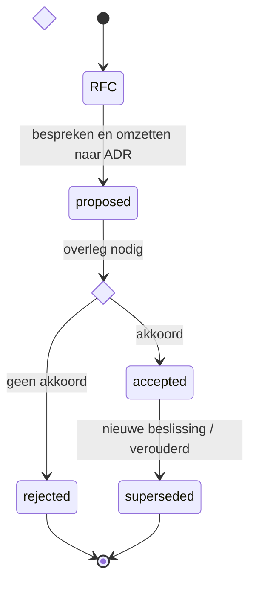
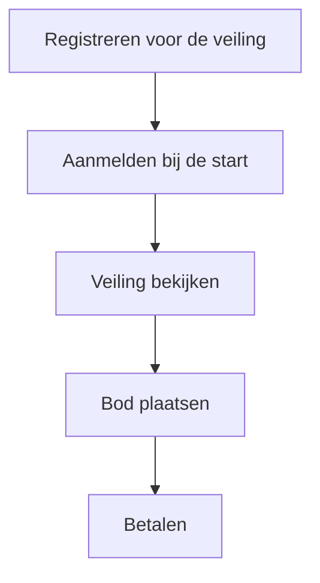

import CodeBlock from '@theme/CodeBlock';

# 4. Software architectuur verantwoorden
In het vorige hoofdstuk hebben we gezien wat een software architectuur is en welke verschillende onderdelen erin zijn. Tijdens dit hoofdstuk gaan we dieper in op het verantwoorden en documenteren van deze architectuur.

### 1. Karakteristieken
Zoals we in het vorige hoofdstuk hebben gezien, is één van de 4 dimensies van software architectuur de karakteristieken. De karakteristieken geven aan **hoe** een systeem werkt, niet **wat** het systeem doet. Een systeem dat wel functioneel is, maar crasht onder hoge belasting is waardeloos.

Enkele voorbeelden van karakteristieken zijn:
- Scalability: hoe goed kan het systeem omgaan met een toenemende hoeveelheid werk?
- Reliability: hoe betrouwbaar is het systeem? Hoe vaak crasht het?
- Availability: hoe vaak is het systeem beschikbaar voor gebruik?
- Maintainability: hoe gemakkelijk is het om het systeem te onderhouden en aan te passen?

:::info[Merk op]
Deze karakteristieken eindigen vaak op -ility. Ze worden ook wel de "ilities" genoemd. 
:::

### 2. De juiste karakteristieken kiezen
Het is belangrijk om de juiste karakteristieken te kiezen voor ons systeem. We kunnen niet gewoon alle karakteristieken kiezen. Als we terugdenken aan de eerste wet:
> Everything is a trade-off
We moeten dus een afweging maken tussen de verschillende karakteristieken. De vuistregel is om 7 karakteristieken te kiezen. Hierdoor hebben we er niet te veel, waardoor we geen focus verliezen, maar ook niet te weinig, waardoor we belangrijke karakteristieken missen. 

Binnen deze 7 karakteristieken, duiden we er 3 aan als "driving" karakteristieken. Deze zijn de belangrijkste karakteristieken voor ons systeem. Ze hebben dan ook de meeste impact op de architectuur van ons systeem.

:::info[tip]
Wees niet te vaag in het kiezen van de karakteristieken. "Performance" is bijvoorbeeld een te vage karakteristiek. Het is beter om te kiezen voor "response time" of "throughput".

Een uitgebreide lijst van karakteristieken kan je vinden in de [ISO/IEC 25010 standaard](https://en.wikipedia.org/wiki/ISO/IEC_25010).
:::

#### Documenteren van karakteristieken
Om deze karakteristieken te documenteren, kunnen we gebruik maken van een tabel. In de tabel geven we aan welke karakteristieken we hebben gekozen, of ze expliciet vermeld zijn in de requirements, en welke karakteristieken de driving karakteristieken zijn.
Bijvoorbeeld:
| Karakteristiek | Expliciet vermeld in requirements? | Meest kritisch (driving)? |
|---|---|---|
| Scalability | Ja | **Ja** |
| Elasticity | Ja | **Ja** |
| Fault tolerance | Nee | **Ja** |
| Integrity | Nee | Nee |
| Customizability | Ja | Nee |

### 3. Casus - Sillycon Symposia
Laten we nogmaals terugkijken naar de casus van Sillycon Symposia en hun sociaal medium Lafter.

**Requirements:**
- Honderden sprekers en duizenden bezoekers
- Gebruikers kunnen accounts aanmaken
- Gebruikers kunnen "jokes" (lange teksten) en "puns" (korte teksten) maken
- Berichten tot 281 tekens sturen
- Links posten
- Bezoekers kunnen sprekers volgen
- Reageren met "Haha" of "Giggle"
- Sprekers hebben een eigen icoontje
- Sprekers kunnen een forum opzetten

**Context:**
- Platform moet beschikbaar zijn in verschillende landen
- Klein supportteam
- Pieken in verkeer tijdens conferenties

Welke architecturale karakteristieken leiden we hieruit af?

Antwoord

| Requirement / context | Afleiding | Karakteristiek |
|---|---|---|
| Honderden sprekers, duizenden bezoekers | Het systeem moet veel gelijktijdige gebruikers aankunnen | **Scalability** |
| Pieken tijdens conferenties | Het systeem moet snel kunnen op- en afschalen bij plotse drukte | **Elasticity** |
| Accounts bepalen eigenaarschap | Data moet correct en consistent blijven | **Integrity** |
| Beschikbaar over verschillende landen | Meertaligheid, tijdzones, regionale wetgeving | **Internationalization** |
| Forums en icoontjes aanmaken | Het platform moet aanpasbaar zijn per gebruiker/spreker | **Customizability** |
| Klein supportteam | Het systeem moet zelf fouten kunnen opvangen zonder veel menselijke tussenkomst | **Fault tolerance** |

Welke karakteristieken hiervan zijn de meest kritische? Welke zijn nu de driving karakteristieken?

Antwoord

| Karakteristiek | Expliciet vermeld in requirements? | Meest kritisch (driving)? |
|---|---|---|
| Scalability | Ja | **Ja** |
| Elasticity | Ja | **Ja** |
| Fault tolerance | Nee (afgeleid uit "klein supportteam") | **Ja** |
| Integrity | Nee (afgeleid uit accounts/eigenaarschap) | Nee |
| Internationalization | Ja | Nee |
| Customizability | Ja | Nee |

### 4. Architecturale beslissingen
Nu we de karakteristieken hebben gekozen, kunnen we kijken naar de tweede dimensie van software architectuur. De architecturale beslissingen. 

:::info[Opfrissing]
De architecturale beslissingen zijn de keuzes die we maken in onze architectuur om aan de karakteristieken te voldoen. Ze zijn de "hoe" van onze architectuur. Neem bijvoorbeeld scalability (schaalbaarheid). Eén van de architecturale beslissingen die we kunnen maken om hieraan te voldoen is het gebruik van asynchrone communicatie en message queues. Hierdoor kunnen we beter omgaan met pieken in verkeer en kunnen we makkelijker opschalen.
:::

We hebben eerder gezegd dat deze beslissingen de "hoe" zijn van het systeem, maar eigenlijk is dat niet het belangrijkste. Het belangrijkste is dat we weten "waarom" we deze beslissingen maken. We moeten kunnen verantwoorden waarom we bepaalde keuzes maken in onze architectuur.

### 5. Tweede wet van software architectuur
De tweede wet van software architectuur is:
> **Why is more important than how**

Hoe de architectuur is opgebouwd, dat zie je in de code zelf. Maar waarom bepaalde keuzes zijn gemaakt is de belangrijkste informatie voor teams die later aan het systeem moeten werken. Neem het volgende voorbeeld:
We krijgen een API die communiceert via XML requests en responses. We kunnen hieruit afleiden dat de architecturale beslissing was om XML te gebruiken als dataformaat. Maar waarom XML? Waarom niet JSON, wat vandaag de facto standaard is? 

De kans is groot dat deze API uit de jaren 2000 komt, toen XML de standaard was. Er waren toen ook al JSON libraries, maar deze begon pas de standaard te worden rond 2008. Het zou dus een perfect juiste beslissing kunnen zijn om dit te herschrijven naar JSON, maar misschien is er een goede reden waarom dit niet is gebeurd. Misschien was er geen tijd of budget om te herschrijven, of misschien was er een andere reden. Zonder deze context kunnen we niet goed inschatten of het een goede beslissing is om al dan niet verder te werken volgens dezelfde architecturale beslissingen.

### 6. Architectural Decision Records (ADRs)
We hebben nu gezien dat het documenteren van de beslissingen belangrijk is, maar hoe doen we dat? We kunnen gebruik maken van een simpel textbestand waar we ons idee in uitschrijven, maar dit zorgt door de tijd heen voor een hoop ongestructureerde informatie. Het is beter om een gestructureerd format te gebruiken, zo is het gemakkelijk om nieuwe en oude beslissingen te begrijpen, ook al heb je nog nooit van het project gehoord of heb je de oorspronkelijke ontwikkelaar niet gesproken.

Een veelgebruikt format hiervoor zijn de Architectural Decision Records (ADRs). Deze bestaan uit een aantal vaste onderdelen:
| Onderdeel | beschrijving |
|---|---|
| Titel | Een korte titel die de beslissing samenvat |
| Status | De status van de beslissing (proposed, accepted, rejected, superseded) |
| Context | De context waarin de beslissing is genomen |
| decision | De beslissing zelf, wat is er gekozen? |
| Consequences | De gevolgen van deze beslissing, zowel positief als negatief |
| governance | Hoe wordt de beslissing opgevolgd? Wie moet er op de hoogte gebracht worden? |
| notes | Eventuele extra notities of links naar relevante informatie |

ADR's hebben ook enkele belangrijke eigenschappen:

#### Geen user-facing docs

ADR's zijn geen documentatie voor (eind)gebruikers. Ze zijn bedoeld voor ontwikkelaars en andere teamleden. Technische taal is dus geen probleem en soms zelfs een vereiste.

#### Structuur
Zoals eerder gezegd is het belangrijk dat ADR's een gestructureerd format hebben. Hier is geen algemene standaard voor, maar het is wel belangrijk dat het format consistent blijft binnen een project.
#### plain-text
Voor ADR's hoeft er geen speciale documentatietool of software gebruikt te worden. Best worden ze bewaard in plain-text bestanden (bv. Markdown). Dit voorkomt dat de ADR's die jaren geleden gemaakt zijn, niet meer leesbaar zijn omdat ze verouderde software vereisen om ze te openen. Door gebruik te maken van plain-text bestanden, kunnen ze ook gemakkelijk worden opgenomen in versiebeheersystemen.
#### Eén beslissing per ADR
Elke ADR mag maar één beslissing bevatten. Dit zorgt ervoor dat elke beslissing zijn eigen beredenering en context heeft, maar ook dat als er in de toekomst slechts één beslissing verandert we niet 5 ADR's moeten vervangen. 
#### Neutrale taal
ADR's zijn geschreven met een focus op beschrijvende taal: "we hebben besloten om X te doen omdat Y", in plaats van "we moeten X doen omdat Y". We proberen zo weinig mogelijk subjectieve taal te gebruiken, of bias. Een slecht voorbeeld zou zijn "We gebruiken XML omdat dit de beste standaard op de markt is." Dit is subjectief en kan allereerst leiden tot discussie, maar geeft ook een vervaagd beeld in de toekomst. Misschien was XML de beste keuze op dat moment, maar dat is niet meer het geval. Een beter voorbeeld zou zijn "We gebruiken XML omdat dit de standaard was op het moment dat we deze beslissing namen." Dit is een feitelijke uitspraak die niet onderhevig is aan discussie en geeft ook een duidelijk beeld van de context waarin deze beslissing is genomen. Nog beter zou zijn "We gebruiken XML omdat dit de standaard was op het moment dat we deze beslissing namen. We maken geen gebruik van JSON omdat dit nog niet de standaard was en er geen tijd was om te herschrijven." Dit geeft nog meer context en maakt het duidelijk dat er een afweging is gemaakt tussen XML en JSON, en waarom XML is gekozen.
#### Toevoegen mag, aanpassen niet
ADRs werken volgens een append-only principe. Dit betekent dat wanneer we een oude beslissing willen aanpassen, we niet de oude ADR aanpassen, maar een nieuwe ADR toevoegen die de oude beslissing vervangt. De oude ADR verandert dan van status naar "superseded". Op deze manier behouden we de geschiedenis van onze beslissingen. 

Ook wanneer een beslissing niet langer van toepassing is, passen we de oude ADR niet meer aan. We veranderen de status van de oude ADR naar "deprecated".

### 7. Van RFC naar ADR
Wanneer een voorstel wordt gedaan spreken we van een RFC, een zogenaamde "Request For Comments". Dit is een voorstel dat oproept tot discussie. Het is nog geen definitieve beslissing en er is ook nog geen keuze gemaakt. Tijdens deze proposal fase wordt de RFC dan in een ADR omgezet en krijgt deze de status "proposed". Na overleg en discussie kan deze ADR dan geaccepteerd of afgewezen worden.

Er is wel een belangrijke nuance tussen een RFC en een ADR. Een RFC is simpelweg een losse neergeschreven versie van een idee. Het is nog niet gestructureerd. (vaak wordt er in een bedrijf wel een template gebruikt voor RFC's, maar dit is niet verplicht). Een voorbeeld van een RFC kan zijn:
<CodeBlock language="markdown" className="wrapCode">
{`# RFC: Asynchrone communicatie via message queues

**status:** proposed

**need:**
De trading service moet andere diensten (analytics, notifications) op de hoogte brengen van nieuwe producten en verkopen. Op dit moment communiceert de trading service rechtstreeks met andere services via REST API calls. Dit zorgt voor een sterke koppeling: als de notifications-service uitvalt, heeft dit ook impact op de trading service. We hebben een oplossing nodig die de services losser koppelt en beter bestand is tegen pieken in gebruik.

**approach:**
Invoeren van message queues (bv. RabbitMQ) als communicatielaag tussen de trading service en consumer-services. De trading service publiceert berichten naar specifieke queues; elke consumer-service leest berichten uit zijn eigen queue. De trading service werkt volgens het "fire and forget" principe: berichten worden verstuurd zonder te wachten op bevestiging.

**alternatives:**
- REST API calls (synchrone communicatie): eenvoudig te implementeren, maar sterke koppeling. Als een consumer-service uitvalt, heeft dit rechtstreeks impact op de trading service.
- Pub/Sub via een centraal topic: flexibeler dan queues, maar vereist extra security-maatregelen om te bepalen welke service welke berichten mag lezen.

**references:**
- Teamgesprek 12/03/2026: consensus dat de huidige directe koppeling een risico vormt bij uitval.
- Zie ook RFC-008 over de selectie van RabbitMQ als message broker.

**update log:**
- 12/03/2026 – J. De Smedt: initieel voorstel opgesteld na uitval van notifications-service tijdens piekmoment.
- 13/03/2026 – A. Peeters: alternatieven aangevuld na intern overleg.`}
</CodeBlock>

### 8. De levenscyclus van een ADR
Een ADR heeft een levenscyclus als volgt:
1. Proposed: de beslissing is voorgesteld, maar nog niet geaccepteerd.
2. Accepted: de beslissing is geaccepteerd en wordt geïmplementeerd.
3. Rejected: de beslissing is afgewezen en zal niet worden geïmplementeerd.
4. Deprecated: de beslissing is verouderd en zal in de toekomst worden vervangen.
5. Superseded: de beslissing is vervangen door een nieuwe beslissing.

Zoals eerder gezegd, wordt een ADR dus nooit verwijderd of aangepast. Het enige wat in een ADR kan veranderen nadat deze voorbij de proposal fase is, is de status. Ook is het zeer belangrijk om de rejected ADR's te behouden. Deze geven namelijk een goed beeld van de afwegingen die zijn gemaakt. Misschien is er in de toekomst een reden om een beslissing die eerder is afgewezen toch te implementeren, of misschien is er een nieuwe technologie die het mogelijk maakt om een beslissing die eerder is geaccepteerd te vervangen door een betere beslissing. Door de geschiedenis van onze beslissingen te behouden, kunnen we beter geïnformeerde keuzes maken in de toekomst.

### 9. Casus - Two Many Sneakers
We kijken terug naar de casus van Two Many Sneakers van het vorige hoofdstuk.
:::info[Opfrissing]
Two Many Sneakers is een bedrijf met een succesvolle mobiele app voor schoenenverzamelaars, waarmee gebruikers sneakers kunnen kopen, verkopen en ruilen.

De oorspronkelijke architectuur was eenvoudig:mobile app → trading service → database. Door de groei van het platform ontstonden nieuwe noden zoals real-time notificaties, analytics/fraudedetectie en betere schaalbaarheid.

Daarom werd de architectuur uitgebreid met extra services (zoals notifications en analytics) en onderzocht het team asynchrone communicatie via message queues/topics om de koppeling te verlagen en het systeem uitbreidbaar te maken.
:::

Een ADR van de beslissing voor asynchrone communicatie via message queues zou er als volgt kunnen uitzien:

<CodeBlock language="markdown" className="wrapCode">
{`#### title
012: gebruik van queues voor asynchrone messaging vanaf tradingdienst

#### status
accepted

#### context
De trading service moet andere diensten (voorlopig: analytics en notifications) op de hoogte brengen van nieuwe producten en van elke verkoop. We hebben twee opties overwogen:
1. Web services (REST API calls): de trading service roept direct de API's van andere services aan
2. Asynchrone messaging (queues of topics): de trading service publiceert berichten naar een bus

Karakteristieken die meespelen: scalability (pieken in gebruik), fault tolerance (services mogen niet afhankelijk zijn van elkaar), extensibility (in de toekomst komen er meer services bij).

#### decision
We zullen message queues gebruiken. Queues maken het systeem veelzijdig, aangezien elke queue andere soorten berichten kan afleveren aan verschillende consumers. Ze maken het systeem ook veiliger, aangezien de trading service steeds weet welke queue voor welke service bedoeld is. De trading service hanteert het "fire and forget" principe: berichten worden naar de queues gestuurd zonder te wachten op bevestiging, waardoor de trading service niet vertraagd wordt.

#### consequences
(+) De koppeling tussen de trading service en consumer-services is losser. Als een consumer-service uitvalt, blijven de berichten in de queue staan tot de service weer online is.
(+) We kunnen eenvoudig nieuwe consumer-services toevoegen zonder de trading service aan te passen (zolang ze bestaande berichtformaten gebruiken).
(-) De koppeling tussen de trading service en de queues zelf is hoger: elke nieuwe queue moet expliciet ondersteund worden door de trading service.
(-) We moeten infrastructuur voor de queues voorzien (RabbitMQ, monitoring, backups).

(werk): We moeten berichtformaten (schemas) documenteren en versioneren.

#### governance
- Alle developers worden getraind in het gebruik van RabbitMQ.
- Nieuwe services die berichten van de trading service nodig hebben, moeten een ADR schrijven voor de benodigde queue.
- Code reviews controleren of berichten correct gepubliceerd worden naar de juiste queues.

#### notes
 Zie ook ADR 008 (keuze voor RabbitMQ als message broker). In de toekomst kunnen we overwegen om over te stappen op een centraal topic, maar dit vereist meer security maatregelen.`}
</CodeBlock>
:::info[tip]
ADR is een concept waar je zeer uitgebreid in kan gaan. Binnen deze cursus gaan we er niet dieper op in , maar extra informatie, tools, templates en best practices kan je [hier](https://adr.github.io/) vinden.
:::

### 10. Logische componenten
We hebben onze karakteristieken gekozen en onze architecturale beslissingen gemaakt, nu komen we aan de derde dimensie van software architectuur: de logische componenten. 

Logische componenten zijn de **bouwstenen** van een systeem. Je kan ze vergelijken met de kamers in een huis: elke kamer heeft een specifieke functie (slaapkamer, keuken, badkamer, woonkamer) en er is een logische reden waarom bepaalde activiteiten in bepaalde kamers plaatsvinden.

:::warning[Belangrijk]
Logische componenten zijn geen fysieke componenten of code. Ze zijn dus **geen**:
- microservices
- docker containers
- Controllers of modules in je code
- klassen of functies 
:::

Enkele voorbeelden van logische componenten zijn:
- Gebruikersbeheer
- Productcatalogus
- Bestellingen
- Rapportage
- Notificaties
- Betalingsverwerking

Logische componenten zijn een manier om de architectuur van een systeem te structureren.

#### Stap 1: Initiële kerncomponenten
We beginnen met het identificeren van de initiële kerncomponenten van ons systeem. Dit zijn de componenten die essentieel zijn voor de werking van het systeem en die direct gerelateerd zijn aan de belangrijkste functionaliteiten. Om deze te bepalen kunnen we gebruik maken van 2 technieken:

##### Workflow
Bij de workflow approach bekijken we het systeem vanuit het perspectief van de gebruiker. We doorlopen zo de conceptuele stappen van één typische user journey, één scenario van hoe een gebruiker het systeem zou kunnen gebruiken. Elke stap in die journey kan leiden tot een aparte logische component. Daarbij gelden drie richtlijnen:

1. standaard hebben alle verschillende stappen elk hun eigen component
2. Sterk verwante stappen kunnen samengevoegd worden in één component
3. Complexe stappen kunnen opgesplitst worden in meerdere componenten

Stel dus dat we de volgende workflow hebben voor "meedoen en winnen":

Hier kunnen we dus 5 componenten van maken die elk een stap in deze workflow 
##### Actor/action
De actor/action approach is handig als het systeem meerdere soorten gebruikers heeft. Je somt de belangrijkste handelingen per actor op en verbindt die handelingen met componenten. Je verbindt ook componenten onderling als ze van elkaar afhankelijk zijn.

Naast menselijke actoren (gebruikers, beheerders, operators, ...) is er ook een "System" actor voor automatische acties die het systeem zelf uitvoert (bijvoorbeeld geplande taken, achtergrondprocessen).

**Online veiling (met meerdere actoren):**
> We hebben een online veilingplatform waar gebruikers kunnen bieden op items. Er is een livestream van de veiling, en er is een fysieke locatie waar de veilingmeester de biedingen bijhoudt en items als verkocht markeert. Het systeem verwerkt ook betalingen en volgt biederactiviteit op.

We hebben drie actoren:
- Kate (online bieder): zoekt een veiling, kijkt de livestream, plaatst een bod
- Sam (veilingmeester ter plaatse): start de veiling, registreert biedingen van ter plaatse, markeert items als verkocht
- System (automatisch): verwerkt betalingen, volgt biederactiviteit op

Dit leidt tot de volgende toewijzing:

| Actor | Actie | Component |
|---|---|---|
| Kate | Zoekt een veiling | `AuctionSearch` |
| Kate | Bekijkt livestream | `VideoStreamer` |
| Kate | Plaatst een bod (online) | `BidCapture` |
| Sam | Start/beheert veiling | `LiveAuctionSession` |
| Sam | Voert een live bod in (ter plaatse) | `BidCapture` |
| Sam | Markeert item als verkocht | `LiveAuctionSession` |
| System | Verwerkt betaling automatisch | `AutomaticPayment` |
| System | Volgt biederactiviteit op | `BidderTracker` |

En de communicatie tussen componenten:
- `BidCapture` stuurt biedingen door naar `BidderTracker` (voor analyse)
- `LiveAuctionSession` vertelt `AutomaticPayment` wie er moet betalen
- `LiveAuctionSession` stuurt start/stop signalen naar `BidderTracker`

Merk op dat `BidCapture` door zowel Kate als Sam gebruikt wordt, het is een gedeeld component voor alle biedingen, ongeacht de bron.

:::info[Combinatie van beiden]
In de praktijk is het perfect mogelijk om beiden te combineren. Je kan bijvoorbeeld eerst de actoren en hun acties onderscheiden en vervolgens op deze verschillende acties de workflow benaderen. Zo krijg je een nog beter beeld van de verschillende componenten en hun onderlinge relaties.
Dit is een optie, maar de exacte techniek die je gebruikt hangt af van het systeem
:::
##### Valkuil: de entity trap
Een veelgemaakte fout is de entity trap: een component krijgt te veel verantwoordelijkheden, waardoor het onduidelijk is wat het precies doet. Dit risico is extra groot bij vage namen zoals "supervisor" of "manager". Deze namen zeggen niets over wat het component precies doet, waardoor het moeilijk is om te begrijpen wat de verantwoordelijkheden van het component zijn.

Als een component zo'n vage naam heeft, stel jezelf dan de vraag: "Wat doet dit component precies?"

Als het antwoord meer dan één duidelijke verantwoordelijkheid omvat, moet je het component opsplitsen. Bijvoorbeeld:

`UserManager` die zowel authenticatie, profielbeheer als notificaties doet

Dit zou dus beter worden opgesplitst in `Authentication`, `UserProfile` en `Notifications` als aparte componenten.

