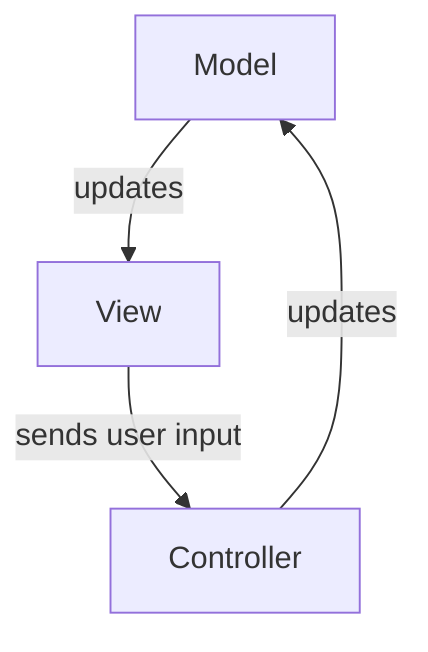
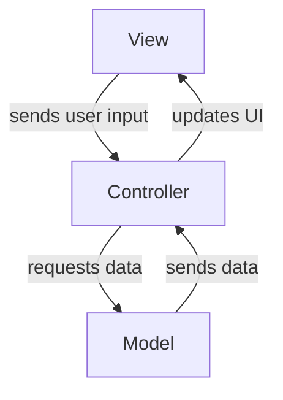
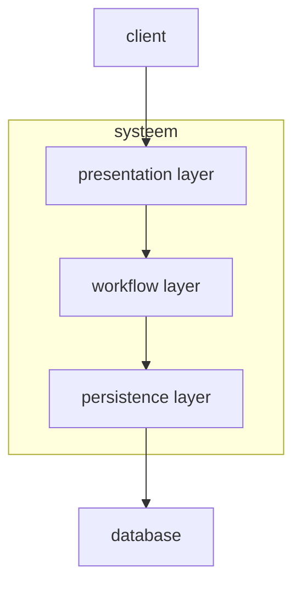
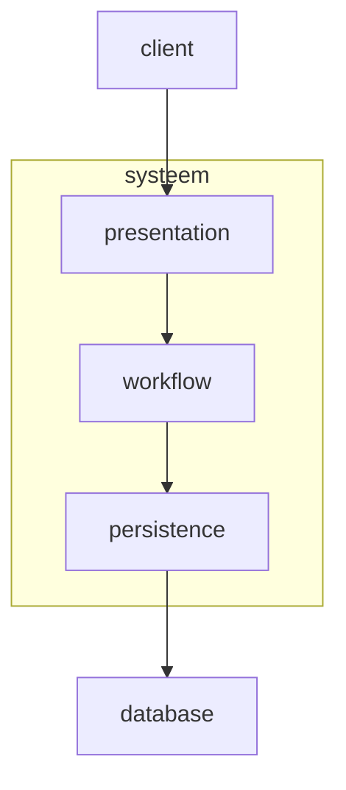
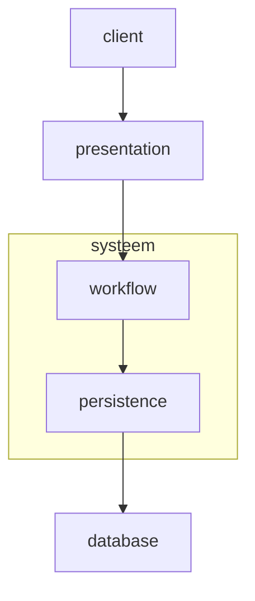
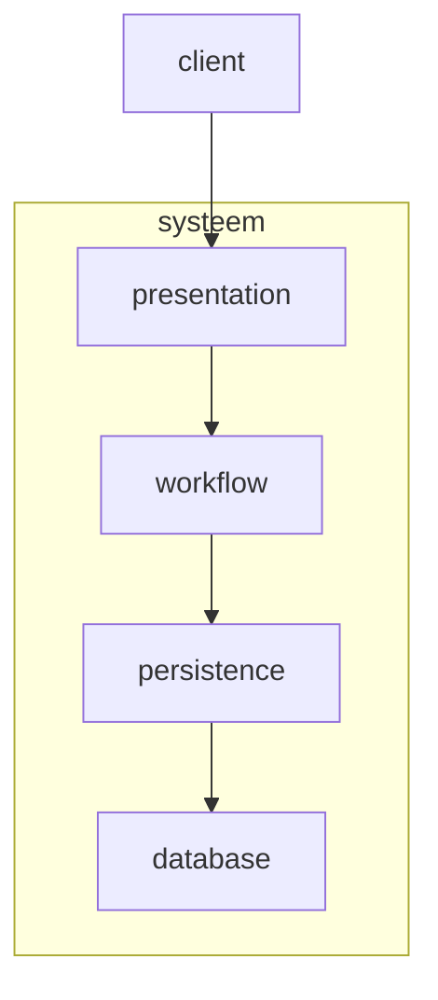
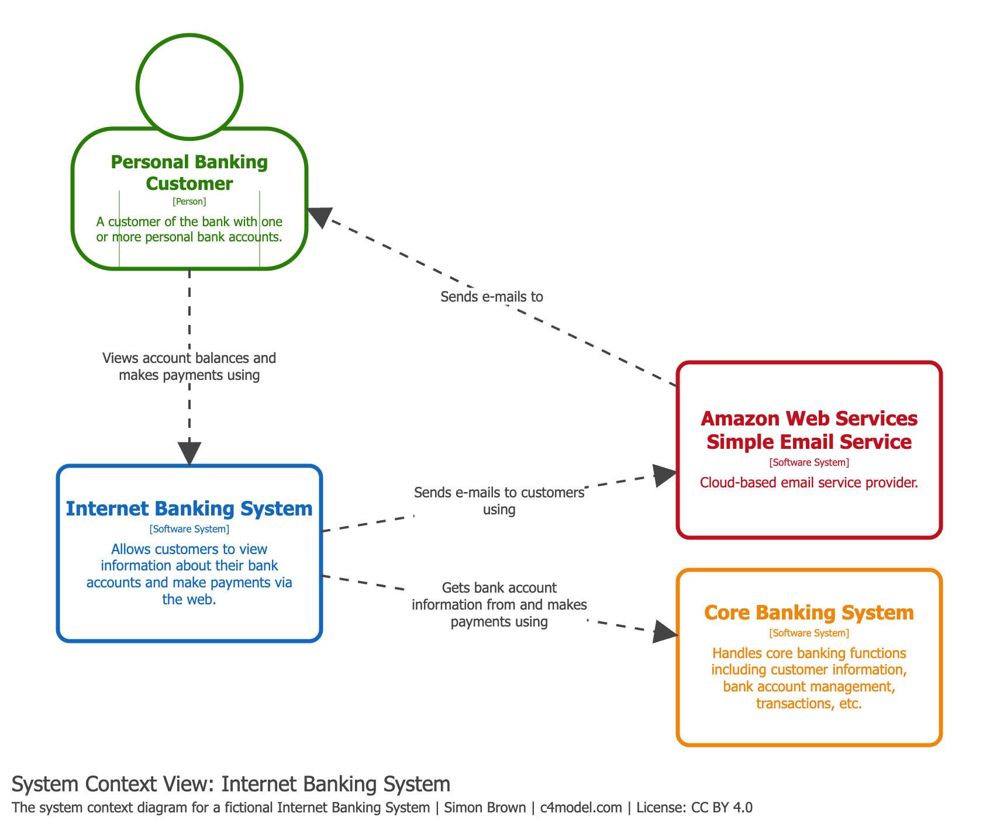
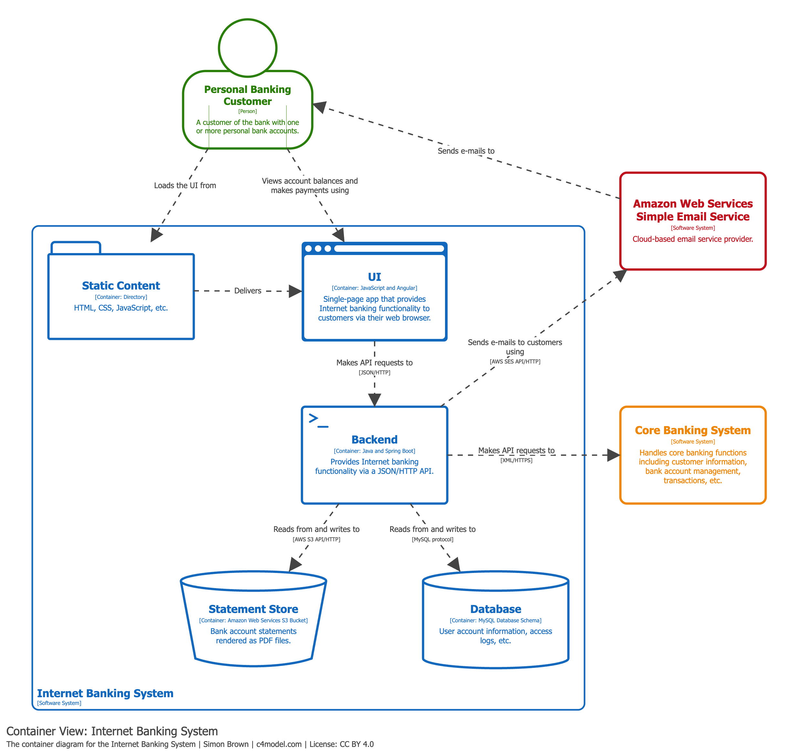
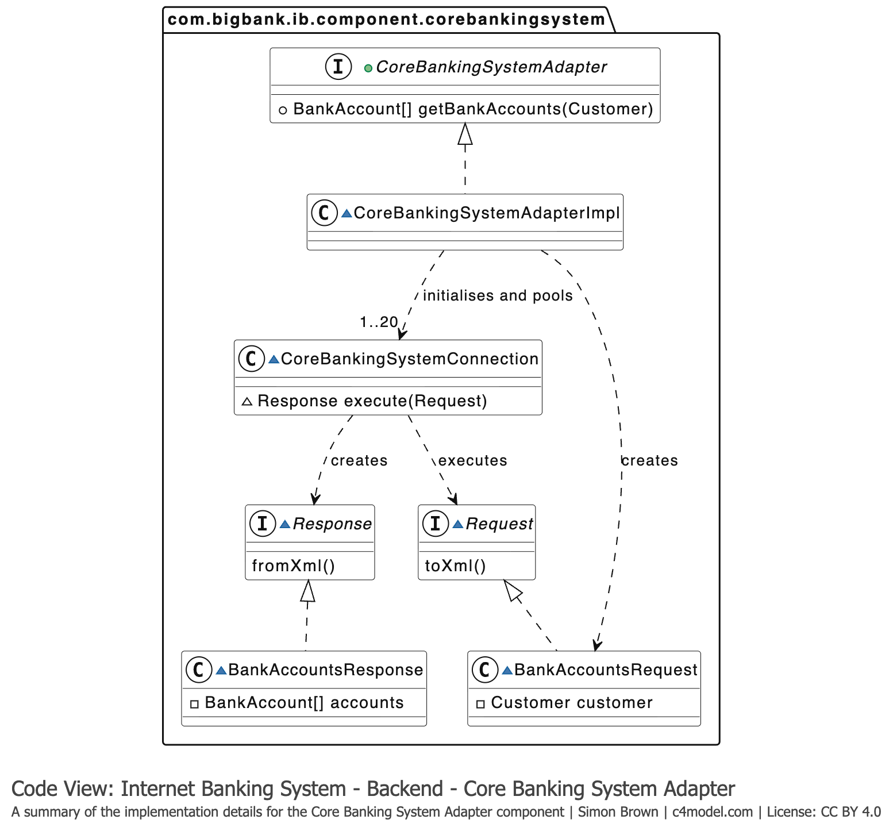
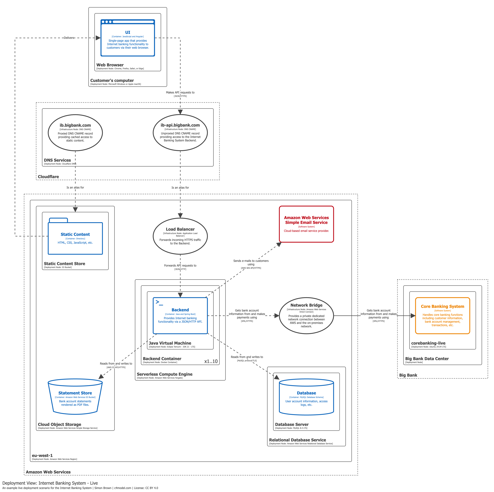

# Gelaagde stijl en C4-model
In dit hoofdstuk gaan we een eerste architecturale stijl bespreken: de gelaagde stijl. We gaan daarnaast ook kijken naar het C4-model, een manier om software architectuur te visualiseren.

### 1. Architecturale stijl
Een architecturale stijl is een patroon of een set van richtlijnen die beschrijven hoe de componeten van een systeem georganiseerd zijn en hoe ze met elkaar communiceren. Er zijn verschillende architecturale stijlen, we zullen er enkele bespreken in de volgende hoofdstukken.

We kunnnen om te beginnnen deze stijlen categoriseren op basis van de manier waarop ze uitgerold worden (deployment) en op de manier waarop de componenten gesplitst worden (partitionering).
<div style={{ overflowX: 'auto' }}>
	<table>
		<thead>
			<tr>
				<th colSpan={2} />
				<th colSpan={2} scope="colgroup" style={{ textAlign: 'center' }}>
					Partitionering
				</th>
			</tr>
			<tr>
				<th colSpan={2} />
				<th scope="col" style={{ textAlign: 'center' }}>Technisch</th>
				<th scope="col" style={{ textAlign: 'center' }}>Op basis domein</th>
			</tr>
		</thead>
		<tbody>
			<tr>
				<th rowSpan={2} scope="rowgroup" style={{ verticalAlign: 'middle' }}>
					Deployment
				</th>
				<th scope="row" style={{ verticalAlign: 'middle' }}>Monolitisch</th>
				<td>
					<ul>
						<li>gelaagd</li>
						<li>microkernel</li>
					</ul>
				</td>
				<td style={{ verticalAlign: 'middle' }}>
                <ul>
                <li>modulaire monoliet</li>
                </ul>
                </td>
			</tr>
			<tr>
				<th scope="row" style={{ verticalAlign: 'middle' }}>Gedistribueerd</th>
				<td style={{ verticalAlign: 'middle' }}>
                <ul>
                <li>event-driven</li>
                </ul>
                </td>
				<td style={{ verticalAlign: 'middle' }}>
                <ul>
                <li>microservices</li>
                </ul>
                </td>
			</tr>
		</tbody>
	</table>
</div>

:::info[Monolitisch vs gedistribueerd]
De term "monolitisch" gaan we nog een aantal keer tegenkomen. Monolitisch betekent dat alle componenten van een systeem in één enkele applicatie zijn verpakt. Je kan het bijvoorbeeld zijn als een backend waarin de API verantwoordelijk is voor alle functionaliteit. In een monolitische omgeving communiceren de verschillende componenten via function of method calls binnen dezelfde applicatie.

Bij een gedistribueerd systeem zijn de componenten verdeeld over meerdere applicaties of services. Hier is het niet meer mogelijk om direct te communiceren via function of method calls. In plaats daarvan moeten de componenten communiceren via netwerkprotcollen zoals HTTP, gRPC, of message queues.
:::

### 2. Technische partitionering en op basis van domein
Partitionering is de manier waarop we code organiseren binnen een systeem. We kunnen op verschillende manieren partitioneren, maar de twee meest voorkomende manieren zijn op basis van technische aspecten of op basis van domein.

#### Technische partitionering
We kunnen code organiseren op basis van technische aspecten. Voorbeelden hiervan zijn:
- Presentatie
- Businesslogica
- Persistentie
- ...

#### partitionering op basis van domein
We kunnen ook code organiseren op basis van domein. Hierbij organiseren we code op basis van de functionele domeinen van het systeem. Voorbeelden hiervan zijn:
- Klanten
- Bestellingen
- Producten
- ...

#### combineren
In de praktijk combineren we vaak beide vormen van partitionering. Echter is het wel belangrijk om de volgorde van partitionering te kiezen. De eerste partitionering noemen we de primaire partitionering, de tweede partitionering noemen we de secundaire partitionering. Deze termen zullen we later nog tegenkomen.

Stel dat we beginnnen met een technische partitionering, en vervolgens opsplitsen op basis van domein. Dan zou onze structuur er als volgt uit kunnen zien:
```
src/
├── presentation/
│   ├── customers/
│   ├── orders/
│   └── products/
├── services/
│   ├── customers/
│   ├── orders/
│   └── products/
└── persistence/
    ├── customers/
    ├── orders/
    └── products/
```
Stel dat we beginnen met een domein-gebaseerde partitionering, en vervolgens opsplitsen op basis van technische aspecten. Dan zou onze structuur er als volgt uit kunnen zien:
```
src/
├── customers/
│   ├── presentation/
│   ├── services/
│   └── persistence/
├── orders/
│   ├── presentation/
│   ├── services/
│   └── persistence/
└── products/
    ├── presentation/
    ├── services/
    └── persistence/
```

Als we zouden werken met een zeer technisch gespecialeerd team (een frontend developer, een backend developer, een database administrator, ...) , kan het logisch zijn om te beginnen met een technische partitionering. Anderzijds , als we zouden werken met domein-experten (een klanten expert, een orders expert, een products expert, ...), kan het logischer zijn om te beginnen met een domein-gebaseerde partitionering.


### 3. Gelaagde stijl
De gelaagde stijl is een architecturale stijl waarbij er technisch wordt gepartitioneerd en er wordt gebruik gemaakt van een monolitische deployment. In deze stijl worden de componenten georganiseerd in lagen, waarbij elke laag een specifieke verantwoordelijkheid heeft. De lagen communiceren alleen met de lagen direct boven of onder hen.

We gaan deze stijl bespreken aan de hand van een voorbeeld. Stel het volgende:

*We gaan een project ontwikkelen voor een klein restaurant "Naan & Pop" dat snacks en drankjes  verkoopt. Ze zijn op zoek naar een nieuw systeem waar klanten bestellingen kunnen plaatsen. Aangezien het restaurant al bestaat en al zijn huidige kosten draagt, willen ze graag dat het systeem er zo snel mogelijk is (liever gisteren dan morgen). Daarom verwachten ze ook iets dat simpeler is, maar nog wel aanpasbaar is naar de toekomst toe.*

*Ons team bestaat uit een deel specialisten, waaronder enkele frontend developers, backend developers en database administrators*

Als we kijken naar de requirements van N&P komt het in de eerste plaats erop aan dat ze vooral zo snel mogelijk een manier moeten hebben om klanten een bestelling te laten plaatsen. Hiervoor bestaan reeds massa's van bestaande programma's of libraries die in enkele dagen opgezet zijn. Toch beslist ons team om hier niet voor te gaan, met de simpele reden dat een andere requirement wel is dat het uitbreidbaar moet zijn. Ons einddoel is niet om een simpele app te bouwen voor bestellingen, maar eerder om een basis te leggen voor de rest van de applicatie, waar we nog geen kennis van hebben.

Tegelijk moeten we ook rekening houden dat we niet te complex gaan in onze uitwerking. N&P heeft geen speciale high-end architectuur nodig op dit moment. We zijn dus op zoek naar een goede balans tussen de twee. Ten slotte is er ook nog een derde onderdeel om rekening mee te houden: ons team bestaat uit mensen met een zeer gespecialiseerde kennis in hun onderdeel. We kunnen dus niet gewoon elke developer een bepaald domein geven (bv. het domein "planning"), want zij zouden niet alle technische aspecten hiervan kunnen uitwerken. Veel interessanter is dus om het technisch op te splitsen: Onze frontend developer voorziet alle frontend, onze backend developer alle backend en onze database administrator voorziet alles voor de database. 

Dit is wat we noemen "splitsen van verantwoordelijkheden" ("separating responsibilities" of "separation of concerns"). Binnen de gelaagde stijl zien we hier een bekend patroon voor terugkomen, namelijk het **Model-View-Controller** patroon.

#### Model - View - Controller (MVC)
Een zeer bekend design pattern binnen de gelaagde stijl is het Model-View-Controller (MVC) patroon. In dit patroon worden de componenten georganiseerd in drie lagen:

- De **View** is verantwoordelijk voor de presentatie van de data aan de gebruiker. In ons voorbeeld zou dit de frontend zijn waar klanten bestellingen kunnen plaatsen.
- De **Controller** is verantwoordelijk voor de businesslogica van de applicatie. In ons voorbeeld zou dit de backend zijn die de bestellingen verwerkt en de data opslaat in de database.
- Het **Model** is verantwoordelijk voor het beheren van de data en de businesslogica. In ons voorbeeld zou dit de database zijn waar de bestellingen worden opgeslagen.

In deze visualisatie lijkt het misschien een cirkelpatroon, maar als we kijken naar hoe de effectieve communicatie loopt, zien we de lagen tevoorschijn komen:

:::warning[Belangrijk]
MVC is één van de vele design patterns die we kunnen gebruiken binnen de gelaagde stijl. Het is belangrijk om te onthouden dat er geen "one size fits all" oplossing is en dat we altijd moeten kijken naar de specifieke requirements van ons project om te bepalen welk patroon het beste past.
:::

#### Interactie met de gebruiker
Wanneer een systeem interactie voert met een gebruiker, hebben we hier binnen de gelaagde stijl een specifieke laag voor. Deze laag noemen we vaak de "presentation layer". Denk hierbij aan een restaurant. De chef bereidt het eten en het wordt mooi op een bord "gepresenteerd" aan de klant. De presentatie laag is dus verantwoordelijk voor het presenteren van de data aan de gebruiker en het ontvangen van input van de gebruiker.
een interactie met een gebruiker bestaat in de meeste gevallen uit een request-response patroon. Hier bestaan uitzonderingen op, maar die behandelen we voorlopig niet. We stellen de volgende drie lagen:

- De **presentation layer** is verantwoordelijk voor de presentatie van de data aan de gebruiker en het ontvangen van input van de gebruiker. In ons voorbeeld zou dit de frontend zijn waar klanten bestellingen kunnen plaatsen.
- De **workflow layer** is verantwoordelijk voor de businesslogica van de applicatie. In ons voorbeeld zou dit de backend zijn die de bestellingen verwerkt en de data opslaat in de database.
- De **persistence layer** is verantwoordelijk voor het beheren van de data en de businesslogica. In ons voorbeeld zou dit de database zijn waar de bestellingen worden opgeslagen.

:::info
We gebruiken hier de term "workflow layer". We hebben op andere plaatsen ook wel eens de term "service layer", "business logic layer", "application layer" of "controller" gezien. Deze termen worden vaak door elkaar gebruikt. Het komt erop neer dat deze laag verantwoordelijk is voor de businesslogica van de applicatie. We zullen in de volgende hoofdstukken nog meer termen tegenkomen, maar het is belangrijk om te onthouden dat ze allemaal verwijzen naar dezelfde laag.
:::
#### Opdeling van logische componenten
Binnen de gelaagde stijl kunnen we de logische componenten ook opdelen. De code zal eerst opgedeeld worden op technisch niveau. De groepering per logische component of domein zal dan een secundaire partitionering zijn. We kunnen bijvoorbeeld de volgende structuur hebben:
```
src/
├── presentation/
│   ├── customerDashboard/
│   ├── orderDashboard/
│   └── productDashboard/
|── Workflow/
│   ├── customerService/
│   ├── orderService/
│   └── productService/
└── persistence/
    ├── customerRepository/
    ├── orderRepository/
    └── productRepository/
```
In deze structuur hebben we eerst een technische partitionering gemaakt (presentation, workflow, persistence) en vervolgens een domein-gebaseerde partitionering binnen elke laag (customer, order, product).
#### Verschijningsvormen van de gelaagde stijl
De gelaagde stijl is monolitisch, maar dit wilt niet zeggen dat alles in één enkele codebase moet zitten. De fysieke architectuur kan er op 3 manieren uitzien:
**1. Alles in één codebase**

Dit gebeurt bij kleine projecten of bij projecten waarbij de backend en frontend sterk met elkaar verweven zijn. We beschouwen de presentation laag zowel voor de frontend als voor de backend en in dit geval zouden deze vanuit dezelfde applicatie worden uitgerold. Dit is een zeer eenvoudige manier van werken, maar het kan ook snel leiden tot een spaghetti codebase als we niet goed opletten. We moeten er dus voor zorgen dat we de code goed organiseren en dat we de verantwoordelijkheden duidelijk scheiden.
**2. presentation in aparte codebase**

In dit geval hebben we de presentation laag in een aparte codebase. Dit kan handig zijn als we een frontend hebben die volledig losstaat van de backend, bijvoorbeeld een mobiele app of een webapplicatie die gebruik maakt van een API. Het voordeel hiervan is dat we de frontend en backend volledig kunnen scheiden en dat we verschillende teams kunnen laten werken aan de frontend en backend. Het nadeel is dat we meer overhead hebben in het communiceren tussen de frontend en backend, omdat we nu moeten communiceren via netwerkprotocollen zoals HTTP of gRPC.
**3. Alles in één codebase, inclusief database**

Dit komt weinig voor, omdat het meestal niet wenselijk is om de database in de codebase van de applicatie zelf te hebben , maar we kunnen het concept van een database ook ruimer zien. We kunnen bijvoorbeeld ook denken aan een embedded database zoals SQLite, of zelfs gewoon een tekstbestand dat als database fungeert. In dit geval zou de database dus ook in dezelfde codebase zitten als de rest van de applicatie. Het voordeel hiervan is dat we alles in één codebase hebben en dat we geen overhead hebben in het communiceren tussen de applicatie en de database. Het nadeel is dat het minder flexibel is, omdat we niet gemakkelijk kunnen switchen naar een andere database of naar een gedistribueerde database.

#### Voordelen en nadelen van de gelaagde stijl
| Voordelen | Nadelen |
| --- | --- |
| praktisch zeer eenvoudig te begrijpen | Beperkt schaalbaar |
| splitsing op expertise (handig voor technisch gespecialiseerde teams) | spreiding van domein over alle lagen |
| goedkoop en snel te implementeren | Als er iets crasht, kan het hele systeem crashen | 

De gelaagde stijl is dus een goede keuze voor kleine projecten of voor projecten waarbij snelheid belangrijk is. Vaak wordt dit gebruikt voor een proof of concept of een minimum viable product (MVP). Het is echter niet de beste keuze voor grote projecten of voor projecten waarbij schaalbaarheid belangrijk is. Ook projecten waarbij de groei in features moeilijk te voorspellen is, kunnen beter niet starten met een gelaagde stijl, omdat features over alle lagen verspreid zijn, waardoor er vaak maar één feature tegelijk kan worden ontwikkeld. 

### 4. C4-model
Het C4-model is een makkelijk te begrijpen manier om software architectuur te visualiseren. De naam "C4" staat voor "Context, Containers, Component, Code". Het model bestaat uit deze vier niveaus van abstractie, waarbij elk niveau een ander aspect van de architectuur visualiseert.

Binnen de cultuur van het C4-model werden nog een aantal extra varianten toegevoegd, waaronder het deployment diagram. Het deployment diagram visualiseert de fysieke architectuur van het systeem, terwijl de andere vier diagrammen de logische architectuur visualiseren. 

Voor de voorbeelden hierrond wijken we af van ons restaurant voorbeeld en maken we gebruik van de voorbeelden die beschikbaar zijn op de officiële website van het C4-model (https://c4model.com/). Deze voorbeelden zijn meer gericht op een enterprise applicatie, maar de concepten zijn hetzelfde en kunnen ook toegepast worden op ons restaurant voorbeeld.
#### Context diagram
Het context diagram, ook wel het systeem context diagram genoemd, is het hoogste niveau van abstractie binnen het C4-model. Het visualiseert het systeem als een geheel en de interacties met externe actoren (zoals gebruikers, andere systemen, ...). Het doel van het context diagram is om een overzicht te geven van het systeem en de omgeving waarin het zich bevindt.


#### Container diagram
Het container diagram is het tweede niveau van abstractie binnen het C4-model. Het visualiseert de verschillende containers binnen het systeem en de interacties tussen deze containers. Een container is een uitvoerbare eenheid binnen het systeem, zoals een applicatie, een database, een webserver, ... Het doel van het container diagram is om een overzicht te geven van de verschillende containers binnen het systeem en hoe ze met elkaar communiceren.




:::info[Containers]
We gebruiken hier de term "container" in een logische zin. Dit is niet hetzelfde als een Docker container of een Kubernetes pod. Een container is gewoon een uitvoerbare eenheid binnen het systeem, en kan dus ook een fysieke machine zijn, een virtuele machine, een serverless functie, ... Het gaat erom dat het een zelfstandige eenheid is die kan worden uitgerold en uitgevoerd.
:::
#### Component diagram
Het component diagram is het derde niveau van abstractie binnen het C4-model. Het visualiseert de verschillende componenten binnen een container en de interacties tussen deze componenten. Een component is een logisch onderdeel van een container dat een specifieke verantwoordelijkheid heeft. Het doel van het component diagram is om een overzicht te geven van de verschillende componenten binnen een container en hoe ze met elkaar communiceren.


#### Code diagram
Het code diagram is het laagste niveau van abstractie binnen het C4-model. Het visualiseert de verschillende klassen, interfaces, functies, ... binnen een component en de interacties tussen deze elementen. Het doel van het code diagram is om een overzicht te geven van de implementatie van een component en hoe de verschillende elementen binnen deze component met elkaar communiceren.


#### Deployment diagram
Het deployment diagram visualiseert de fysieke architectuur van het systeem, inclusief de verschillende machines, virtuele machines, containers, ... waarop het systeem wordt uitgevoerd. Het doel van het deployment diagram is om een overzicht te geven van de fysieke architectuur van het systeem en hoe de verschillende onderdelen van het systeem worden uitgerold. Wanneer we in deze context dus van containers spreken, hebben we het over fysieke containers zoals Docker containers, Kubernetes pods, virtuele machines, ... Het deployment diagram is dus een aanvulling op de andere vier diagrammen binnen het C4-model, die zich richten op de logische architectuur van het systeem.



In het ideale geval heeft een applicatie een C4-model van de ganse applicatie die tot op het code niveau gaat. In de praktijk is dit vaak niet haalbaar, omdat het veel tijd kost om een C4-model te maken en code snel kan veranderen. Daarom wordt hier soms wel gewerkt met een vereenvoudigde weergave.

:::info[structurizr]
Er bestaan verschillende tools om C4-diagrammen te maken, maar een van de meest populaire tools is [Structurizr](https://structurizr.com/). Dit is een tool speciaal ontworpen voor het maken van C4-diagrammen en biedt de mogelijkheid om door te klikken van het ene niveau naar het andere. Het is ook mogelijk om C4-diagrammen te maken met andere tools zoals draw.io, Lucidchart, ... maar deze tools zijn niet specifiek ontworpen voor C4-diagrammen en kunnen daarom minder gebruiksvriendelijk zijn.
:::

