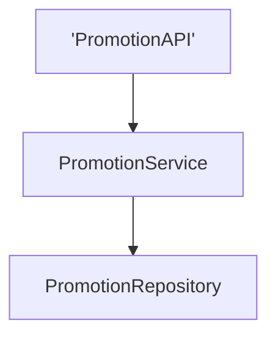
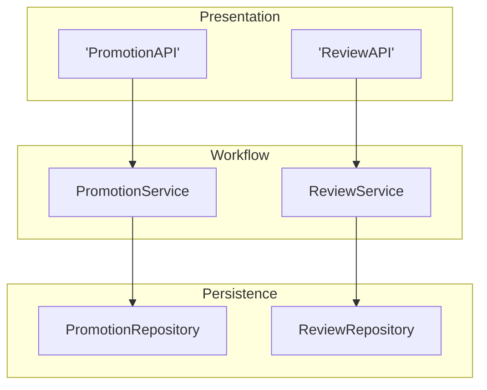
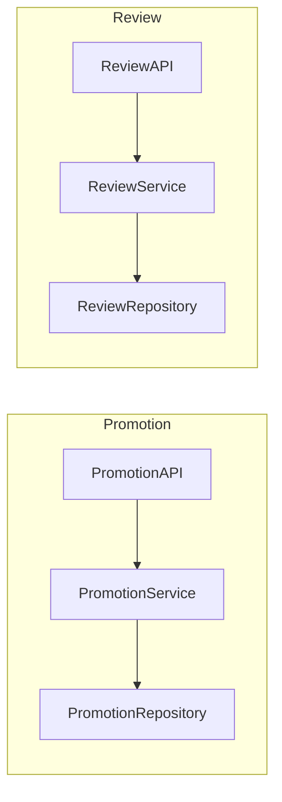
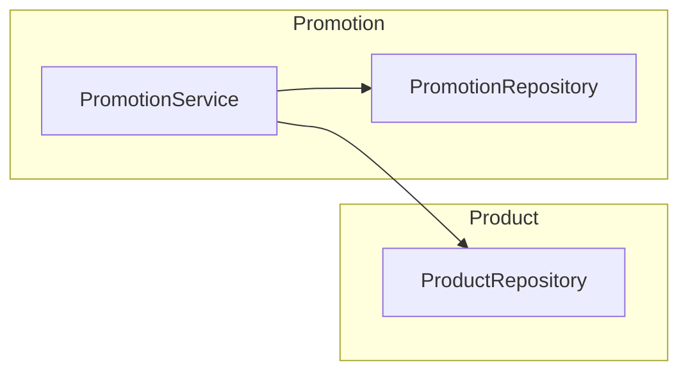
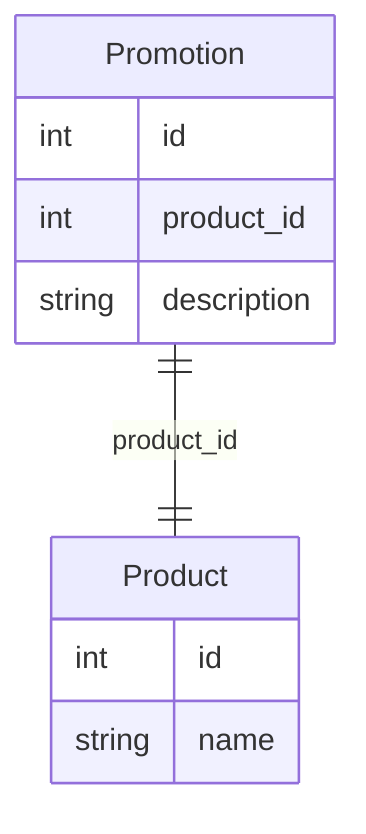
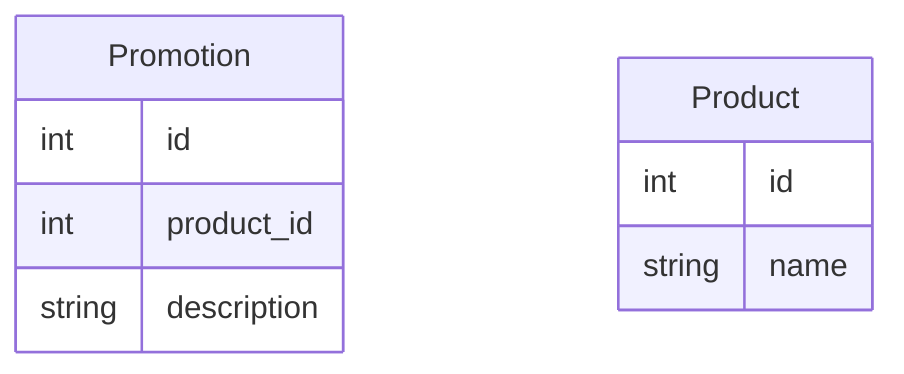

# Modulaire monoliet en microkernel
In dit hoofdstuk gaan we twee nieuwe architecturale stijlen bespreken die we kunnen gebruiken bij het ontwerpen van software: de modulaire monoliet en de microkernel.
### 1. Modulaire monoliet
Een modulaire monoliet is een softwarearchitectuur die ontstaan is uit de traditionele gelaagde stijl. Om te begrijpen wat een modulaire monoliet is, moeten we eerst even terug kijken naar wat de problemen waren met de gelaagde stijl.

#### Problemen met de gelaagde stijl
De gelaagde stijl is een populaire architecturale stijl waarbij de software is opgedeeld in verschillende technische lagen. Hierdoor wordt het mogelijk om het werk in de codebase parallel te laten verlopen door verschillende specialsten. Maar bij grotere projecten die dit model gebruikten ontstond het volgende probleem. Stel dat we een nieuwe feature willen toevoegen aan de software, om bijvoorbeeld promoties te kunnen toevoegen aan de webshop. Dit kunnen we perfect parallel laten ontwikkelen op onze verschillende lagen, zonder dat er moet worden gewacht op de andere lagen.

Echter wanneer we tegelijk een nieuwe feature willen toevoegen aan de software, bijvoorbeeld een nieuwe feature die het mogelijk maakt om reviews te kunnen toevoegen aan de webshop, dan gaat dit niet zomaar.

Beiden features werken op dezelfde lagen, en kunnen niet parallel ontwikkeld worden. Dit zou zorgen voor conflicten in de codebase. Stel dat onze promotion feature dan nog niet klaar is, dan moeten alle volgende features uitgesteld worden tot de promotion feature klaar is. 

#### Partitionering op basis van domein 
Om dit probleem op te lossen, kijken we terug naar de partitionering van de software. Bij de gelaagde stijl hebben we de software opgedeeld in verschillende technische lagen en vervolgens een secundaire opdeling gemaakt in domeinen. Wat als we deze opdeling omdraaien? We kunnen de software ook eerst opdelen in domeinen en vervolgens in technische lagen. Dit is precies wat er gebeurt bij een modulaire monoliet.

In de bestandenstructuur van een modulaire monoliet zou dit er als volgt uit kunnen zien:
```
src
├── promotion
│   ├── presentation
|   │   └── PromotionAPI.py
│   ├── workflow
|   │   └── PromotionService.py
│   └── persistence
|       └── PromotionRepository.py
└── review
    ├── presentation
    │   └── ReviewAPI.py
    ├── workflow
    │   └── ReviewService.py
    └── persistence
        └── ReviewRepository.py
```
Door deze opdeling kunnen we nu perfect een team van developers aan de promotion feature laten werken, zonder dat dit invloed heeft op de review feature. Ze kunnen ook uitgesteld worden als de promotion feature nog niet klaar is, zonder dat dit invloed heeft op de review feature.

#### Modulegrenzen
Bij een modulaire monoliet is het wel belangrijk om duidelijke modulegrenzen te definiëren. Overloop tussen bestanden was niet echt een probleem bij de gelaagde stijl, omdat de bestanden een verschillende technische toepassing hadden, maar het zou wel kunnen dat er een overlap ontstaat bij een modulaire monoliet met het idee het te "vergemakkelijken". Neem het volgende voorbeeld:

In onze webshop willen we een promotie kunnen toevoegen aan een product. We hebben hiervoor een promotion module gemaakt. Voor de producten zelf maken we gebruik van een product module. Om deze promoties toe te voegen aan de producten zouden we dus vanuit de promotieService kunnen communiceren met de productRepository.

Dit zou kunnen, maar het is niet echt een goede praktijk. Het zorgt ervoor dat er geen duidelijke structuur meer is waar een domein begint en eindigt.
In dit geval moeten we ons de vraag stellen : "Welke informatie heeft de promotionService nodig van een product?" Als het antwoord hierop is "Alle informatie van een product", dan kunnen we overwegen om de feature van promoties toe te voegen aan de product module. In dit geval is het eigenlijk enkel een ID van een product dat nodig is, om te weten welk product er in promotie is. 

#### Databasereferenties
We zouden dus gebruik kunnen maken van foreign keys in onze database om deze referenties te maken tussen de verschillende modules.

Hier hebben we een promotie die een product_id heeft, en deze product_id is een foreign key die verwijst naar het id van een product. Op deze manier kunnen we de referentie maken tussen de promotie en het product zonder dat we een directe afhankelijkheid hebben tussen de promotionService en de productRepository.

Maar dit geeft ons alsnog een probleem. De promotie module is nog steeds afhankelijk van de product module, maar nu op databaseniveau, omdat er een foreign key is die verwijst naar de product module. Dit zorgt ervoor dat we nog steeds niet echt een volledige scheiding hebben tussen de modules. De oplossing hiervoor is dat we gewoon een referentie maken naar het product ID in plaats van een foreign key. Op deze manier hebben we nog steeds de referentie tussen de promotie en het product, maar we hebben geen directe afhankelijkheid tussen de modules.

In dit geval hebben we nog steeds een referentie tussen de promotie en het product, maar we hebben geen directe afhankelijkheid tussen de modules. We kunnen nu perfect de promotie module ontwikkelen zonder dat we de product module nodig hebben, en vice versa. We kunnen ook perfect de promotie module uitstellen als de product module nog niet klaar is, zonder dat dit invloed heeft op de product module. Natuurlijk moeten we er wel voor zorgen dat we de referentie naar het product ID correct houden, maar dit is een veel kleinere afhankelijkheid dan een directe afhankelijkheid tussen de modules.

#### Voordelen en nadelen van een modulaire monoliet
| Voordelen | Nadelen |
| --- | --- |
| goed onderhoudbaar | deployment gebeurt nog steeds als een monoliet |
| features kunnen parallel ontwikkeld worden | code ontdubbelen is complex* |
| budgetvriendelijke laag tussen monoliet en gedistribueerde systemen | grenzen tussen modules vereisen discipline |

* Doordat de modules een duidelijke grens hebben mogen ze elkaars code niet gebruiken. Hierdoor kan het zijn dat één functie in meerdere modules moet opnieuw gedefinieerd worden, wat zorgt voor code duplicatie. Technisch gezien is het mogelijk om te ontdubbele door een soort "shared library" te maken, dit noemen we dependancies van de modules, maar dit is een relatief complex proces en niet altijd de beste ingreep. Het risico is dat deze shared library een soort "dumping ground" wordt voor alle code die gedeeld moet worden tussen de modules, waardoor het een grote, onoverzichtelijke codebase wordt die moeilijk te onderhouden is. Het is dus belangrijk om goed na te denken over welke code we in deze shared library plaatsen, en om ervoor te zorgen dat we niet te veel code in deze shared library plaatsen.

### 2. Microkernel
Om het concept van microkernels te begrijpen vertrekken we vanuit een case study van een software die we willen bouwen.
We willen graag een applicatie ontwikkelen voor het beheer van slimme huishoudapparaten. Deze applicatie gaat verantwoordelijk zijn voor het coördineren van de werking van deze verschillende apparaten. 

Als we kijken naar de stijlen die we tot nu toe hebben gehad, kunnen we overwegen om dit te bouwen als een modulaire monoliet. We zouden dan verschillende modules kunnen maken voor de verschillende soorten apparaten, bijvoorbeeld een module voor slimme lampen, een module voor slimme thermostaten, enzovoort. Deze modules zouden dan allemaal communiceren met die shared library die we hebben gemaakt voor de gemeenschappelijke functionaliteit. 
```
src
├── lamp
│   ├── presentation
|   │   └── LampAPI.py
│   ├── workflow
|   │   └── LampService.py
│   └── persistence
|       └── LampRepository.py
├── thermostat
│   ├── presentation
|   │   └── ThermostatAPI.py
│   ├── workflow
|   │   └── ThermostatService.py
│   └── persistence
|       └── ThermostatRepository.py
└── shared
```
Er is een probleem met deze aanpak, omwille van de aard van de software. We kunnen namelijk onmogelijk alle mogelijke apparaten voorzien die er op de markt zijn op dit moment. Sommige apparaten zijn misschien zeer niche of zelfs zelfgebouwde toestellen. Daarnaast kunnen we ook niet voorzien op de toekomst, er zullen altijd nieuwe apparaten op de markt komen die we niet voorzien hebben. We zouden dus constant nieuwe modules moeten toevoegen aan onze software, wat zorgt voor een zeer onstabiele codebase en veel werk voor de developers. 

#### De kernel en plugins
Maar wie zijn die developers nu eigenlijk? In een normale context is dit meestal een team van vaste ontwikkelaars, consultants, researchers, enzovoort. Maar in dit geval is het misschien wel mogelijk dat de gebruikers zelf ook developer kunnen zijn. Dit zou de gebruikers de mogelijkheid geven om hun eigen apparaten, waar wij niet op voorzien zijn met onze app toch toe te voegen aan de app, zonder dat zij heel veel technische kennis nodig hebben. Om dit te doen vertrekken we vanuit de codebase van onze modulaire monoliet en we gaan kijken naar die shared library, die we nu omvormen tot de **core** van onze applicatie.
```
src
└── core
    ├── device_manager.py
    ├── device_registry.py
    └── event_bus.py
```
Deze core is de **kernel** van onze software: ze bevat enkel de minimale, gemeenschappelijke functionaliteiten die elke plugin nodig heeft en definieert de interface waaraan plugins moeten voldoen. We kunnen hieraan nu een "plugins" map toevoegen. In plaats van zelf alle apparaatmodules te maken, kunnen derden (fabrikanten, enthousiastelingen, ...) hun eigen plugins schrijven en toevoegen. Een plugin bestaat uit een **manifest-bestand** dat de plugin beschrijft aan de core, en een implementatiebestand dat de interface van de core implementeert.
```
src
├── core
│   ├── device_manager.py
│   ├── device_registry.py
│   └── event_bus.py
└── plugins
    └── px1000
        ├── manifest.json
        └── px1000.py
```
Het `manifest.json` bestand beschrijft de plugin aan de core:
```json
{
    "domain": "px1000",
    "name": "PX-1000 Smart Bulb",
    "version": "1.0.0"
}
```
Het `px1000.py` bestand bevat de implementatie van de plugin, waarbij de interface van de core geïmplementeerd wordt. Op die manier weet de core wat de plugin kan doen, zonder dat de core zelf afhankelijk is van de specifieke implementatie. 

Hoe weet de software nu dat er een nieuwe plugin bestaat? Dit doen we aan de hand van de **registry** die deel uitmaakt van de core. Bij het opstarten van de software scant de `device_registry.py` automatisch de "plugins" map op `manifest.json` bestanden en registreert alle beschikbare plugins. Op die manier kan de software automatisch nieuwe plugins detecteren zonder dat er handmatig iets aangepast moet worden.
```python
import json
import os

class DeviceRegistry:
    def __init__(self, plugins_dir):
        self.devices = {}
        self._discover_plugins(plugins_dir)

    def _discover_plugins(self, plugins_dir):
        for plugin_name in os.listdir(plugins_dir):
            manifest_path = os.path.join(plugins_dir, plugin_name, "manifest.json")
            if os.path.exists(manifest_path):
                with open(manifest_path) as f:
                    manifest = json.load(f)
                self.devices[manifest["domain"]] = manifest

    def get_device(self, domain):
        return self.devices.get(domain)
```
In deze `DeviceRegistry` klasse scannen we bij het opstarten automatisch de plugins map naar `manifest.json` bestanden. Zo detecteert de software zelf welke plugins er beschikbaar zijn, zonder dat er handmatig iets geregistreerd moet worden.

:::info
Dit voorbeeld is in Python geschreven, maar het concept van een microkernel is niet gebonden aan een specifieke programmeertaal. Het kan in elke programmeertaal worden geïmplementeerd, zolang er een manier is om modules te registreren en op te halen.
:::

#### Pluginsysteem vs microkernel
Een pluginsysteem is niet noodzakelijk een microkernel. Een pluginsysteem zoals bijvoorbeeld een webbrowser die plugins ondersteunt biedt gebruikers aan om extra functionaliteiten toe te voegen aan de software. Echter is het perfect mogelijk om de software te gebruiken zonder dat er plugins aanwezig zijn. Een microkernel daarentegen is een softwarearchitectuur waarbij de kern van de software (de kernel) alleen de meest essentiële functionaliteiten bevat, en alle andere functionaliteiten worden toegevoegd via plugins. In een microkernel is het dus niet mogelijk om de software te gebruiken zonder dat er plugins aanwezig zijn, omdat de kernel zelf niet genoeg functionaliteit biedt om de software te laten werken. Het kan zijn dat de leveranciers van de software zelf ook plugins maken en deze meeleveren bij een basisinstallatie, maar de core van de software is zo minimaal mogelijk gehouden, en alle extra functionaliteiten worden toegevoegd via plugins.

#### Gedistribueerde microkernel
Het is ook mogelijk om een microkernel te maken waar de plugins niet lokaal zijn, maar gedistribueerd in een netwerk. Het concept blijft hetzelfde maar in plaats van dat de registry bijhoudt welke plugins er allemaal zijn die lokaal aanwezig zijn, houdt de registry bij welke plugins er allemaal zijn die beschikbaar zijn in het netwerk. Wanneer een gebruiker een nieuwe plugin toevoegt, kunnen ze deze registreren in de registry, en de software kan dan automatisch detecteren dat er een nieuwe plugin is toegevoegd en deze gebruiken, zelfs als deze plugin zich op een andere machine bevindt in het netwerk. Dit vergt natuurlijk wel een moeilijkere implementatie, omdat we moeten zorgen voor communicatie tussen de verschillende machines in het netwerk, en we moeten ook zorgen voor beveiliging, omdat we niet willen dat er kwaadaardige plugins worden toegevoegd aan de software.

:::info[communicatie tussen plugins en kernel]
De communicatie tussen de plugins en de kernel kan op verschillende manieren gebeuren, afhankelijk van de implementatie van de microkernel. Dit kan zowel met function calls in een monoliet als met API calls in een gedistribueerde microkernel. Vaak wordt er gekozen voor een message queue systeem, waarbij de plugins berichten sturen naar de kernel om bepaalde functionaliteiten aan te roepen, en de kernel stuurt dan weer berichten terug naar de plugins met de resultaten van deze functionaliteiten. Dit zorgt voor een losse koppeling tussen de plugins en de kernel, waardoor het makkelijker is om nieuwe plugins toe te voegen zonder dat dit invloed heeft op de kernel. 
:::

#### Communicatie van plugin naar plugin
Plugins moeten per definitie communiceren met de kernel en mogen niet rechtstreeks communiceren met een andere plugin,om afhankelijkheden tussen plugins te vermijden. De kernel is dan verantwoordelijk voor de vertaling van de communicatie tussen de plugins.

#### Voordelen en nadelen van een microkernel
| Voordelen | Nadelen |
| --- | --- |
| gebruikers kunnen zelf functionaliteiten toevoegen | complexiteit van de software neemt toe |
| Zeer flexibel en uitbreidbaar | security risico's door plugins van derden |
| Kernel blijft stabiel en lichtgewicht | Kernel moet ook legacy functionaliteiten ondersteunen bij upgrades |
|  |  Ontwikkeling loopt zeer traag door de afhankelijkheid van plugins |

:::note[Reëel voorbeeld: Home Assistant]
Het voorbeeld van de applicatie voor slimme huishoudapparaten is geen fictief voorbeeld: **Home Assistant** is een open-source domoticaplatform dat exact deze microkernel-architectuur gebruikt. De kern van Home Assistant beheert de basiswerking (event bus, state machine, service registry), terwijl duizenden integraties beschikbaar zijn als plugins. Fabrikanten, enthousiastelingen en ontwikkelaars kunnen zelf integraties schrijven via de `custom_components` map, elk met hun eigen `manifest.json` en implementatiebestanden. Meer info op [home-assistant.io](https://www.home-assistant.io).
:::

