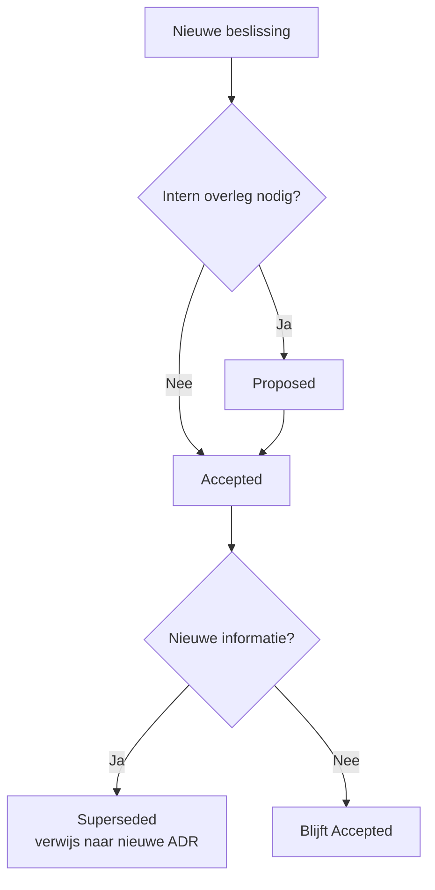

# 4. Architecturale karakteristieken, beslissingen en logische componenten

In het vorige hoofdstuk hebben we de vier dimensies van software architectuur leren kennen: **karakteristieken**, **beslissingen**, **logische componenten** en **architecturale stijl**. We hebben ook geleerd over de eerste wet van software architectuur: "**Everything is a trade-off**". In dit hoofdstuk gaan we dieper in op drie van deze dimensies en leren we hoe we ze systematisch kunnen bepalen en documenteren.

---

## 1. Architecturale karakteristieken

### Wat zijn architecturale karakteristieken?

Zoals we al gezien hebben, beschrijven architecturale karakteristieken **hoe** een systeem werkt, niet **wat** het doet. Ze worden ook wel "niet-functionele vereisten" genoemd. De term "niet-functioneel" betekent echter **niet** dat ze minder belangrijk zijn — integendeel! Een systeem dat wel functioneel correct is maar crasht onder belasting, of te traag is om bruikbaar te zijn, is waardeloos.

Bekende voorbeelden van architecturale karakteristieken zijn:
- **Scalability** (schaalbaarheid): kan het systeem omgaan met groeiend aantal gebruikers?
- **Reliability** (betrouwbaarheid): werkt het systeem consistent zonder fouten?
- **Maintainability** (onderhoudbaarheid): is het systeem makkelijk aan te passen?
- **Availability** (beschikbaarheid): is het systeem beschikbaar wanneer gebruikers het nodig hebben?
- **Security** (veiligheid): is het systeem veilig tegen aanvallen?

In de literatuur wordt deze categorie soms de **"ilities"** genoemd, omdat veel van deze Engelse termen eindigen op "-ility".

---

### Hoe kies je de juiste karakteristieken?

Je kan niet alle karakteristieken tegelijk nastreven. Dit brengt ons terug bij de eerste wet: **everything is a trade-off**. Elke eigenschap heeft een kost:

- Meer veiligheid maakt een systeem vaak trager of moeilijker te gebruiken
- Hogere schaalbaarheid vraagt meer infrastructuur en complexiteit
- Betere performance kan ten koste gaan van onderhoudbaarheid

Een bekende uitspraak in software-ontwikkeling luidt:

> **"Good, cheap, fast. Pick any two."**

Dit geldt ook voor architecturale karakteristieken. De **vuistregel** is: **kies ongeveer 7 karakteristieken**. Niet te veel (anders verlies je focus), niet te weinig (anders mis je belangrijke eigenschappen). Je mag ook een handvol aanduiden als **"driving characteristics"** — dit zijn de allerbelangrijkste eigenschappen die de grootste invloed hebben op je architecturale beslissingen.

#### Wees concreet

Vermijd vage termen. "Performance" is te algemeen — wees specifieker:
- **Responsiveness**: hoe snel reageert het systeem op een gebruikersactie?
- **Throughput**: hoeveel verzoeken kan het systeem per seconde verwerken?

Een uitgebreide lijst met mogelijke karakteristieken vind je op [Wikipedia: List of system quality attributes](https://en.wikipedia.org/wiki/List_of_system_quality_attributes). Let op: deze lijst is niet universeel of definitief. De concepten evolueren mee met de technologie. Vroeger was "availability" (24/7 beschikbaar zijn) zelfs geen relevante eigenschap, omdat systemen gewoon 's nachts offline gingen voor onderhoud.

Sommige karakteristieken zijn ook moeilijk te combineren. **Security** en **convenience** (gebruiksgemak) staan bijvoorbeeld regelmatig op gespannen voet met elkaar.

---

### Casus: Sillycon Symposia — Lafter (herhaald)

Laten we nogmaals kijken naar het voorbeeld uit hoofdstuk 3: Sillycon Symposia en hun sociaal medium **Lafter**.

**Requirements:**
- Honderden sprekers en duizenden bezoekers
- Gebruikers kunnen accounts aanmaken
- Gebruikers kunnen "jokes" (lange teksten) en "puns" (korte teksten) maken
- Berichten tot 281 tekens sturen
- Links posten
- Bezoekers kunnen sprekers volgen
- Reageren met "Haha" of "Giggle"
- Sprekers hebben een eigen icoontje
- Sprekers kunnen een forum opzetten

**Context:**
- Platform moet beschikbaar zijn in verschillende landen
- Klein supportteam
- Pieken in verkeer tijdens conferenties

Welke architecturale karakteristieken leiden we hieruit af?

| Requirement / context | Afleiding | Karakteristiek |
|---|---|---|
| Honderden sprekers, duizenden bezoekers | Het systeem moet veel gelijktijdige gebruikers aankunnen | **Scalability** |
| Pieken tijdens conferenties | Het systeem moet snel kunnen op- en afschalen bij plotse drukte | **Elasticity** |
| Accounts bepalen eigenaarschap | Data moet correct en consistent blijven | **Integrity** |
| Beschikbaar over verschillende landen | Meertaligheid, tijdzones, regionale wetgeving | **Internationalization** |
| Forums en icoontjes aanmaken | Het platform moet aanpasbaar zijn per gebruiker/spreker | **Customizability** |
| Klein supportteam | Het systeem moet zelf fouten kunnen opvangen zonder veel menselijke tussenkomst | **Fault tolerance** |

> **Belangrijk principe:** breng de karakteristieken in kaart **zonder** al over de implementatie te speculeren. Je bepaalt eerst **wat** het systeem moet kunnen, dan pas **hoe** je dat gaat bouwen.

> **Context is cruciaal:** factoren zoals "klein supportteam" zijn geen functionele vereisten, maar ze hebben wél een grote invloed op de gewenste eigenschappen. Lees requirementsdocumenten dus altijd aandachtig, ook tussen de regels.

---

### Hoe documenteer je karakteristieken?

Een goede manier om karakteristieken te documenteren is via een tabel:

| Karakteristiek | Expliciet vermeld in requirements? | Meest kritisch (driving)? |
|---|---|---|
| Scalability | Ja | **Ja** |
| Elasticity | Ja | **Ja** |
| Fault tolerance | Nee (afgeleid uit "klein supportteam") | **Ja** |
| Integrity | Nee (afgeleid uit accounts/eigenaarschap) | Nee |
| Internationalization | Ja | Nee |
| Customizability | Ja | Nee |

De kolom **"Expliciet vermeld?"** geeft aan of de karakteristiek letterlijk in de requirements staat of dat je deze hebt afgeleid uit de context. De kolom **"Meest kritisch?"** helpt om de driving characteristics te identificeren — dit zijn de eigenschappen die je architecturale beslissingen het meest zullen beïnvloeden.

---

## 2. Architecturale beslissingen

### Wat zijn architecturale beslissingen?

Architecturale beslissingen zijn de grote, ingrijpende keuzes die gemaakt worden bij het ontwerpen van een systeem. Ze worden gemaakt op basis van de gewenste karakteristieken en hebben een directe impact op hoe het systeem gebouwd en onderhouden wordt.

Voorbeelden van architecturale beslissingen:
- "We gebruiken uitsluitend een SQL-database."
- "Alle communicatie tussen services moet asynchroon zijn via message queues."
- "De applicatie wordt gebouwd als een microservices-architectuur."
- "We gebruiken Python als hoofdprogrammeertaal."

Let op de link met karakteristieken: kies bijvoorbeeld geen programmeertaal met automatische garbage collection als **voorspelbare performance** een kritische karakteristiek is, want garbage collection kan op willekeurige momenten het systeem vertragen.

---

### Wet 2: *Why* is more important than *how*

Bij architecturale beslissingen is het niet de vraag **hoe** iets gebouwd is — dat zie je in de code zelf. De echte waarde zit in het antwoord op de vraag **waarom** een keuze gemaakt werd. 

Die context is cruciaal voor iedereen die later met het systeem werkt:
- Nieuwe teamleden die de architectuur moeten begrijpen
- Toekomstige architecten die wijzigingen willen doorvoeren
- Jezelf, over twee jaar, wanneer je je eigen beslissingen niet meer herinnert

Daarom is het essentieel om architecturale beslissingen goed te documenteren.

---

### ADR's — Architectural Decision Records

Een **ADR** (Architectural Decision Record) is een gestructureerd document waarmee je een architecturale beslissing vastlegt. Het is een vorm van **developer documentatie** — niet bedoeld voor eindgebruikers, maar voor het ontwikkelteam.

#### Kenmerken van een ADR:

- **Eén ADR per beslissing** — elke beslissing krijgt zijn eigen document
- **Gestructureerd** — altijd hetzelfde formaat, zodat het makkelijk te lezen is
- **Niet user-facing** — dit is interne technische documentatie
- **Append-only** — je past een ADR nooit aan achteraf; als een beslissing verandert, schrijf je een **nieuwe** ADR die de vorige vervangt (status: "superseded")
- **Plain text** — bij voorkeur in Markdown, zodat het goed werkt met versiebeheer (Git)
- **Per project** — elk project houdt zijn eigen ADR's bij
- **Neutrale toon** — zakelijk en objectief, geen oordelen zoals "programmeertaal X is slecht ontworpen"

> **Tip:** gebruik nummers met voorloopnullen in de titel (bijv. `001`, `012`, `100`) zodat de volgorde altijd correct gesorteerd wordt, ook in bestandslijsten.

---

### Template voor een ADR

Een gangbare structuur voor een ADR ziet er als volgt uit:

| Veld | Beschrijving |
|---|---|
| **Title** | Korte, beschrijvende titel op één regel (met nummer) |
| **Status** | De huidige toestand: RFC, Proposed, Accepted, of Superseded |
| **Context** | Alle factoren die meespelen, **zonder** de beslissing zelf te vermelden |
| **Decision** | De gemaakte keuze, kordaat geformuleerd, met objectieve verantwoording |
| **Consequences** | Wat wordt mogelijk/onmogelijk? Welk werk ontstaat of valt weg? |
| **Governance** | Hoe wordt de beslissing opgevolgd? (bewustmaking, audits, code reviews, ...) |
| **Notes** | Extra aantekeningen, metadata, links naar relevante documenten |

#### Toelichting bij de velden:

**Title:** Op één regel, duidelijk en beschrijvend. Bijvoorbeeld: "012: Gebruik van queues voor asynchrone messaging vanaf tradingdienst"

**Status:** 
- **RFC** (*Request for Comment*): de beslissing is opgesteld maar nog niet beoordeeld
- **Proposed**: intern bekeken, maar moet nog verder goedgekeurd worden door anderen (bijvoorbeeld door een architectuurteam)
- **Accepted**: de beslissing is goedgekeurd en van kracht
- **Superseded**: een latere ADR maakt deze beslissing niet meer van toepassing

**Context:** Alle relevante achtergrondinformatie en overwegingen, **zonder** de beslissing zelf al te vermelden. Dit is het "waarom" achter de vraag.

**Decision:** De gemaakte keuze, kordaat uitgedrukt ("We zullen X gebruiken"), samen met **objectieve** verantwoording. Je mag zaken vermelden als "het development team heeft ervaring met technologie X", maar geen subjectieve negatieve uitspraken over alternatieven ("technologie Y is slecht").

**Consequences:** Eerlijk en volledig: wat wordt mogelijk, wat wordt onmogelijk, welk werk ontstaat, wat valt weg? Vermeld ook de **nadelen** van je keuze — dit helpt toekomstige beslissers om te begrijpen wat de trade-offs waren.

**Governance:** Hoe ga je ervoor zorgen dat de beslissing nageleefd wordt? Denk aan: bewustmaking bij developers, code reviews, audits, automatische checks, ...

---

### Levenscyclus van een ADR

Een ADR doorloopt verschillende toestanden tijdens zijn leven:

Een ADR wordt dus **nooit verwijderd**, zelfs niet als de beslissing achterhaald is. In plaats daarvan krijgt het de status "Superseded" met een verwijzing naar de nieuwe ADR die hem vervangt. Dit zorgt voor een volledig historisch overzicht van alle architecturale beslissingen.

---

### Voorbeeld van een ADR

Laten we terugkeren naar de casus **Two Many Sneakers** uit hoofdstuk 3. Het team moest beslissen hoe de trading service zou communiceren met de analytics en notifications services.

> **Title:** 012: Gebruik van queues voor asynchrone messaging vanaf tradingdienst
>
> **Status:** Accepted
>
> **Context:** De trading service moet andere diensten (voorlopig: analytics en notifications) op de hoogte brengen van nieuwe producten en van elke verkoop. We hebben twee opties overwogen:
> 1. Web services (REST API calls): de trading service roept direct de API's van andere services aan
> 2. Asynchrone messaging (queues of topics): de trading service publiceert berichten naar een bus
>
> Karakteristieken die meespelen: scalability (pieken in gebruik), fault tolerance (services mogen niet afhankelijk zijn van elkaar), extensibility (in de toekomst komen er meer services bij).
>
> **Decision:** **We zullen message queues gebruiken.** Queues maken het systeem veelzijdig, aangezien elke queue andere soorten berichten kan afleveren aan verschillende consumers. Ze maken het systeem ook veiliger, aangezien de trading service steeds weet welke queue voor welke service bedoeld is. De trading service hanteert het "fire and forget" principe: berichten worden naar de queues gestuurd zonder te wachten op bevestiging, waardoor de trading service niet vertraagd wordt.
>
> **Consequences:** 
> - **Voordeel:** De koppeling tussen de trading service en consumer-services is losser. Als een consumer-service uitvalt, blijven de berichten in de queue staan tot de service weer online is.
> - **Voordeel:** We kunnen eenvoudig nieuwe consumer-services toevoegen zonder de trading service aan te passen (zolang ze bestaande berichtformaten gebruiken).
> - **Nadeel:** De koppeling tussen de trading service en de queues zelf is hoger: elke nieuwe queue moet expliciet ondersteund worden door de trading service.
> - **Nadeel:** We moeten infrastructuur voor de queues voorzien (RabbitMQ, monitoring, backups).
> - **Werk:** We moeten berichtformaten (schemas) documenteren en versioneren.
>
> **Governance:** 
> - Alle developers worden getraind in het gebruik van RabbitMQ.
> - Nieuwe services die berichten van de trading service nodig hebben, moeten een ADR schrijven voor de benodigde queue.
> - Code reviews controleren of berichten correct gepubliceerd worden naar de juiste queues.
>
> **Notes:** Zie ook ADR 008 (keuze voor RabbitMQ als message broker). In de toekomst kunnen we overwegen om over te stappen op een centraal topic (zie ADR RFC 014), maar dat vraagt extra security-maatregelen.

Merk op:
- De beslissing is **kordaat** ("We zullen queues gebruiken")
- De verantwoording is **objectief** (gebaseerd op karakteristieken en praktische overwegingen)
- De gevolgen worden **eerlijk** vermeld — ook de nadelen
- Er zijn **concrete acties** voor governance

> **Meer informatie:** voor extra tools en templates voor ADR's, zie [adr.github.io](https://adr.github.io/#decision-capturing-tools)

---

## 3. Logische componenten

### Wat zijn logische componenten?

Logische componenten zijn de **bouwstenen** van een systeem. Je kan ze vergelijken met de kamers in een huis: elke kamer heeft een specifieke functie (slaapkamer, keuken, badkamer, woonkamer) en er is een logische reden waarom bepaalde activiteiten in bepaalde kamers plaatsvinden.

**Belangrijk:** logische componenten staan **los van de code** en de fysieke implementatie. Het zijn **conceptuele** subsystemen met een duidelijke verantwoordelijkheid. Ze zijn géén:
- Docker-containers
- Microservices
- Controllers of modules in je code
- Klassen of objecten

Ze zijn eerder abstracte functionele eenheden die later op verschillende manieren geïmplementeerd kunnen worden, afhankelijk van je architecturale stijl.

Voorbeelden van logische componenten:
- "Gebruikersbeheer"
- "Betalingsverwerking"
- "Notificaties"
- "Zoekfunctie"
- "Rapportage"

---

### Het proces: van requirements naar componenten

Het identificeren van logische componenten is een iteratief proces met vier stappen:

1. **Initiële kerncomponenten bepalen** (met workflow- of actor/action-approach)
2. **Requirements toewijzen aan componenten**
3. **Rol en verantwoordelijkheden analyseren** (cohesie)
4. **Architecturale karakteristieken analyseren**

We gaan nu elke stap in detail bekijken.

---

### Stap 1: Initiële kerncomponenten bepalen

Je begint met een eerste ruwe schets van de componenten. Dit is een beetje "raden", maar je verfijnt het daarna iteratief. Er zijn twee technieken die je hierbij helpen:

1. **Workflow approach**
2. **Actor/action approach**

Je mag beide technieken gebruiken, en ze kunnen ook gecombineerd worden.

---

#### Techniek 1: Workflow approach

Bij de workflow approach bekijk je het systeem vanuit het **perspectief van een gebruiker**. Je beschrijft de conceptuele stappen van één typische **user journey** — één scenario van hoe een gebruiker het systeem gebruikt.

Elke stap in die journey kan leiden tot een apart logisch component. Daarbij gelden twee richtlijnen:

- **Sterk verwante stappen** kunnen onder hetzelfde component vallen
- **Omgekeerd:** één stap kan soms zo complex zijn dat ze beter over meerdere componenten verdeeld wordt

**Voorbeeld — Online veiling:**

Stel dat de user journey "Meedoen en winnen aan een veiling" er als volgt uitziet:

1. **Registreren voor de veiling**
2. **Aanmelden bij de start**
3. **Veiling bekijken** (live videostream)
4. **Bod plaatsen**
5. **Betalen**

Elke stap suggereert een logisch component:

| Stap | Logisch component | Verantwoordelijkheid |
|---|---|---|
| 1. Registreren voor de veiling | **Auction Registration** | Beheren van veilingregistraties |
| 2. Aanmelden + veiling bekijken | **Live Auction Session** | Beheren van actieve veilingsessies |
| 3. Live videostream | **Video Streamer** | Streamen van live video |
| 4. Bod plaatsen | **Bid Capture** | Ontvangen en valideren van biedingen |
| 5. Betalen | **Automatic Payment** | Verwerken van betalingen |

Merk op dat stappen 2 en 3 mogelijk onder verschillende componenten vallen omdat ze verschillende technische verantwoordelijkheden hebben (sessiebeheer vs. video-streaming).

---

#### Techniek 2: Actor/action approach

De actor/action approach is handig als het systeem **meerdere soorten gebruikers** heeft. Je somt de belangrijkste handelingen per actor op en verbindt die handelingen met componenten. Je verbindt ook componenten onderling als ze van elkaar afhankelijk zijn.

Naast menselijke actoren (gebruikers, beheerders, operators, ...) is er ook een **"System" actor** voor automatische acties die het systeem zelf uitvoert (bijvoorbeeld geplande taken, achtergrondprocessen).

**Voorbeeld — Online veiling (met meerdere actoren):**

We hebben drie actoren:
- **Kate** (online bieder): zoekt een veiling, kijkt de livestream, plaatst een bod
- **Sam** (veilingmeester ter plaatse): start de veiling, registreert biedingen van ter plaatse, markeert items als verkocht
- **System** (automatisch): verwerkt betalingen, volgt biederactiviteit op

Dit leidt tot de volgende toewijzing:

| Actor | Actie | Component |
|---|---|---|
| Kate | Zoekt een veiling | **AuctionSearch** |
| Kate | Bekijkt livestream | **VideoStreamer** |
| Kate | Plaatst een bod (online) | **BidCapture** |
| Sam | Start/beheert veiling | **LiveAuctionSession** |
| Sam | Voert een live bod in (ter plaatse) | **BidCapture** |
| Sam | Markeert item als verkocht | **LiveAuctionSession** |
| System | Verwerkt betaling automatisch | **AutomaticPayment** |
| System | Volgt biederactiviteit op | **BidderTracker** |

En de communicatie tussen componenten:
- **BidCapture** stuurt biedingen door naar **BidderTracker** (voor analyse)
- **LiveAuctionSession** vertelt **AutomaticPayment** wie er moet betalen
- **LiveAuctionSession** stuurt start/stop signalen naar **BidderTracker**

Merk op dat **BidCapture** door zowel Kate als Sam gebruikt wordt — het is een gedeeld component voor alle biedingen, ongeacht de bron.

---

#### Valkuil: de Entity Trap

Een veelgemaakte fout is de **entity trap**: een component krijgt te veel verantwoordelijkheden, waardoor het onduidelijk is wat het precies doet. Dit risico is extra groot bij **vage namen** zoals:

- "Supervisor"
- "Manager"
- "Handler"
- "Controller"
- "Control Center"
- "Coordinator"

Als een component zo'n vage naam heeft, stel jezelf dan de vraag: **"Wat doet dit component *precies*?"**

Als het antwoord meer dan **één duidelijke verantwoordelijkheid** omvat, moet je het component opsplitsen. Bijvoorbeeld:

- ❌ "UserManager" die zowel authenticatie, profielbeheer als notificaties doet
- ✅ "Authentication", "UserProfile" en "Notifications" als aparte componenten

---

#### Technieken combineren (optioneel)

Je kan de twee technieken ook combineren:

1. Identificeer de actoren en hun primaire acties (zoals in actor/action)
2. Doorloop vervolgens die acties stap voor stap (zoals in workflow) om meer in detail te gaan

Dit is een **optie**, geen verplichting. Gebruik wat het best werkt voor jouw specifieke situatie.

---

### Stap 2: Requirements toewijzen aan componenten

Nadat je de initiële componenten hebt bepaald, wijs je alle **functionele requirements** toe aan de componenten. Elke requirement zou een "thuis" moeten krijgen — een component dat verantwoordelijk is voor die functionaliteit.

**Voorbeeld voor Lafter (Sillycon Symposia):**

| Functionele requirement | Component |
|---|---|
| Account aanmaken | User Management |
| Inloggen | Authentication |
| "Joke" of "Pun" posten | Content Publishing |
| Bericht tot 281 tekens sturen | Content Publishing |
| Link posten | Content Publishing |
| Spreker volgen | Social Connections |
| Reageren met "Haha" of "Giggle" | Reactions |
| Eigen icoontje uploaden | User Profile |
| Forum opzetten | Forum Management |

Als je een requirement **niet kunt plaatsen**, is dat een signaal dat je mogelijk een component over het hoofd hebt gezien. Voeg dan een nieuw component toe en documenteer waarom.

Als je merkt dat **één component te veel requirements** krijgt, is dat een teken dat het component mogelijk opgesplitst moet worden (zie volgende stap: cohesie).

---

### Stap 3: Rol en verantwoordelijkheden analyseren (cohesie)

Per component stel je jezelf de vraag: **"Welke taken heeft dit component?"**

De mate van interne samenhang van een component noemen we **cohesie**. 

- **Sterke cohesie**: het component doet één ding goed, met duidelijk afgebakende taken
- **Zwakke cohesie**: het component heeft een verwarrende mix van taken die weinig met elkaar te maken hebben

**Mik altijd op sterke cohesie.**

**Voorbeeld van sterke cohesie:**
- Component: **Authentication**
- Taken: gebruikers inloggen, wachtwoorden valideren, sessies beheren, uitloggen
- ✅ Alles draait om authenticatie — duidelijke focus

**Voorbeeld van zwakke cohesie:**
- Component: **UserManager**
- Taken: inloggen, profiel bewerken, notificaties versturen, vrienden beheren, zoeken naar gebruikers
- ❌ Te veel verschillende verantwoordelijkheden — moet opgesplitst worden

Naarmate het systeem groeit, moet je de cohesie blijven bewaken. Soms zal je merken dat een component te groot wordt en opgesplitst moet worden. **Tip:** houd zo'n wijziging bij in een ADR! (bijvoorbeeld: "ADR 024: Opsplitsen van UserManager in Authentication, UserProfile en SocialConnections")

---

### Stap 4: Architecturale karakteristieken analyseren

In deze stap bekijk je de **driving characteristics** (de meest kritische karakteristieken uit deel 1) en controleer je of de verdeling van componenten deze karakteristieken ondersteunt.

Hier heb je al een **idee van de fysieke implementatie** nodig. De componenten, de karakteristieken, de beslissingen en de architecturale stijl moeten op elkaar afgestemd zijn — ze convergeren naar een coherent geheel.

**Voorbeeld — Online veiling:**

**Driving characteristics:** scalability, availability, performance

**Probleem:** Stel dat het component **Bid Capture** elk bod direct opslaat in een database voordat het de veiling bijwerkt. Bij hoge belasting (bijvoorbeeld 1000 biedingen per seconde tijdens een populaire veiling) kan dit de veiling vertragen. De database wordt een bottleneck.

**Oplossing:** 
- **Bid Capture** houdt enkel het **hoogste bod** (of de hoogste paar biedingen) in het **werkgeheugen** bij
- De volledige geschiedenis wordt **asynchroon** opgeslagen via een aparte service
- Dit kan bijvoorbeeld met behulp van **message queues** (RabbitMQ): Bid Capture publiceert elk bod naar een queue, en een aparte **Bid History** service leest deze queue uit en slaat de biedingen op in een database

Resultaat: de veiling blijft snel en beschikbaar (performance + availability), terwijl de data-integriteit gewaarborgd blijft.

Dit is een mooi voorbeeld van hoe **architecturale karakteristieken** leiden tot **architecturale beslissingen** (gebruik van message queues) die weer invloed hebben op de **logische componenten** (opsplitsing in Bid Capture en Bid History).

---

## 4. Koppeling tussen componenten

Componenten kunnen intern goed zitten (sterke cohesie), maar de communicatie **tussen** componenten is een apart aandachtspunt. We noemen dit **koppeling** (*coupling*).

Er zijn twee soorten koppeling:

---

### Afferente koppeling (CA — fan-in)

De **afferente koppeling** van een component is het **aantal inkomende afhankelijkheden**: hoeveel andere componenten zijn afhankelijk van dit component?

Een pijl van A naar B betekent "A is afhankelijk van B" (A gebruikt B). Component B heeft dan een afferente koppeling van 1 (vanuit A).

**Voorbeeld:**
- Component **UserProfile** wordt gebruikt door: Authentication, ContentPublishing, SocialConnections
- Afferente koppeling van UserProfile: **3**

Een **hoge CA** betekent dat veel andere componenten op jou steunen. Als jij verandert, moeten zij mogelijk ook aangepast worden. Dit maakt het component **kritisch**.

---

### Efferente koppeling (CE — fan-out)

De **efferente koppeling** van een component is het **aantal uitgaande afhankelijkheden**: van hoeveel andere componenten is dit component afhankelijk?

**Voorbeeld:**
- Component **ContentPublishing** gebruikt: UserProfile, Authentication, MediaStorage
- Efferente koppeling van ContentPublishing: **3**

Een **hoge CE** betekent dat jij op veel andere componenten steunt. Als één van die anderen verandert, moet jij mogelijk ook aanpassen. Dit maakt het component **kwetsbaar**.

---

### Koppeling meten

Je meet de koppeling als volgt:

- **Per component:** afferente koppeling (CA), efferente koppeling (CE), en **totale koppeling** (CA + CE)
- **Voor het hele systeem:** de som van alle totale koppelingen

Dit geeft je een kwantitatief beeld van hoe sterk de componenten met elkaar verweven zijn.

**Voorbeeld:**

| Component | CA (fan-in) | CE (fan-out) | Totaal |
|---|---|---|---|
| Authentication | 5 | 1 | 6 |
| UserProfile | 3 | 1 | 4 |
| ContentPublishing | 2 | 3 | 5 |
| SocialConnections | 1 | 2 | 3 |
| MediaStorage | 4 | 0 | 4 |
| **Systeem totaal** | — | — | **22** |

---

### Wet van Demeter — streven naar losse koppeling

De **Wet van Demeter** (ook wel het *Principle of Least Knowledge* genoemd) is een richtlijn die staat voor **losse koppeling**. De kern van deze wet:

> **Een component mag zo min mogelijk weten over de interne werking van andere componenten.**

Het spreekt enkel met zijn directe "buren", niet met de buren van zijn buren.

**Voorbeeld:**
- ❌ Component A roept een functie aan op Component B, die een object teruggeeft, waarop A vervolgens een functie van Component C aanroept
  - `a.getB().getC().doSomething()` — A moet nu weten over zowel B als C
- ✅ Component A vraagt B om iets te doen, en B delegeert intern naar C indien nodig
  - `a.askB_to_doSomething()` — A hoeft alleen B te kennen

> **Analogie uit cybersecurity:** in de context van security kent men een vergelijkbaar principe: *least privilege* — een systeem heeft enkel toegang tot wat het strikt nodig heeft, niet meer.

Het doel is niet om de koppelingscijfers zo laag mogelijk te maken, maar om een **goede balans** te vinden. Een systeem met zeer lage koppeling maar slechte structuur is niet beter dan een systeem met iets hogere koppeling maar duidelijke, logische verbanden.

---

### Hoge vs. lage koppeling — toegepast

Stel je twee architecturen voor met dezelfde componenten, maar verschillende koppelingsverdeling:

**Situatie 1 — Hoge koppeling (slecht verdeeld):**

| Component | CA | CE | Totaal |
|---|---|---|---|
| CentralController | 0 | 8 | 8 |
| ServiceA | 1 | 0 | 1 |
| ServiceB | 1 | 0 | 1 |
| ServiceC | 1 | 0 | 1 |
| ServiceD | 1 | 0 | 1 |
| **Totaal** | — | — | **12** |

Hier communiceert **CentralController** met bijna alle andere componenten. Hoewel alle componenten op zichzelf goed afgebakend zijn (**sterke cohesie**), is er één component met een opvallend hoge totale koppeling. Elke wijziging aan CentralController riskeert een **domino-effect** door het hele systeem.

**Situatie 2 — Lage(re) koppeling (goed verdeeld):**

| Component | CA | CE | Totaal |
|---|---|---|---|
| Orchestrator | 1 | 2 | 3 |
| ServiceA | 1 | 1 | 2 |
| ServiceB | 1 | 1 | 2 |
| ServiceC | 1 | 1 | 2 |
| ServiceD | 1 | 1 | 2 |
| SharedUtility | 4 | 0 | 4 |
| **Totaal** | — | — | **15** |

Hier zijn de verbindingen beter verdeeld over de componenten. Geen enkel component draagt een buitensporig groot deel van de koppeling. Wijzigingen blijven meer **lokaal**.

Het gaat niet alleen om de **som** (die is hier zelfs iets hoger!), maar om de **spreiding**. Als je twijfelt of een herverdeling beter is, kan je statistiek gebruiken: mik op dezelfde totale som maar met een **lagere standaarddeviatie** — dat betekent minder uitschieters en een evenwichtigere architectuur.

> **Belangrijk:** optimaliseer geen diagrammen en getallen als een spelletje. Stel jezelf altijd de praktische vraag: **"Lijkt dit implementeerbaar? Is dit onderhoudbaar?"**

**Definitie:** Twee componenten zijn gekoppeld als een aanpassing aan de ene een aanpassing in de andere **zou kunnen** vereisen. Dat is het criterium om te beoordelen of een pijl in je architectuurdiagram gerechtvaardigd is.

---

## Samenvatting

| Concept | Kernidee |
|---|---|
| **Architecturale karakteristieken** | *Hoe* werkt het systeem? Niet-functionele vereisten. Kies er ~7, wees concreet, identificeer de driving characteristics. |
| **Trade-off (Wet 1)** | Elke keuze heeft voor- en nadelen. Maak deze expliciet. |
| **Architecturale beslissingen** | Grote technische keuzes op systeemniveau, gemaakt op basis van karakteristieken. |
| **Why > How (Wet 2)** | Documenteer het *waarom* achter beslissingen, niet alleen het *hoe*. |
| **ADR** | Gestructureerd document per beslissing. Append-only, plain text, neutrale toon. Velden: title, status, context, decision, consequences, governance, notes. |
| **Logische componenten** | Conceptuele bouwstenen los van code. Duidelijke verantwoordelijkheden. |
| **Workflow approach** | Componenten afleiden via de stappen van een user journey. |
| **Actor/action approach** | Componenten afleiden via actoren en hun handelingen. |
| **Entity trap** | Valkuil: component met te veel verantwoordelijkheden, vaak door vage naamgeving. |
| **Cohesie** | Interne samenhang van een component. Hoe duidelijker het takenpakket, hoe beter. Mik op sterke cohesie. |
| **Afferente koppeling (CA)** | Aantal inkomende afhankelijkheden (fan-in). Hoge CA = veel andere componenten steunen op jou. |
| **Efferente koppeling (CE)** | Aantal uitgaande afhankelijkheden (fan-out). Hoge CE = jij steunt op veel andere componenten. |
| **Wet van Demeter** | Streven naar losse koppeling: praat enkel met je directe buren, ken zo min mogelijk over de interne werking van anderen. |
| **Koppeling meten** | Totaal = CA + CE per component. Streven naar goede **spreiding**, niet alleen lage som. |

---

## Praktische checklist

Wanneer je werkt aan een nieuw softwareproject, doorloop dan de volgende stappen:

### Fase 1: Karakteristieken bepalen
1. ✅ Verzamel alle functionele requirements
2. ✅ Lees de context aandachtig (ook tussen de regels!)
3. ✅ Leid architecturale karakteristieken af
4. ✅ Selecteer ~7 karakteristieken
5. ✅ Duid 2-3 "driving characteristics" aan
6. ✅ Documenteer in een tabel (expliciet vermeld? / kritisch?)

### Fase 2: Beslissingen nemen
1. ✅ Beslis op basis van de driving characteristics
2. ✅ Schrijf een ADR per belangrijke beslissing
3. ✅ Gebruik het standaard template
4. ✅ Wees eerlijk over consequences (ook nadelen!)
5. ✅ Definieer governance-maatregelen

### Fase 3: Componenten ontwerpen
1. ✅ Gebruik workflow- of actor/action-approach (of beide)
2. ✅ Wijs alle requirements toe aan componenten
3. ✅ Analyseer cohesie per component
4. ✅ Splits componenten met zwakke cohesie op
5. ✅ Controleer of componenten de driving characteristics ondersteunen
6. ✅ Meet koppeling (CA, CE, totaal)
7. ✅ Streef naar goede spreiding van koppeling
8. ✅ Pas Wet van Demeter toe (losse koppeling)

### Fase 4: Itereren
1. ✅ Herhaal stap 3 totdat de architectuur coherent is
2. ✅ Update ADR's bij wijzigingen (nieuwe ADR, oude op "superseded")
3. ✅ Blijf trade-offs expliciet maken

---

## Tot slot

Software-architectuur is geen exacte wetenschap, maar een creatief proces met richtlijnen en best practices. De twee wetten helpen je om gefocust te blijven:

> **Wet 1: Everything is a trade-off**  
> Elke keuze heeft voor- en nadelen. Maak deze expliciet.

> **Wet 2: Why is more important than how**  
> Documenteer het *waarom* achter je beslissingen.

Door systematisch karakteristieken te bepalen, beslissingen te documenteren en componenten te ontwerpen met aandacht voor cohesie en koppeling, bouw je systemen die niet alleen functioneel correct zijn, maar ook schaalbaar, onderhoudbaar en begrijpelijk blijven voor iedereen die ermee werkt.

Succes met het ontwerpen van je architectuur!
